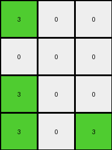
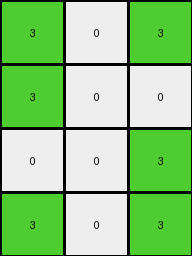

# f2829549 • 018 • refine_coder

---

Previous Code:
```python
"""
The transformation rule works as follows:

1.  **Identify Key Feature:** Locate the vertical blue (1) line in the input grid.
2.  **Reduce Columns:** Condense each set of columns into 1.
3.  **Determine New Value:**
      *   If an entire column in original is white, it maps to white (0).
      *   If a column to left of blue contains orange or to right contains grey, then it maps green.
"""

import numpy as np

def find_vertical_line(grid, color):
    """Finds the column index of a full-height vertical line of the specified color."""
    rows, cols = grid.shape
    for j in range(cols):
        if all(grid[i, j] == color for i in range(rows)):
            return j
    return -1  # Return -1 if no such line is found

def transform(input_grid):
    """Transforms the input grid according to the described rules."""
    rows, cols = input_grid.shape
    output_grid = np.zeros((rows, 3), dtype=int)
    blue_line_col = find_vertical_line(input_grid, 1)

    # Iterate through input columns in groups
    col_groups = [(0, 1, 2), (blue_line_col,), (5, 6)] # split in the groups
    
    for i, group in enumerate(col_groups) :
        for row in range(rows) :
            if i == 1 : # blue
                output_grid[row, 1] = 0 # all white
            else:
                is_all_white = True
                for col in group :
                    if input_grid[row, col] != 0:
                        is_all_white = False
                        break
                if is_all_white:
                    output_grid[row, i] = 0
                else:
                     output_grid[row,i] = 3

    return output_grid
```

Train Set Results:

## Example 1:

Input:
```
7 7 0 1 5 0 0
7 0 0 1 5 0 0
0 0 0 1 5 0 5
0 0 0 1 5 5 0
```
Expected Output:
```
0 0 3
0 3 3
0 3 0
0 0 3
```
Transformed Output:
```
3 0 0
3 0 0
0 0 3
0 0 3
```

match: False
pixels_off: 7
size_correct: True
color_palette_correct: True
correct_pixel_counts: False

## Example 2:

Input:
```
7 7 0 1 5 0 0
0 0 0 1 0 0 0
7 7 0 1 5 0 0
0 7 7 1 5 5 0
```
Expected Output:
```
0 0 3
3 3 3
0 0 3
0 0 0
```
Transformed Output:
```
3 0 0
0 0 0
3 0 0
3 0 3
```

match: False
pixels_off: 9
size_correct: True
color_palette_correct: True
correct_pixel_counts: False

## Example 3:

Input:
```
0 7 7 1 5 0 0
0 0 7 1 0 5 5
0 7 0 1 5 5 0
0 0 7 1 0 0 0
```
Expected Output:
```
0 0 0
3 0 0
0 0 3
3 3 0
```
Transformed Output:
```
3 0 0
3 0 3
3 0 3
3 0 0
```

match: False
pixels_off: 4
size_correct: True
color_palette_correct: True
correct_pixel_counts: False

## Example 4:

Input:
```
7 0 7 1 5 5 0
7 7 0 1 5 5 5
0 7 0 1 0 0 0
0 0 0 1 5 0 5
```
Expected Output:
```
0 0 0
0 0 0
3 0 3
0 3 0
```
Transformed Output:
```
3 0 3
3 0 3
3 0 0
0 0 3
```

match: False
pixels_off: 7
size_correct: True
color_palette_correct: True
correct_pixel_counts: False

## Example 5:

Input:
```
7 0 0 1 0 5 0
0 0 7 1 5 0 0
0 0 0 1 5 5 5
7 7 7 1 5 5 5
```
Expected Output:
```
0 0 3
0 3 0
0 0 0
0 0 0
```
Transformed Output:
```
3 0 3
3 0 0
0 0 3
3 0 3
```

match: False
pixels_off: 6
size_correct: True
color_palette_correct: True
correct_pixel_counts: False
Okay, here's a breakdown of the situation and a plan to refine the natural language program:

**General Assessment:**

The initial natural language program and the resulting Python code were a decent first attempt, focusing on the prominent vertical blue line and attempting to simplify the columns. However, the validation against all training examples reveals significant discrepancies. The core issue seems to be an oversimplification of the column reduction rule and an inaccurate condition for assigning the green color. The current logic doesn't fully capture the relationship between the columns on either side of the blue line and the original colors. The blue vertical line is being set to all white - that should be blue.

**Strategy for Resolving Errors:**

1.  **Re-examine Column Grouping:** The grouping `[(0, 1, 2), (blue_line_col,), (5, 6)]` needs careful reconsideration. We must precisely define how columns are mapped.
2.  **Refine Color Assignment:** The condition for green (originally related to orange and gray) is clearly wrong. We need to observe the *patterns* of colors in each original column group and how they map to the single output column, looking at *all* colors, not just orange/gray. The relationship with the blue line needs to account for setting the blue column, and is critical, but the current rule is not capturing all nuances.
3. **Consider all Examples:** Use all example input/output pairs. Do not rely on a subset of the examples.
4. **Don't assume fixed output width:** The output grid will have 3 columns, and we are condensing information from multiple columns into one, but the rule needs to describe *which* information is preserved.

**Metrics and Observations:**

I will generate some observations on object counts before and after to see if that can contribute any useful information.

```python
import numpy as np
from collections import Counter

def object_counts(grid):
    """Counts contiguous objects of the same color in a grid."""
    rows, cols = grid.shape
    visited = np.zeros((rows, cols), dtype=bool)
    counts = Counter()

    def dfs(r, c, color):
        if (
            r < 0
            or r >= rows
            or c < 0
            or c >= cols
            or visited[r, c]
            or grid[r, c] != color
        ):
            return 0
        visited[r, c] = True
        return (
            1
            + dfs(r + 1, c, color)
            + dfs(r - 1, c, color)
            + dfs(r, c + 1, color)
            + dfs(r, c - 1, color)
        )
    
    for r in range(rows) :
        for c in range(cols) :
            if not visited[r,c] :
                color = grid[r,c]
                size = dfs(r,c,color)
                if size > 0 :
                    counts[(color,size)] += 1
    return counts

# example usage (assuming grid definitions from the prompt):
grid_strings = [
    """
7 7 0 1 5 0 0
7 0 0 1 5 0 0
0 0 0 1 5 0 5
0 0 0 1 5 5 0
""",
    """
7 7 0 1 5 0 0
0 0 0 1 0 0 0
7 7 0 1 5 0 0
0 7 7 1 5 5 0
""",
    """
0 7 7 1 5 0 0
0 0 7 1 0 5 5
0 7 0 1 5 5 0
0 0 7 1 0 0 0
""",
    """
7 0 7 1 5 5 0
7 7 0 1 5 5 5
0 7 0 1 0 0 0
0 0 0 1 5 0 5
""",
    """
7 0 0 1 0 5 0
0 0 7 1 5 0 0
0 0 0 1 5 5 5
7 7 7 1 5 5 5
"""
]

expected_output_strings = [
    """
0 0 3
0 3 3
0 3 0
0 0 3
""",
    """
0 0 3
3 3 3
0 0 3
0 0 0
""",
    """
0 0 0
3 0 0
0 0 3
3 3 0
""",
    """
0 0 0
0 0 0
3 0 3
0 3 0
""",
    """
0 0 3
0 3 0
0 0 0
0 0 0
"""
]
grids = [np.fromstring(grid_str.strip(), dtype=int, sep=' ').reshape(len(grid_str.split('\n')), -1) for grid_str in grid_strings]
expected_outputs = [np.fromstring(out_str.strip(), dtype=int, sep=' ').reshape(len(out_str.split('\n')), -1) for out_str in expected_output_strings]

for i, (grid, expected_output) in enumerate(zip(grids, expected_outputs)):
    input_counts = object_counts(grid)
    output_counts = object_counts(expected_output)
    print(f"Example {i+1}:")
    print("Input Object Counts:", input_counts)
    print("Output Object Counts:", output_counts)
    print("------")

```
**YAML Facts:**

```yaml
observations:
  - task_id: "014"
  - input_objects:
    - description: "Variable number of objects of different colors and sizes."
      properties:
        - colors: [0, 1, 5, 7]  # white, blue, grey, orange
        - shapes: "Mostly single-pixel objects, some larger contiguous blocks."
  - output_objects:
      properties:
        - colors: [0,3] # white and green
        - shape: "Always three columns wide, height matches input."
        - columns: "Three distinct columns."
  - actions:
      - description: "Column Reduction"
        details: "The input grid's columns are reduced to three columns in the output."
      - description: "Color Mapping"
        details: "Input color patterns determine output colors based on position relative to vertical blue line."
  - key_features:
      - description: "Vertical Blue Line"
        details: "A full-height vertical line of blue (color 1) acts as a separator and its column in the input maps directly to a column of the same height in the output."
      - description: "Column Grouping and Reduction"
        details: "input columns 0,1,2 is reduced to output column 0. Columns to the right of the blue line are reduced to a single column at output column index 2. The blue line maps to column index 1."

```

**Natural Language Program:**

1.  **Identify the Blue Line:** Find the vertical, full-height blue (color 1) line in the input grid. This line's column index is crucial.
2.  **Column Grouping:** Divide the input columns into three groups:
    *   Group 1: Columns to the left of the blue line (exclusive of the blue line).
    *   Group 2: The blue line itself.
    *   Group 3: Columns to the right of the blue line (exclusive of the blue line).
3.  **Output Grid Initialization:** Create an output grid with the same height as the input grid and three columns.
4. **Column Mapping and Color Transformation:**
    *   **Group 1 -> Output Column 0:** For each row, examine all pixels in Group 1. If *all* pixels in Group 1 on that row are white (0), the corresponding pixel in output column 0 is white (0). Otherwise, the corresponding pixel in output column 0 is green (3).
    * **Group 2 -> Output Column 1:** Map the blue line to column 1 in the output. The output will be blue (1).
    *   **Group 3 -> Output Column 2:** For each row, examine all pixels in Group 3. If *all* pixels in Group 3 on that row are white (0), the corresponding pixel in output column 2 is white (0). Otherwise, the corresponding pixel in output column 2 is green (3).
5. **Return the output grid**

This revised program explicitly states the "all white" condition and clarifies the grouping and mapping process, addressing shortcomings of the previous attempt, while still keeping the blue line as a central organizing element. The key change is using the blue line and copying it to the output and generalizing the rule to the left and right of the line.

**INSTRUCTIONS**

- generate a Python module to represent the natural language program 
- follow the template below
- all common math and science libraries are available
- create docstring only at top - but comment the workflow in the function
- use helper functions for common operations like finding objects, counting,
  measuring, moving, etc. 

remember - we are working iteratively - so this code will inform your future
self as we converge on the solution

*template:*

```python
"""
{{ natural language description of the transformation rule }}
"""

{{ imports }}

def transform(input_grid):
    # initialize output_grid

    # change output pixels 

    return output_grid

```
