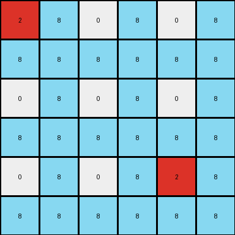
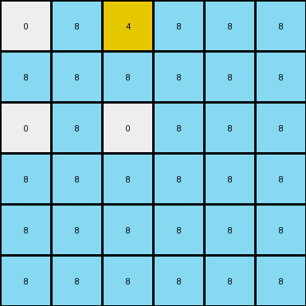

# f5b8619d • 003 • refine_dreamer

---

Previous Code:
```python
"""
1.  **Initialization:** Start with the 3x3 input grid.
2.  **Expansion:** Create a new 6x6 grid.
3.  **Replication with insertion**: For every value on the original grid, copy the value to the new grid in the same relative position as the original, using a 2x2 offset (row *2, col *2).
4. **Border Insertion**: For any position in the new 6x6 grid, If the position does not match any of the co-ordinates created by the above step, insert 8
"""

import numpy as np

def transform(input_grid):
    # Initialize output_grid as a 6x6 array filled with 8s.
    output_grid = np.full((6, 6), 8, dtype=int)

    # Iterate through the input grid.
    for i in range(input_grid.shape[0]):
        for j in range(input_grid.shape[1]):
            # Copy each value from input_grid to output_grid with a 2x2 offset.
            output_grid[i*2, j*2] = input_grid[i, j]

    return output_grid
```

Train Set Results:

## Example 1:

Input:
```
2 0 0
0 0 0
0 0 2
```
Expected Output:
```
2 0 8 2 0 8
8 0 8 8 0 8
8 0 2 8 0 2
2 0 8 2 0 8
8 0 8 8 0 8
8 0 2 8 0 2
```
Transformed Output:
```
2 8 0 8 0 8
8 8 8 8 8 8
0 8 0 8 0 8
8 8 8 8 8 8
0 8 0 8 2 8
8 8 8 8 8 8
```

match: False
pixels_off: 21
size_correct: True
color_palette_correct: True
correct_pixel_counts: False

## Example 2:

Input:
```
0 5 0 0 0 0
0 0 0 0 0 0
0 0 0 0 0 0
0 0 0 0 0 0
5 0 0 0 0 5
0 0 0 0 0 0
```
Expected Output:
```
8 5 0 0 0 8 8 5 0 0 0 8
8 8 0 0 0 8 8 8 0 0 0 8
8 8 0 0 0 8 8 8 0 0 0 8
8 8 0 0 0 8 8 8 0 0 0 8
5 8 0 0 0 5 5 8 0 0 0 5
8 8 0 0 0 8 8 8 0 0 0 8
8 5 0 0 0 8 8 5 0 0 0 8
8 8 0 0 0 8 8 8 0 0 0 8
8 8 0 0 0 8 8 8 0 0 0 8
8 8 0 0 0 8 8 8 0 0 0 8
5 8 0 0 0 5 5 8 0 0 0 5
8 8 0 0 0 8 8 8 0 0 0 8
```
match: ERROR: index 6 is out of bounds for axis 1 with size 6
pixels_off: None
size_correct: None
color_palette_correct: None
correct_pixel_counts: None

## Example 3:

Input:
```
0 4
0 0
```
Expected Output:
```
0 4 0 4
0 8 0 8
0 4 0 4
0 8 0 8
```
Transformed Output:
```
0 8 4 8 8 8
8 8 8 8 8 8
0 8 0 8 8 8
8 8 8 8 8 8
8 8 8 8 8 8
8 8 8 8 8 8
```

match: False
pixels_off: None
size_correct: False
color_palette_correct: True
correct_pixel_counts: False
**INSTRUCTIONS**

The code above was generated based on observations from the first training
example

we have tested the transform function on each of the task example inputs and
compared with the expected output

review each of the examples provided and the results and consider how the
natural language program should be updated to accommodate this new knowledge

respond with the following deliverables:

- general assessment of the information provided and strategy for resolving the
  errors
- gather metrics about each of the examples and results - use code_execution to
  develop accurate reports on your assumptions
- a YAML block documenting facts - Focus on identifying objects, their properties, and the actions performed on them.
- a natural language program - Be as clear and concise as possible, providing a complete description of the transformation rule.


your responses should be considered as information in a report - not a
conversation
