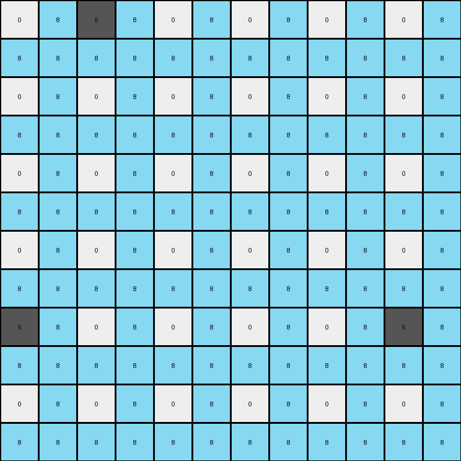
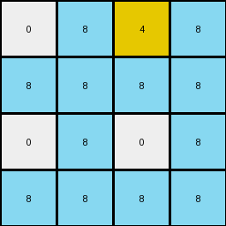

# f5b8619d • 011 • refine_dreamer

---


Previous Code:
```python
"""
1. Double Dimensions: Create an output grid with twice the height and twice the width of the input grid.
2. Iterate Input Pixels: For each pixel in the input grid:
    *   Get its color and its row (r) and column (c) coordinates.
    *   In the output grid, create a 2x2 block at the starting position (2*r, 2*c).
    *   Place the input pixel's color at the top-left corner of this block: `output_grid[2*r, 2*c] = input_pixel_color`.
    *   Fill the remaining three positions of the 2x2 block with azure (8):
        *   `output_grid[2*r + 1, 2*c] = 8`
        *   `output_grid[2*r, 2*c + 1] = 8`
        *   `output_grid[2*r + 1, 2*c + 1] = 8`
3. Return the output grid
"""

import numpy as np

def transform(input_grid):
    # initialize output_grid
    input_height, input_width = input_grid.shape
    output_height, output_width = 2 * input_height, 2 * input_width
    output_grid = np.zeros((output_height, output_width), dtype=int)

    # Iterate through each pixel of the input grid
    for r in range(input_height):
        for c in range(input_width):
            # Get the color of the current input pixel
            input_pixel_color = input_grid[r, c]

            # Place the input pixel's color in the top-left of the 2x2 block
            output_grid[2*r, 2*c] = input_pixel_color

            # Fill the rest of the 2x2 block with azure (8)
            output_grid[2*r + 1, 2*c] = 8
            output_grid[2*r, 2*c + 1] = 8
            output_grid[2*r + 1, 2*c + 1] = 8

    return output_grid
```

Train Set Results:

## Example 1:

Input:
```
2 0 0
0 0 0
0 0 2
```
Expected Output:
```
2 0 8 2 0 8
8 0 8 8 0 8
8 0 2 8 0 2
2 0 8 2 0 8
8 0 8 8 0 8
8 0 2 8 0 2
```
Transformed Output:
```
2 8 0 8 0 8
8 8 8 8 8 8
0 8 0 8 0 8
8 8 8 8 8 8
0 8 0 8 2 8
8 8 8 8 8 8
```

match: False
pixels_off: 21
size_correct: True
color_palette_correct: True
correct_pixel_counts: False

## Example 2:

Input:
```
0 5 0 0 0 0
0 0 0 0 0 0
0 0 0 0 0 0
0 0 0 0 0 0
5 0 0 0 0 5
0 0 0 0 0 0
```
Expected Output:
```
8 5 0 0 0 8 8 5 0 0 0 8
8 8 0 0 0 8 8 8 0 0 0 8
8 8 0 0 0 8 8 8 0 0 0 8
8 8 0 0 0 8 8 8 0 0 0 8
5 8 0 0 0 5 5 8 0 0 0 5
8 8 0 0 0 8 8 8 0 0 0 8
8 5 0 0 0 8 8 5 0 0 0 8
8 8 0 0 0 8 8 8 0 0 0 8
8 8 0 0 0 8 8 8 0 0 0 8
8 8 0 0 0 8 8 8 0 0 0 8
5 8 0 0 0 5 5 8 0 0 0 5
8 8 0 0 0 8 8 8 0 0 0 8
```
Transformed Output:
```
0 8 5 8 0 8 0 8 0 8 0 8
8 8 8 8 8 8 8 8 8 8 8 8
0 8 0 8 0 8 0 8 0 8 0 8
8 8 8 8 8 8 8 8 8 8 8 8
0 8 0 8 0 8 0 8 0 8 0 8
8 8 8 8 8 8 8 8 8 8 8 8
0 8 0 8 0 8 0 8 0 8 0 8
8 8 8 8 8 8 8 8 8 8 8 8
5 8 0 8 0 8 0 8 0 8 5 8
8 8 8 8 8 8 8 8 8 8 8 8
0 8 0 8 0 8 0 8 0 8 0 8
8 8 8 8 8 8 8 8 8 8 8 8
```

match: False
pixels_off: 70
size_correct: True
color_palette_correct: True
correct_pixel_counts: False

## Example 3:

Input:
```
0 4
0 0
```
Expected Output:
```
0 4 0 4
0 8 0 8
0 4 0 4
0 8 0 8
```
Transformed Output:
```
0 8 4 8
8 8 8 8
0 8 0 8
8 8 8 8
```

match: False
pixels_off: 9
size_correct: True
color_palette_correct: True
correct_pixel_counts: False

**INSTRUCTIONS**

The code above was generated based on observations from the first training
example

we have tested the transform function on each of the task example inputs and
compared with the expected output

review each of the examples provided and the results and consider how the
natural language program should be updated to accommodate this new knowledge

respond with the following deliverables:

- general assessment of the information provided and strategy for resolving the
  errors
- gather metrics about each of the examples and results - use code_execution to
  develop accurate reports on your assumptions
- a YAML block documenting facts - Focus on identifying objects, their properties, and the actions performed on them.
- a natural language program - Be as clear and concise as possible, providing a complete description of the transformation rule.


your responses should be considered as information in a report - not a
conversation
