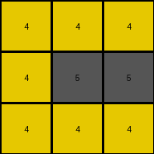
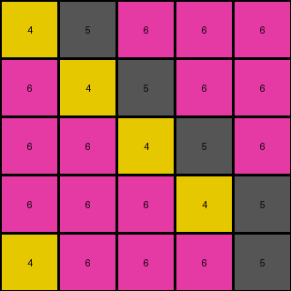
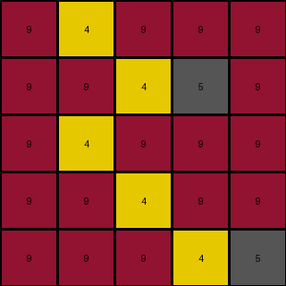

# f76d97a5 • 005 • refine_dreamer

---


Previous Code:
```python
"""
Iterate through each row (line) of the input grid.
For the first group of contiguous pixels of color 5 (gray) on a line:
    transform the first pixel of color 5 to color 4 (yellow).
    All other pixels of color 5 remain color 5.
All other colors are unchanged.
"""

import numpy as np

def transform(input_grid):
    # initialize output_grid as a copy of the input grid
    output_grid = np.copy(input_grid)

    # Iterate through each row of the grid
    for i in range(output_grid.shape[0]):
        first_five_found = False
        contiguous_block = False

        #Iterate through each cell in the row
        for j in range(output_grid.shape[1]):
            if output_grid[i, j] == 5:  # Check if the cell is gray (5)
                if not first_five_found:
                    if not contiguous_block: # start a new contig block
                        output_grid[i,j] = 4 # set first 5 to 4
                        first_five_found = True
                    contiguous_block = True
                # else leave it alone

            else: # not a 5
                contiguous_block = False # reset contig block

    return output_grid
```

Train Set Results:

## Example 1:

Input:
```
4 5 4
5 5 5
4 5 4
```
Expected Output:
```
0 4 0
4 4 4
0 4 0
```
Transformed Output:
```
4 4 4
4 5 5
4 4 4
```

match: False
pixels_off: 6
size_correct: True
color_palette_correct: False
correct_pixel_counts: False

## Example 2:

Input:
```
5 5 6 6 6
6 5 5 6 6
6 6 5 5 6
6 6 6 5 5
5 6 6 6 5
```
Expected Output:
```
6 6 0 0 0
0 6 6 0 0
0 0 6 6 0
0 0 0 6 6
6 0 0 0 6
```
Transformed Output:
```
4 5 6 6 6
6 4 5 6 6
6 6 4 5 6
6 6 6 4 5
4 6 6 6 5
```

match: False
pixels_off: 25
size_correct: True
color_palette_correct: False
correct_pixel_counts: False

## Example 3:

Input:
```
9 5 9 9 9
9 9 5 5 9
9 5 9 9 9
9 9 5 9 9
9 9 9 5 5
```
Expected Output:
```
0 9 0 0 0
0 0 9 9 0
0 9 0 0 0
0 0 9 0 0
0 0 0 9 9
```
Transformed Output:
```
9 4 9 9 9
9 9 4 5 9
9 4 9 9 9
9 9 4 9 9
9 9 9 4 5
```

match: False
pixels_off: 25
size_correct: True
color_palette_correct: False
correct_pixel_counts: False

**INSTRUCTIONS**

The code above was generated based on observations from the first training
example

we have tested the transform function on each of the task example inputs and
compared with the expected output

review each of the examples provided and the results and consider how the
natural language program should be updated to accommodate this new knowledge

respond with the following deliverables:

- general assessment of the information provided and strategy for resolving the
  errors
- gather metrics about each of the examples and results - use code_execution to
  develop accurate reports on your assumptions
- a YAML block documenting facts - Focus on identifying objects, their properties, and the actions performed on them.
- a natural language program - Be as clear and concise as possible, providing a complete description of the transformation rule.


your responses should be considered as information in a report - not a
conversation
