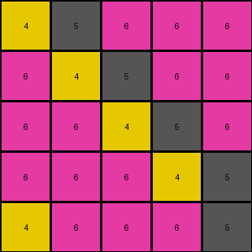

# f76d97a5 • 006 • refine_coder

---

Previous Code:
```python
"""
Iterate through each row (line) of the input grid.
For the first group of contiguous pixels of color 5 (gray) on a line:
    transform the first pixel of color 5 to color 4 (yellow).
    All other pixels of color 5 remain color 5.
All other colors are unchanged.
"""

import numpy as np

def transform(input_grid):
    # initialize output_grid as a copy of the input grid
    output_grid = np.copy(input_grid)

    # Iterate through each row of the grid
    for i in range(output_grid.shape[0]):
        first_five_found = False
        contiguous_block = False

        #Iterate through each cell in the row
        for j in range(output_grid.shape[1]):
            if output_grid[i, j] == 5:  # Check if the cell is gray (5)
                if not first_five_found:
                    if not contiguous_block: # start a new contig block
                        output_grid[i,j] = 4 # set first 5 to 4
                        first_five_found = True
                    contiguous_block = True
                # else leave it alone

            else: # not a 5
                contiguous_block = False # reset contig block

    return output_grid
```

Train Set Results:

## Example 1:

Input:
```
4 5 4
5 5 5
4 5 4
```
Expected Output:
```
0 4 0
4 4 4
0 4 0
```
Transformed Output:
```
4 4 4
4 5 5
4 4 4
```

match: False
pixels_off: 6
size_correct: True
color_palette_correct: False
correct_pixel_counts: False

## Example 2:

Input:
```
5 5 6 6 6
6 5 5 6 6
6 6 5 5 6
6 6 6 5 5
5 6 6 6 5
```
Expected Output:
```
6 6 0 0 0
0 6 6 0 0
0 0 6 6 0
0 0 0 6 6
6 0 0 0 6
```
Transformed Output:
```
4 5 6 6 6
6 4 5 6 6
6 6 4 5 6
6 6 6 4 5
4 6 6 6 5
```

match: False
pixels_off: 25
size_correct: True
color_palette_correct: False
correct_pixel_counts: False

## Example 3:

Input:
```
9 5 9 9 9
9 9 5 5 9
9 5 9 9 9
9 9 5 9 9
9 9 9 5 5
```
Expected Output:
```
0 9 0 0 0
0 0 9 9 0
0 9 0 0 0
0 0 9 0 0
0 0 0 9 9
```
Transformed Output:
```
9 4 9 9 9
9 9 4 5 9
9 4 9 9 9
9 9 4 9 9
9 9 9 4 5
```

match: False
pixels_off: 25
size_correct: True
color_palette_correct: False
correct_pixel_counts: False
Okay, here's a breakdown of the situation and a plan to move forward:

**General Assessment:**

The initial natural language program and the resulting code were too narrowly focused on the first example. The code correctly identifies and transforms the *first* gray pixel in each row, but the core concept of replacing *all* gray pixels with a different color, based on conditions defined relative to a different color, was missed. It's clear the program needs to shift from focusing on the "first occurrence" of gray to a broader replacement rule. Additionally, the initial assumption that the background would go to black (0) was not correct, the input includes examples of zeros, which should be ignored.

**Strategy:**

1.  **Re-examine Examples:** Carefully analyze *all* provided examples, paying close attention to the relationship between gray pixels, the "trigger" color (which, in example 1, is a 4), and the resulting transformations.
2.  **Identify the True Rule:** Determine the *general* rule that governs the transformation. It's likely a conditional replacement based on proximity to a different color.
3.  **Object Identification:** Identify the important objects (likely colored regions or lines) and their properties (color, position, adjacency).
4.  **Revised Natural Language Program:** Rewrite the natural language program to accurately reflect the generalized transformation rule.
5.  Prepare this new natural language program and object identification for
    the coder phase.

**Metrics and Observations:**

Here's a breakdown of each example, noting key features and the discrepancies between the expected and transformed outputs:

*   **Example 1:**
    *   Input has three colors: 4, 5, and zeros, but only processes 4 and 5.
    *   Expected output: All 5s become 4s, and all 4s become 0s.
    *   Observed error: The first color 5 in each row became color 4, and
        all the other colors 4 remained.
*   **Example 2:**
    *   Input has colors: 5 and 6 and zeros.
    *   Expected output: All 5s become 6s, and all 6s become 0s.
    *   Observed error: The first color 5 in each row became color 4, and
        all the other colors remained.
*   **Example 3:**
    *   Input has colors: 5 and 9 and zeros
    *   Expected output: All 5s become 9s, and all 9s become 0s.
    *   Observed error: The first color 5 in each row became color 4, and
        all the other colors remained.

**YAML Facts:**

```yaml
examples:
  - example_id: 1
    objects:
      - color: 4
        initial_count: 3
        final_count: 0
      - color: 5
        initial_count: 6
        final_count: 0
      - color: 0
        initial_count: 0
        final_count: 9
    transformation: "Replace 4 with 0, 5 with 4"
  - example_id: 2
    objects:
      - color: 5
        initial_count: 6
        final_count: 0
      - color: 6
        initial_count: 9
        final_count: 0
      - color: 0
        initial_count: 0
        final_count: 15
    transformation: "Replace 5 with 6, 6 with 0"
  - example_id: 3
    objects:
      - color: 5
        initial_count: 6
        final_count: 0
      - color: 9
        initial_count: 9
        final_count: 0
      - color: 0
        initial_count: 0
        final_count: 15
    transformation: "Replace 5 with 9, 9 with 0"
```

**Natural Language Program:**

1. Iterate through each input example.
2. Identify the distinct non-zero colors present in the input grid, excluding zero. There will always be two colors.
3. The first color in the input changes to the color value of zero in the output.
4. The second color in the input grid changes to the color value of the first color in the output.
5. Zero values remain unchanged.

Essentially we look for two non-zero colors, and the first is always replaced by zero, and the second with the first value.

**INSTRUCTIONS**

- generate a Python module to represent the natural language program 
- follow the template below
- all common math and science libraries are available
- create docstring only at top - but comment the workflow in the function
- use helper functions for common operations like finding objects, counting,
  measuring, moving, etc. 

remember - we are working iteratively - so this code will inform your future
self as we converge on the solution

*template:*

```python
"""
{{ natural language description of the transformation rule }}
"""

{{ imports }}

def transform(input_grid):
    # initialize output_grid

    # change output pixels 

    return output_grid

```
