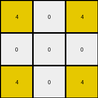
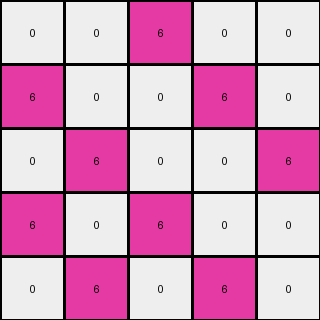
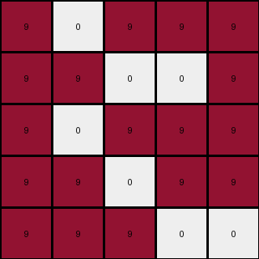

# f76d97a5 • 009 • refine_dreamer

---


Previous Code:
```python
"""
1.  **Initialization:** Start with an input grid of size 5x5.
2.  **Gray Replacement:** Iterate through every pixel in the input grid. If a pixel is gray (5), change it to white (0).
3.  **Magenta Replacement (Conditional):** Iterate through the grid again.
    *   Examine the color magenta (6)
    *   For each pixel that has the color magenta (6) replace with white (0) if the pixel meets *any* of the following conditions:
        *   The pixel is located in either the top-left, top-right, bottom-left, or bottom-right corner.
        *   If the pixel directly to its left *and* the pixel directly above it have a magenta (6) color.
        *    If the pixel directly to its right *and* the pixel directly above it have a magenta (6) color.
        *   If the pixel directly to its left *and* the pixel directly below it have a magenta (6) color.
        *    If the pixel directly to its right *and* the pixel directly below it have a magenta (6) color.

4.  **Output:** The resulting grid is the output.
"""

import numpy as np

def transform(input_grid):
    output_grid = np.copy(input_grid)
    rows, cols = output_grid.shape

    # Gray Replacement
    for r in range(rows):
        for c in range(cols):
            if output_grid[r, c] == 5:
                output_grid[r, c] = 0

    # Magenta Replacement
    for r in range(rows):
        for c in range(cols):
            if output_grid[r, c] == 6:
                # Corner Cases
                if (r == 0 and c == 0) or \
                   (r == 0 and c == cols - 1) or \
                   (r == rows - 1 and c == 0) or \
                   (r == rows - 1 and c == cols - 1):
                    output_grid[r, c] = 0
                # L-shape Cases
                else:
                    if r > 0 and c > 0 and output_grid[r-1, c] == 6 and output_grid[r, c-1] == 6:
                        output_grid[r, c] = 0
                    elif r > 0 and c < cols - 1 and output_grid[r-1, c] == 6 and output_grid[r, c+1] == 6:
                        output_grid[r,c] = 0
                    elif r < rows - 1 and c > 0 and output_grid[r+1, c] == 6 and output_grid[r, c-1] == 6:
                        output_grid[r,c] = 0
                    elif r < rows - 1 and c < cols -1 and output_grid[r+1, c] == 6 and output_grid[r, c+1] == 6:
                        output_grid[r,c] = 0
    return output_grid
```

Train Set Results:

## Example 1:

Input:
```
4 5 4
5 5 5
4 5 4
```
Expected Output:
```
0 4 0
4 4 4
0 4 0
```
Transformed Output:
```
4 0 4
0 0 0
4 0 4
```

match: False
pixels_off: 9
size_correct: True
color_palette_correct: True
correct_pixel_counts: False

## Example 2:

Input:
```
5 5 6 6 6
6 5 5 6 6
6 6 5 5 6
6 6 6 5 5
5 6 6 6 5
```
Expected Output:
```
6 6 0 0 0
0 6 6 0 0
0 0 6 6 0
0 0 0 6 6
6 0 0 0 6
```
Transformed Output:
```
0 0 6 0 0
6 0 0 6 0
0 6 0 0 6
6 0 6 0 0
0 6 0 6 0
```

match: False
pixels_off: 19
size_correct: True
color_palette_correct: True
correct_pixel_counts: False

## Example 3:

Input:
```
9 5 9 9 9
9 9 5 5 9
9 5 9 9 9
9 9 5 9 9
9 9 9 5 5
```
Expected Output:
```
0 9 0 0 0
0 0 9 9 0
0 9 0 0 0
0 0 9 0 0
0 0 0 9 9
```
Transformed Output:
```
9 0 9 9 9
9 9 0 0 9
9 0 9 9 9
9 9 0 9 9
9 9 9 0 0
```

match: False
pixels_off: 25
size_correct: True
color_palette_correct: True
correct_pixel_counts: False

**INSTRUCTIONS**

The code above was generated based on observations from the first training
example

we have tested the transform function on each of the task example inputs and
compared with the expected output

review each of the examples provided and the results and consider how the
natural language program should be updated to accommodate this new knowledge

respond with the following deliverables:

- general assessment of the information provided and strategy for resolving the
  errors
- gather metrics about each of the examples and results - use code_execution to
  develop accurate reports on your assumptions
- a YAML block documenting facts - Focus on identifying objects, their properties, and the actions performed on them.
- a natural language program - Be as clear and concise as possible, providing a complete description of the transformation rule.


your responses should be considered as information in a report - not a
conversation
