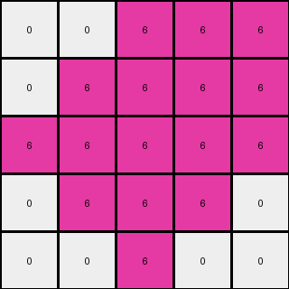
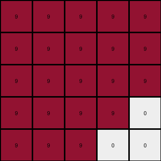

# f76d97a5 • 011 • refine_dreamer

---

Previous Code:
```python
"""
1.  **Initial Scan:** Find all gray (5) pixels.
2.  **Corner Replacement:**  If a gray (5) pixel is at any corner of the grid, change it to white (0).
3.  **Non-Corner Replacement:**  If a gray (5) pixel is *not* at a corner, change it to the color of another pixel in the input grid.
4.  **Adjacent Replacement:** After steps 2 and 3, find *all* the pixels that are the *same* color of other pixels that are directly adjacent (up, down, left, or right, but not diagonally) to a newly-white (0) pixel (created in step 2).  Change these adjacent pixels to white (0) as well.
"""

import numpy as np

def transform(input_grid):
    # initialize output_grid
    output_grid = np.copy(input_grid)
    rows, cols = output_grid.shape
    
    # Find non-gray colors
    other_colors = [color for color in np.unique(input_grid) if color != 5]
    if len(other_colors) == 0: # Handle edge case where input is all gray.
        other_color = 0
    else:
        other_color = other_colors[0]

    # Corner and Non-Corner Replacement of Gray (5)
    for r in range(rows):
        for c in range(cols):
            if output_grid[r, c] == 5:
                if (r == 0 and c == 0) or \
                   (r == 0 and c == cols - 1) or \
                   (r == rows - 1 and c == 0) or \
                   (r == rows - 1 and c == cols - 1):
                    output_grid[r, c] = 0  # Corner replacement
                else:
                    output_grid[r, c] = other_color # Non-corner replacement

    # Adjacent Replacement (create a copy to avoid modifying during iteration)
    new_output_grid = np.copy(output_grid)
    for r in range(rows):
        for c in range(cols):
            if output_grid[r,c] == 0: #check neighbors
                if r > 0 and output_grid[r-1,c] == other_color: #up
                    new_output_grid[r-1,c] = 0
                if r < rows-1 and output_grid[r+1,c] == other_color: #down
                    new_output_grid[r+1,c] = 0
                if c > 0 and output_grid[r,c-1] == other_color: #left
                    new_output_grid[r,c-1] = 0
                if c < cols-1 and output_grid[r,c+1] == other_color: #right
                    new_output_grid[r,c+1] = 0
    
    return new_output_grid
```

Train Set Results:

## Example 1:

Input:
```
4 5 4
5 5 5
4 5 4
```
Expected Output:
```
0 4 0
4 4 4
0 4 0
```
Transformed Output:
```
4 4 4
4 4 4
4 4 4
```

match: False
pixels_off: 4
size_correct: True
color_palette_correct: True
correct_pixel_counts: False

## Example 2:

Input:
```
5 5 6 6 6
6 5 5 6 6
6 6 5 5 6
6 6 6 5 5
5 6 6 6 5
```
Expected Output:
```
6 6 0 0 0
0 6 6 0 0
0 0 6 6 0
0 0 0 6 6
6 0 0 0 6
```
Transformed Output:
```
0 0 6 6 6
0 6 6 6 6
6 6 6 6 6
0 6 6 6 0
0 0 6 0 0
```

match: False
pixels_off: 16
size_correct: True
color_palette_correct: True
correct_pixel_counts: False

## Example 3:

Input:
```
9 5 9 9 9
9 9 5 5 9
9 5 9 9 9
9 9 5 9 9
9 9 9 5 5
```
Expected Output:
```
0 9 0 0 0
0 0 9 9 0
0 9 0 0 0
0 0 9 0 0
0 0 0 9 9
```
Transformed Output:
```
9 9 9 9 9
9 9 9 9 9
9 9 9 9 9
9 9 9 9 0
9 9 9 0 0
```

match: False
pixels_off: 19
size_correct: True
color_palette_correct: True
correct_pixel_counts: False
**INSTRUCTIONS**

The code above was generated based on observations from the first training
example

we have tested the transform function on each of the task example inputs and
compared with the expected output

review each of the examples provided and the results and consider how the
natural language program should be updated to accommodate this new knowledge

respond with the following deliverables:

- general assessment of the information provided and strategy for resolving the
  errors
- gather metrics about each of the examples and results - use code_execution to
  develop accurate reports on your assumptions
- a YAML block documenting facts - Focus on identifying objects, their properties, and the actions performed on them.
- a natural language program - Be as clear and concise as possible, providing a complete description of the transformation rule.


your responses should be considered as information in a report - not a
conversation
