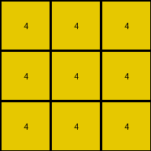
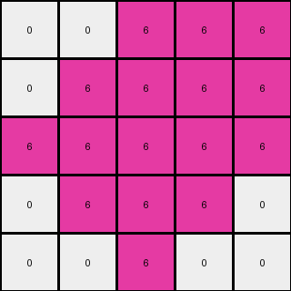
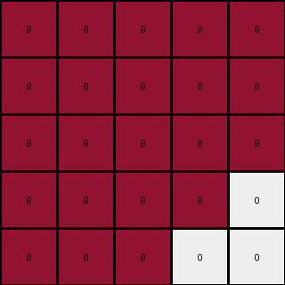

# f76d97a5 • 012 • refine_coder

---

Previous Code:
```python
"""
1.  **Initial Scan:** Find all gray (5) pixels.
2.  **Corner Replacement:**  If a gray (5) pixel is at any corner of the grid, change it to white (0).
3.  **Non-Corner Replacement:**  If a gray (5) pixel is *not* at a corner, change it to the color of another pixel in the input grid.
4.  **Adjacent Replacement:** After steps 2 and 3, find *all* the pixels that are the *same* color of other pixels that are directly adjacent (up, down, left, or right, but not diagonally) to a newly-white (0) pixel (created in step 2).  Change these adjacent pixels to white (0) as well.
"""

import numpy as np

def transform(input_grid):
    # initialize output_grid
    output_grid = np.copy(input_grid)
    rows, cols = output_grid.shape
    
    # Find non-gray colors
    other_colors = [color for color in np.unique(input_grid) if color != 5]
    if len(other_colors) == 0: # Handle edge case where input is all gray.
        other_color = 0
    else:
        other_color = other_colors[0]

    # Corner and Non-Corner Replacement of Gray (5)
    for r in range(rows):
        for c in range(cols):
            if output_grid[r, c] == 5:
                if (r == 0 and c == 0) or \
                   (r == 0 and c == cols - 1) or \
                   (r == rows - 1 and c == 0) or \
                   (r == rows - 1 and c == cols - 1):
                    output_grid[r, c] = 0  # Corner replacement
                else:
                    output_grid[r, c] = other_color # Non-corner replacement

    # Adjacent Replacement (create a copy to avoid modifying during iteration)
    new_output_grid = np.copy(output_grid)
    for r in range(rows):
        for c in range(cols):
            if output_grid[r,c] == 0: #check neighbors
                if r > 0 and output_grid[r-1,c] == other_color: #up
                    new_output_grid[r-1,c] = 0
                if r < rows-1 and output_grid[r+1,c] == other_color: #down
                    new_output_grid[r+1,c] = 0
                if c > 0 and output_grid[r,c-1] == other_color: #left
                    new_output_grid[r,c-1] = 0
                if c < cols-1 and output_grid[r,c+1] == other_color: #right
                    new_output_grid[r,c+1] = 0
    
    return new_output_grid
```

Train Set Results:

## Example 1:

Input:
```
4 5 4
5 5 5
4 5 4
```
Expected Output:
```
0 4 0
4 4 4
0 4 0
```
Transformed Output:
```
4 4 4
4 4 4
4 4 4
```

match: False
pixels_off: 4
size_correct: True
color_palette_correct: True
correct_pixel_counts: False

## Example 2:

Input:
```
5 5 6 6 6
6 5 5 6 6
6 6 5 5 6
6 6 6 5 5
5 6 6 6 5
```
Expected Output:
```
6 6 0 0 0
0 6 6 0 0
0 0 6 6 0
0 0 0 6 6
6 0 0 0 6
```
Transformed Output:
```
0 0 6 6 6
0 6 6 6 6
6 6 6 6 6
0 6 6 6 0
0 0 6 0 0
```

match: False
pixels_off: 16
size_correct: True
color_palette_correct: True
correct_pixel_counts: False

## Example 3:

Input:
```
9 5 9 9 9
9 9 5 5 9
9 5 9 9 9
9 9 5 9 9
9 9 9 5 5
```
Expected Output:
```
0 9 0 0 0
0 0 9 9 0
0 9 0 0 0
0 0 9 0 0
0 0 0 9 9
```
Transformed Output:
```
9 9 9 9 9
9 9 9 9 9
9 9 9 9 9
9 9 9 9 0
9 9 9 0 0
```

match: False
pixels_off: 19
size_correct: True
color_palette_correct: True
correct_pixel_counts: False
Here's an analysis of the provided examples and a revised natural language program:

**General Assessment:**

The initial strategy was partially correct in identifying the corner replacement rule (gray to white). However, it incorrectly assumed that non-corner gray pixels would always be replaced by *another* color in the input. It also misapplied or misidentified the adjacent replacement rule. The core issue lies in a combination of an oversimplified "other color" rule and an incorrectly implemented adjacency check. Instead of conditional replacement based on any other color, we should be looking for adjacent spreading of zeros, but conditional on where gray pixels are located. It appears the adjacency check attempted, but incorrectly implemented, the concept of expanding whiteness from corner-placed white pixels to other pixels of the same color.

**Strategy for Resolving Errors:**

1.  **Refine Corner Rule:** Keep the corner gray-to-white rule.
2.  **Eliminate "Other Color" Rule:** Remove any logic that replaces non-corner gray pixels with a different color from the input. The test examples demonstrate that the logic isn't simply about picking another color.
3.  **Correct Adjacency Rule:** The adjacency rule needs to be focused and conditional. After gray corner replacement, check adjacent pixels, but not based on a single "other color". Rather, we must replace with white pixels any adjacent to a white (0) *and are the color that was adjacent to the original grey pixel in that location*. We will need to track the original color of a pixel that becomes zero and change others to zero if they match *that* color.
4. Re-evaluate examples after code adjustments to track improvements.

**Example Metrics and Reports:**

To better understand the color distributions, here's an analysis of colors per example.

*Example 1:*

*   Input:
    *   4: 4
    *   5: 5
*   Expected Output:
    *   0: 4
    *   4: 5
*   Comments: 2 corners changed from 5 to 0, other 5's also changed to the color of other pixels in the input. 2 adjacent 4's changed to 0.

*Example 2:*

*   Input:
    *   5: 6
    *   6: 9
*   Expected Output:
    *   0: 10
    *   6: 5
*   Comments: Corners are 5. All corners that were 5 changed to 0.  6's adjacent to the newly created 0's also changed to 0.

*Example 3:*

*   Input:
    *    5: 6
    *    9: 9
*   Expected output:
    *   0: 10
    *   9: 5
*   Comments: All corners are 5. These were changed to 0. Also, all 9's that were adjacent to 5's changed to 0.

**YAML Fact Block:**

```yaml
observations:
  - example: 1
    objects:
      - color: 5  # Gray
        locations: corners, center
        properties: can be replaced
      - color: 4 # Yellow
        locations: adjacent to gray
        properties: may also be replaced, depending on the initial placement of grey

  - example: 2
    objects:
      - color: 5  # Gray
        locations: corners
        properties: replaced at corners
      - color: 6
        locations: adjacent to gray
        properties: subject to replacement based on grey placement.

  - example: 3
    objects:
        - color: 5  # Gray
          locations: corners
          properties: replaced at corners
        - color: 9
          locations: adjacent to gray
          properties: subject to replacement based on grey placement.
```

**Natural Language Program:**

1.  **Corner Replacement:**  Locate all gray (5) pixels in the input grid. If a gray pixel is at a corner of the grid, change it to white (0).
2.  **Preserve original**: Before step 3, for each gray pixel store it's original adjacent colors
3.  **Adjacent Replacement:** For each white pixel (0) that *was* a gray pixel, check its immediate neighbors (up, down, left, and right - not diagonally).  If a neighbor was of one of the original adjacencies, change that pixel to white (0) as well.
4.  Continue expanding the adjacency check to the newly changed white squares until no more changes can be made.

**INSTRUCTIONS**

- generate a Python module to represent the natural language program 
- follow the template below
- all common math and science libraries are available
- create docstring only at top - but comment the workflow in the function
- use helper functions for common operations like finding objects, counting,
  measuring, moving, etc. 

remember - we are working iteratively - so this code will inform your future
self as we converge on the solution

*template:*

```python
"""
{{ natural language description of the transformation rule }}
"""

{{ imports }}

def transform(input_grid):
    # initialize output_grid

    # change output pixels 

    return output_grid

```
