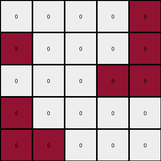

# f76d97a5 • 015 • refine_dreamer

---

Previous Code:
```python
"""
The output grid is the same size as the input. All 5s in the input grid are replaced by 0s in the output grid. 9s in the input grid that have a 5 to their immediate right or immediate down are replaced by 0s, the rest of the 9s are kept as 9s.
"""

import numpy as np

def transform(input_grid):
    # initialize output_grid with 0s
    output_grid = np.zeros_like(input_grid)
    rows, cols = input_grid.shape

    # iterate through input grid
    for r in range(rows):
        for c in range(cols):
            # check for 9
            if input_grid[r, c] == 9:
                # check neighbors, default to keeping the 9
                keep_9 = True
                # Check down neighbor
                if r + 1 < rows:
                  if input_grid[r+1,c] == 5:
                    keep_9 = False
                #check right neighbor
                if c + 1 < cols:
                  if input_grid[r,c+1] == 5:
                    keep_9 = False
                
                if keep_9:
                  output_grid[r,c] = 9

            #5s are already 0 in output_grid

    return output_grid
```

Train Set Results:

## Example 1:

Input:
```
4 5 4
5 5 5
4 5 4
```
Expected Output:
```
0 4 0
4 4 4
0 4 0
```
Transformed Output:
```
0 0 0
0 0 0
0 0 0
```

match: False
pixels_off: 5
size_correct: True
color_palette_correct: True
correct_pixel_counts: False

## Example 2:

Input:
```
5 5 6 6 6
6 5 5 6 6
6 6 5 5 6
6 6 6 5 5
5 6 6 6 5
```
Expected Output:
```
6 6 0 0 0
0 6 6 0 0
0 0 6 6 0
0 0 0 6 6
6 0 0 0 6
```
Transformed Output:
```
0 0 0 0 0
0 0 0 0 0
0 0 0 0 0
0 0 0 0 0
0 0 0 0 0
```

match: False
pixels_off: 10
size_correct: True
color_palette_correct: True
correct_pixel_counts: False

## Example 3:

Input:
```
9 5 9 9 9
9 9 5 5 9
9 5 9 9 9
9 9 5 9 9
9 9 9 5 5
```
Expected Output:
```
0 9 0 0 0
0 0 9 9 0
0 9 0 0 0
0 0 9 0 0
0 0 0 9 9
```
Transformed Output:
```
0 0 0 0 9
9 0 0 0 9
0 0 0 9 9
9 0 0 0 0
9 9 0 0 0
```

match: False
pixels_off: 15
size_correct: True
color_palette_correct: True
correct_pixel_counts: False
**INSTRUCTIONS**

The code above was generated based on observations from the first training
example

we have tested the transform function on each of the task example inputs and
compared with the expected output

review each of the examples provided and the results and consider how the
natural language program should be updated to accommodate this new knowledge

respond with the following deliverables:

- general assessment of the information provided and strategy for resolving the
  errors
- gather metrics about each of the examples and results - use code_execution to
  develop accurate reports on your assumptions
- a YAML block documenting facts - Focus on identifying objects, their properties, and the actions performed on them.
- a natural language program - Be as clear and concise as possible, providing a complete description of the transformation rule.


your responses should be considered as information in a report - not a
conversation
