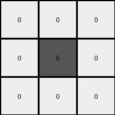

# f76d97a5 • 017 • refine_dreamer

---

Previous Code:
```python
"""
1. Iterate through each cell of the input grid.
2. Identify the color of the cell.
3. Check the colors of all adjacent cells (up, down, left, and right).
4. Apply these transformation rules:
    *   If the cell is color 5, and is adjacent to a cell of any other color, the output cell is color 0
    *   If a cell is color 9, and is adjacent to color 5, the output cell is 0
    *   If a cell is color 4, and is adjacent to color 5, the output cell is 0
    *   All colors 6 are unchanged
    *   Otherwise, the output cell is the same as the input cell.
"""

import numpy as np

def is_adjacent_to_other_color(grid, r, c, color):
    """Checks if a cell at (r, c) is adjacent to any cell of a different color."""
    rows, cols = grid.shape
    for dr, dc in [(0, 1), (0, -1), (1, 0), (-1, 0)]:
        nr, nc = r + dr, c + dc
        if 0 <= nr < rows and 0 <= nc < cols:
            if grid[nr, nc] != color:
                return True
    return False

def is_adjacent_to_color(grid, r, c, target_color):
    """Checks if cell at (r,c) is adjacent to a cell of target_color"""
    rows, cols = grid.shape
    for dr, dc in [(0, 1), (0, -1), (1, 0), (-1, 0)]:
        nr, nc = r + dr, c + dc
        if 0 <= nr < rows and 0 <= nc < cols:
            if grid[nr, nc] == target_color:
                return True
    return False

def transform(input_grid):
    # initialize output_grid as a copy of the input grid.
    output_grid = input_grid.copy()
    rows, cols = input_grid.shape

    # iterate through each cell
    for r in range(rows):
        for c in range(cols):
            #apply transformation rules
            if input_grid[r,c] == 5 and is_adjacent_to_other_color(input_grid,r,c,5):
                output_grid[r,c] = 0
            elif input_grid[r,c] == 9 and is_adjacent_to_color(input_grid, r,c, 5):
                output_grid[r,c] = 0
            elif input_grid[r,c] == 4 and is_adjacent_to_color(input_grid, r,c, 5):
                output_grid[r,c] = 0
            # color 6 is always unchanged
            # other colors are unchanged by default because of copy

    return output_grid
```

Train Set Results:

## Example 1:

Input:
```
4 5 4
5 5 5
4 5 4
```
Expected Output:
```
0 4 0
4 4 4
0 4 0
```
Transformed Output:
```
0 0 0
0 5 0
0 0 0
```

match: False
pixels_off: 5
size_correct: True
color_palette_correct: False
correct_pixel_counts: False

## Example 2:

Input:
```
5 5 6 6 6
6 5 5 6 6
6 6 5 5 6
6 6 6 5 5
5 6 6 6 5
```
Expected Output:
```
6 6 0 0 0
0 6 6 0 0
0 0 6 6 0
0 0 0 6 6
6 0 0 0 6
```
Transformed Output:
```
0 0 6 6 6
6 0 0 6 6
6 6 0 0 6
6 6 6 0 0
0 6 6 6 0
```

match: False
pixels_off: 25
size_correct: True
color_palette_correct: True
correct_pixel_counts: False

## Example 3:

Input:
```
9 5 9 9 9
9 9 5 5 9
9 5 9 9 9
9 9 5 9 9
9 9 9 5 5
```
Expected Output:
```
0 9 0 0 0
0 0 9 9 0
0 9 0 0 0
0 0 9 0 0
0 0 0 9 9
```
Transformed Output:
```
0 0 0 0 9
9 0 0 0 0
0 0 0 0 9
9 0 0 0 0
9 9 0 0 0
```

match: False
pixels_off: 13
size_correct: True
color_palette_correct: True
correct_pixel_counts: False
**INSTRUCTIONS**

The code above was generated based on observations from the first training
example

we have tested the transform function on each of the task example inputs and
compared with the expected output

review each of the examples provided and the results and consider how the
natural language program should be updated to accommodate this new knowledge

respond with the following deliverables:

- general assessment of the information provided and strategy for resolving the
  errors
- gather metrics about each of the examples and results - use code_execution to
  develop accurate reports on your assumptions
- a YAML block documenting facts - Focus on identifying objects, their properties, and the actions performed on them.
- a natural language program - Be as clear and concise as possible, providing a complete description of the transformation rule.


your responses should be considered as information in a report - not a
conversation
