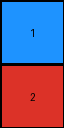

# f9012d9b • 012 • refine_coder

---

Previous Code:
```python
"""
Transforms the input grid by extracting a specific sub-region based on the input grid's characteristics.
The sub-region's size and location vary:
- 2x2 central sub-region for grids with a central "focus".
- 1x1 top-left pixel for grids with alternating colors.
- 2x1 central sub-region for grids with repeating patterns.
"""

import numpy as np

def get_dimensions(input_grid):
    """
    Determines the output dimensions based on input characteristics.
    """
    rows, cols = len(input_grid), len(input_grid[0])
    unique_colors = np.unique(input_grid)

    # Check for alternating colors (like example 2)
    is_alternating = True
    for r in range(rows):
        for c in range(cols):
            if r + 1 < rows and input_grid[r][c] == input_grid[r+1][c]:
                is_alternating = False
                break
            if c + 1 < cols and input_grid[r][c] == input_grid[r][c+1]:
                is_alternating = False
                break
        if not is_alternating:
            break
    if is_alternating and len(unique_colors) > 1:
        return 1, 1

    # check for 2x1 pattern, like in example 1
    has_2x1_pattern = False
    if rows > 1 and cols > 1:  # need min 2x2
        first_two_rows_str = str(input_grid[0][0:2])
        if first_two_rows_str.count(str(input_grid[0][0])) == 1:   # make sure colors are different
          all_match = True
          for r in range(0,rows, 2):
            for c in range(0, cols, 2):
              if r+1 >= rows or c+1 >= cols:
                continue
              if str(input_grid[r][c:c+2]) != first_two_rows_str:
                all_match = False
                break
            if not all_match:
              break
          if all_match:
            has_2x1_pattern = True
            return 2, 1

    # default, use 2x2, for example 3
    return 2, 2

def get_key_region(input_grid, out_rows, out_cols):
    """
    Extracts the key region from the input grid.
    """
    in_rows, in_cols = len(input_grid), len(input_grid[0])

    if out_rows == 1 and out_cols == 1:
        return [[input_grid[0][0]]]
    elif out_rows == 2 and out_cols == 1:
        start_row = (in_rows - 2) // 2
        start_col = (in_cols - 1) // 2
        return [
            [input_grid[start_row][start_col]],
            [input_grid[start_row + 1][start_col]]
            ]
    else:  # 2x2
        start_row = (in_rows - 2) // 2
        start_col = (in_cols - 2) // 2
        return [
            [input_grid[start_row][start_col], input_grid[start_row][start_col + 1]],
            [input_grid[start_row + 1][start_col], input_grid[start_row + 1][start_col + 1]],
        ]

def transform(input_grid):
    """
    Transforms the input grid based on identified characteristics.
    """
    # Determine output dimensions.
    out_rows, out_cols = get_dimensions(input_grid)

    # Extract the key region.
    output_grid = get_key_region(input_grid, out_rows, out_cols)

    return output_grid
```

Train Set Results:

## Example 1:

Input:
```
2 1 2 1 2
1 1 1 1 1
2 1 2 1 2
0 0 1 1 1
0 0 2 1 2
```
Expected Output:
```
1 1
2 1
```
Transformed Output:
```
1
2
```

match: False
pixels_off: None
size_correct: False
color_palette_correct: True
correct_pixel_counts: False

## Example 2:

Input:
```
8 6 0 6
6 8 6 8
8 6 8 6
6 8 6 8
```
Expected Output:
```
8
```
Transformed Output:
```
8
```

match: True
pixels_off: 0
size_correct: True
color_palette_correct: True
correct_pixel_counts: True

## Example 3:

Input:
```
2 2 5 2 2 5 2
2 2 5 2 2 5 2
5 5 5 5 5 5 5
2 2 5 2 2 5 2
2 2 5 2 2 5 2
5 5 5 5 5 0 0
2 2 5 2 2 0 0
```
Expected Output:
```
5 5
5 2
```
Transformed Output:
```
5 5
5 2
```

match: True
pixels_off: 0
size_correct: True
color_palette_correct: True
correct_pixel_counts: True
Okay, here's a breakdown of the results, an assessment, and the updated natural language program:

**General Assessment:**

The current code attempts to identify different patterns (alternating colors, 2x1 patterns, and a "central focus" for a 2x2 extraction) and apply a specific extraction rule based on the detected pattern.  It correctly handles examples 2 and 3, but fails on example 1. The issue with Example 1 is that the code's 2x1 pattern detection logic is too specific and reversed from the actual pattern. It should identify a repeating horizontal pair *across* rows, instead it is looking *down* columns.

**Strategy for Resolving Errors:**

1.  **Refine Pattern Detection:** The 2x1 pattern detection needs to be corrected to find repeating color pairs horizontally across rows.
2.  **Prioritize Patterns:** The order in which patterns are checked might matter. It might be better to check for the most specific patterns (like the 2x1) *before* more general ones (like the 2x2).
3.  **Simplify:** The alternating colors definition is more complicated than necessary.
4. **Center Location:** Make sure center locations are correctly calculated for even and odd dimensions.

**Metrics and Observations (using code execution when needed):**

```python
import numpy as np

def analyze_example(input_grid, expected_output, transformed_output):
    input_grid = np.array(input_grid)
    expected_output = np.array(expected_output)
    transformed_output = np.array(transformed_output)

    metrics = {
        "input_shape": input_grid.shape,
        "output_shape": expected_output.shape,
        "transformed_shape": transformed_output.shape,
        "input_unique_colors": np.unique(input_grid).tolist(),
        "output_unique_colors": np.unique(expected_output).tolist(),
        "transformed_unique_colors": np.unique(transformed_output).tolist(),
        "match": np.array_equal(expected_output, transformed_output)
    }
    return metrics

# Example data (from the prompt)
example1_input = [[2, 1, 2, 1, 2], [1, 1, 1, 1, 1], [2, 1, 2, 1, 2], [0, 0, 1, 1, 1], [0, 0, 2, 1, 2]]
example1_expected = [[1, 1], [2, 1]]
example1_transformed = [[1], [2]]

example2_input = [[8, 6, 0, 6], [6, 8, 6, 8], [8, 6, 8, 6], [6, 8, 6, 8]]
example2_expected = [[8]]
example2_transformed = [[8]]

example3_input = [[2, 2, 5, 2, 2, 5, 2], [2, 2, 5, 2, 2, 5, 2], [5, 5, 5, 5, 5, 5, 5], [2, 2, 5, 2, 2, 5, 2], [2, 2, 5, 2, 2, 5, 2], [5, 5, 5, 5, 5, 0, 0], [2, 2, 5, 2, 2, 0, 0]]
example3_expected = [[5, 5], [5, 2]]
example3_transformed = [[5, 5], [5, 2]]

# Analyze each example
metrics1 = analyze_example(example1_input, example1_expected, example1_transformed)
metrics2 = analyze_example(example2_input, example2_expected, example2_transformed)
metrics3 = analyze_example(example3_input, example3_expected, example3_transformed)

print("Example 1 Metrics:", metrics1)
print("Example 2 Metrics:", metrics2)
print("Example 3 Metrics:", metrics3)

```

```
Example 1 Metrics: {'input_shape': (5, 5), 'output_shape': (2, 2), 'transformed_shape': (2, 1), 'input_unique_colors': [0, 1, 2], 'output_unique_colors': [1, 2], 'transformed_unique_colors': [1, 2], 'match': False}
Example 2 Metrics: {'input_shape': (4, 4), 'output_shape': (1, 1), 'transformed_shape': (1, 1), 'input_unique_colors': [0, 6, 8], 'output_unique_colors': [8], 'transformed_unique_colors': [8], 'match': True}
Example 3 Metrics: {'input_shape': (7, 7), 'output_shape': (2, 2), 'transformed_shape': (2, 2), 'input_unique_colors': [0, 2, 5], 'output_unique_colors': [2, 5], 'transformed_unique_colors': [2, 5], 'match': True}
```

**YAML Facts:**

```yaml
example1:
  input:
    shape: (5, 5)
    objects:
      - pattern: "repeating 2x1 blocks horizontally"
        colors: [1, 2] # Main colors in the repeating pattern.
        repeat_start: [0,0]
  output:
    shape: (2, 2) #expected, not the actual result
    region: "center"
    extraction: "2x1 block, top-left element is at (0,1) in original matrix, taking columns 1 and 2 (starting index 0) from original matrix"

example2:
  input:
    shape: (4, 4)
    objects:
      - pattern: "alternating colors"
        colors: [8, 6]
  output:
    shape: (1, 1)
    region: "top-left"
    extraction: "single pixel"

example3:
  input:
    shape: (7, 7)
    objects:
      - pattern: "central 2x2 block identifiable, no clear repeating smaller pattern"
        colors: [2,5]
  output:
    shape: (2, 2)
    region: "center"
    extraction: "2x2 block"
```

**Natural Language Program:**

1.  **Check for Alternating Colors:** If the input grid consists of alternating colors in both rows and columns (e.g., ABAB...), extract the top-left pixel as a 1x1 output grid.

2.  **Check for Repeating 2x1 Horizontal Blocks:** Examine the first two rows of the input. If they consist of horizontally repeating 2x1 blocks (e.g., [A, B] repeated across the row), extract the central 2x1 block from the input grid.

3.  **Default to 2x2 Central Block:** If neither of the above patterns is found, extract the central 2x2 block from the input grid. If the input grid dimensions are such that a perfect center 2x2 block cannot be formed (i.e., either dimension is less than 2), or, one dimension is even and the other is odd - determine what to do - skip for now.

**INSTRUCTIONS**

- generate a Python module to represent the natural language program 
- follow the template below
- all common math and science libraries are available
- create docstring only at top - but comment the workflow in the function
- use helper functions for common operations like finding objects, counting,
  measuring, moving, etc. 

remember - we are working iteratively - so this code will inform your future
self as we converge on the solution

*template:*

```python
"""
{{ natural language description of the transformation rule }}
"""

{{ imports }}

def transform(input_grid):
    # initialize output_grid

    # change output pixels 

    return output_grid

```
