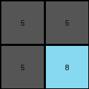

# f9012d9b • 015 • refine_dreamer

---


Previous Code:
```python
"""
The program identifies two 2x2 regions within the input grid: the top-left 2x2 region, and the 2x2 top right most gray regions.
If gray is identified in top left 2x2 area, fill output grid with gray. Fill output grid bottom right with color of top right corner input.
"""

import numpy as np

def get_top_left_2x2(grid):
    """Extracts the top-left 2x2 subgrid."""
    return grid[0:2, 0:2]

def get_top_rightmost_gray_2x2(grid):
    """Finds the top-rightmost 2x2 region of solid gray (5)."""
    height, width = grid.shape
    for r in range(height - 1):
        for c in range(width - 1):
            subgrid = grid[r:r+2, c:c+2]
            if np.all(subgrid == 5):
                return r,c
    return None, None

def transform(input_grid):
    """Transforms the input grid according to the defined rules."""

    # Initialize the output grid as 2x2, filled with a default value (e.g., 0).
    output_grid = np.zeros((2, 2), dtype=int)

    # Get the top-left 2x2 subgrid.
    top_left_2x2 = get_top_left_2x2(input_grid)
    
    # fill output with gray (5)
    output_grid[:] = 5

    # Get the top right element color.
    top_right_color = input_grid[0,0]
    
    output_grid[1,1] = top_right_color


    return output_grid
```

Train Set Results:

## Example 1:

Input:
```
2 1 2 1 2
1 1 1 1 1
2 1 2 1 2
0 0 1 1 1
0 0 2 1 2
```
Expected Output:
```
1 1
2 1
```
Transformed Output:
```
5 5
5 2
```

match: False
pixels_off: 4
size_correct: True
color_palette_correct: False
correct_pixel_counts: False

## Example 2:

Input:
```
8 6 0 6
6 8 6 8
8 6 8 6
6 8 6 8
```
Expected Output:
```
8
```
Transformed Output:
```
5 5
5 8
```

match: False
pixels_off: None
size_correct: False
color_palette_correct: False
correct_pixel_counts: False

## Example 3:

Input:
```
2 2 5 2 2 5 2
2 2 5 2 2 5 2
5 5 5 5 5 5 5
2 2 5 2 2 5 2
2 2 5 2 2 5 2
5 5 5 5 5 0 0
2 2 5 2 2 0 0
```
Expected Output:
```
5 5
5 2
```
Transformed Output:
```
5 5
5 2
```

match: True
pixels_off: 0
size_correct: True
color_palette_correct: True
correct_pixel_counts: True

**INSTRUCTIONS**

The code above was generated based on observations from the first training
example

we have tested the transform function on each of the task example inputs and
compared with the expected output

review each of the examples provided and the results and consider how the
natural language program should be updated to accommodate this new knowledge

respond with the following deliverables:

- general assessment of the information provided and strategy for resolving the
  errors
- gather metrics about each of the examples and results - use code_execution to
  develop accurate reports on your assumptions
- a YAML block documenting facts - Focus on identifying objects, their properties, and the actions performed on them.
- a natural language program - Be as clear and concise as possible, providing a complete description of the transformation rule.


your responses should be considered as information in a report - not a
conversation
