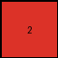
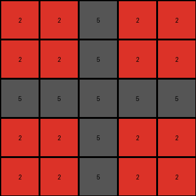

# f9012d9b • 017 • refine_dreamer

---


Previous Code:
```python
"""
1. Determine Output Size: Identify the size of the largest square subgrid, at the top left corner of the input grid, that is made up of all the same color/number, excluding 5 (gray). This defines the dimension of the output grid.
2. Copy the Subgrid: Copy this subgrid to the output.
"""

import numpy as np

def get_largest_uniform_top_left_subgrid_size(grid):
    """
    Finds the size of the largest square subgrid at the top-left corner
    of the input grid that contains only one color (excluding gray, 5).
    """
    height, width = grid.shape
    max_size = min(height, width)

    for size in range(max_size, 0, -1):
        subgrid = grid[0:size, 0:size]
        unique_colors = np.unique(subgrid)
        if len(unique_colors) == 1 and unique_colors[0] != 5:
            return size
        elif len(unique_colors) == 2 and 5 in unique_colors:
            if unique_colors[0] == 5:
               if unique_colors[1] != 5:
                   return size
            elif unique_colors[1] == 5:
               if unique_colors[0] != 5:
                   return size

    return 0  # Should not happen in well-formed ARC tasks, but included for safety

def transform(input_grid):
    """Transforms the input grid according to the defined rules."""

    # Determine output size.
    output_size = get_largest_uniform_top_left_subgrid_size(input_grid)

    # Initialize the output grid.
    output_grid = np.zeros((output_size, output_size), dtype=int)
    
    if output_size > 0:
        # Copy the subgrid.
        output_grid[:] = input_grid[0:output_size, 0:output_size]


    return output_grid
```

Train Set Results:

## Example 1:

Input:
```
2 1 2 1 2
1 1 1 1 1
2 1 2 1 2
0 0 1 1 1
0 0 2 1 2
```
Expected Output:
```
1 1
2 1
```
Transformed Output:
```
2
```

match: False
pixels_off: None
size_correct: False
color_palette_correct: True
correct_pixel_counts: False

## Example 2:

Input:
```
8 6 0 6
6 8 6 8
8 6 8 6
6 8 6 8
```
Expected Output:
```
8
```
Transformed Output:
```
8
```

match: True
pixels_off: 0
size_correct: True
color_palette_correct: True
correct_pixel_counts: True

## Example 3:

Input:
```
2 2 5 2 2 5 2
2 2 5 2 2 5 2
5 5 5 5 5 5 5
2 2 5 2 2 5 2
2 2 5 2 2 5 2
5 5 5 5 5 0 0
2 2 5 2 2 0 0
```
Expected Output:
```
5 5
5 2
```
Transformed Output:
```
2 2 5 2 2
2 2 5 2 2
5 5 5 5 5
2 2 5 2 2
2 2 5 2 2
```

match: False
pixels_off: None
size_correct: False
color_palette_correct: True
correct_pixel_counts: False

**INSTRUCTIONS**

The code above was generated based on observations from the first training
example

we have tested the transform function on each of the task example inputs and
compared with the expected output

review each of the examples provided and the results and consider how the
natural language program should be updated to accommodate this new knowledge

respond with the following deliverables:

- general assessment of the information provided and strategy for resolving the
  errors
- gather metrics about each of the examples and results - use code_execution to
  develop accurate reports on your assumptions
- a YAML block documenting facts - Focus on identifying objects, their properties, and the actions performed on them.
- a natural language program - Be as clear and concise as possible, providing a complete description of the transformation rule.


your responses should be considered as information in a report - not a
conversation
