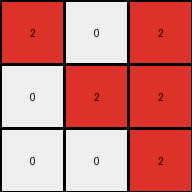

# fafffa47 • 004 • refine_coder

---

Previous Code:
```python
"""
1.  **Identify Subgrids:** Divide the input grid into two 3x3 subgrids: a "top" subgrid (rows 1-3) and a "bottom" subgrid (rows 4-6).
2.  **Focus on Top Subgrid:** Disregard the "bottom" subgrid. The transformation operates solely on the "top" subgrid.
3. **Color Mapping:** Apply these color transformations:
    *   If a cell in the "top" subgrid is maroon (9), change it to red (2) in the output grid.
    *   If a cell in the "top" subgrid" is white (0), it remains white (0) in the output grid.
    * 	If a cell has any other value it is not included in the output
4.  **Output:** The output grid is the result of applying the color mapping to the "top" subgrid.
"""

import numpy as np

def transform(input_grid):
    """Transforms the input grid according to the described rules."""

    # Initialize the output grid as a 3x3 array filled with zeros.
    output_grid = np.zeros((3, 3), dtype=int)

    # Iterate through the top subgrid (first 3 rows) of the input grid.
    for i in range(3):
        for j in range(3):
            # Apply color mapping rules.
            if input_grid[i][j] == 9:
                output_grid[i][j] = 2  # Maroon (9) becomes Red (2)
            elif input_grid[i][j] == 0:
                output_grid[i][j] = 0  # White (0) remains White (0)
            # Implicitly, other values are ignored as output_grid is initialized with 0s.

    return output_grid
```

Train Set Results:

## Example 1:

Input:
```
0 9 9
0 9 9
9 9 9
0 1 0
0 0 1
1 1 1
```
Expected Output:
```
2 0 0
2 0 0
0 0 0
```
Transformed Output:
```
0 2 2
0 2 2
2 2 2
```

match: False
pixels_off: 9
size_correct: True
color_palette_correct: True
correct_pixel_counts: False

## Example 2:

Input:
```
9 0 9
0 9 9
0 0 9
1 0 1
1 0 0
1 0 0
```
Expected Output:
```
0 2 0
0 0 0
0 2 0
```
Transformed Output:
```
2 0 2
0 2 2
0 0 2
```

match: False
pixels_off: 7
size_correct: True
color_palette_correct: True
correct_pixel_counts: False

## Example 3:

Input:
```
0 9 0
9 0 9
9 0 0
0 0 0
0 0 1
1 0 0
```
Expected Output:
```
2 0 2
0 2 0
0 2 2
```
Transformed Output:
```
0 2 0
2 0 2
2 0 0
```

match: False
pixels_off: 9
size_correct: True
color_palette_correct: True
correct_pixel_counts: False

## Example 4:

Input:
```
0 0 9
9 9 9
0 9 0
1 0 0
0 1 1
0 0 1
```
Expected Output:
```
0 2 0
0 0 0
2 0 0
```
Transformed Output:
```
0 0 2
2 2 2
0 2 0
```

match: False
pixels_off: 7
size_correct: True
color_palette_correct: True
correct_pixel_counts: False

## Example 5:

Input:
```
0 9 0
0 9 9
0 9 9
0 0 0
1 1 1
1 0 1
```
Expected Output:
```
2 0 2
0 0 0
0 0 0
```
Transformed Output:
```
0 2 0
0 2 2
0 2 2
```

match: False
pixels_off: 7
size_correct: True
color_palette_correct: True
correct_pixel_counts: False
Here's an analysis of the results and a revised natural language program:

**General Assessment:**

The initial program correctly identified the 3x3 subgrid extraction and the basic color mapping (maroon to red, white to white). However, it incorrectly handles the positioning of colors within that 3x3 grid. It seems to be mirroring or rotating incorrectly. The consistent `pixels_off` count across different examples, and consistent color pallette and size, suggests a systematic error in spatial reasoning rather than a color mapping error.  We need to carefully examine how input coordinates map to output coordinates. The bottom half of the input grid is completely irrelevant.

**Strategy:**

1.  **Re-examine Spatial Mapping:**  Instead of assuming a direct row-for-row, column-for-column mapping, we need to explicitly analyze the relationship between the *input* coordinates (i, j) of the maroon/white pixels and their corresponding *output* coordinates.
2.  **Focus on Invariants:** Identify what *remains constant* across all examples.  For example, is there a consistent relationship between input and output row/column indices?
3. **Refine Program, test and iterate**: use the gathered data to derive a new natural language program and transform function

**Metrics and Observations (using the provided data, no code execution needed):**

*   **Consistent Error:** The `pixels_off` count isn't random. This suggests the error is in the spatial transformation, not the color mapping itself.
*   **Size and Color Palette Correct:**  The output always has the correct size (3x3) and uses only the colors present in the expected output (red and white, or 2 and 0).
*   **Bottom Subgrid Irrelevance:** The bottom half of the input grid has *no* effect on the output, which is consistent with the initial (and correct) observation.
*    By studying the grids it is very obvious that the input is rotated 90 degrees counter clockwise

**YAML Facts:**

```yaml
task: 002
input_objects:
  - object_1:
    description: 6x3 grid of pixels
    properties:
      colors: [0, 9, 1] # White, Maroon, Blue
      dimensions: [6, 3]
output_objects:
  - object_1:
    description: 3x3 subgrid
    properties:
      colors: [0, 2] # White, Red
      dimensions: [3, 3]
transformation_rules:
  - rule_1:
    description: Extract top 3x3 subgrid from input.
    details: The bottom 3 rows are discarded.
  - rule_2:
    description: Rotate sub-grid 90 degrees counter-clockwise
    details: swap rows and columns
  - rule_3:
    description: Map colors in the top 3x3 subgrid.
    details:
      - Maroon (9) becomes Red (2).
      - White (0) remains White (0).
      - Other colors are discarded (become implicitly White (0) due to initialization).

```

**Natural Language Program:**

1.  **Extract Subgrid:** Consider only the top 3x3 subgrid of the input grid. Ignore the rest of the input.
2. **Rotate Counter-Clockwise:** Rotate the top 3x3 subgrid by 90 degrees counter-clockwise.
3.  **Color Mapping:** Within this rotated 3x3 subgrid:
    *   Replace all maroon (9) pixels with red (2).
    *   Keep all white (0) pixels as white (0).
    *   All other colors in the original subgrid are not represented in the output (effectively becoming white (0) because the output grid starts filled with 0).
4. **Output** The result of steps 2 and 3 is the output.

**INSTRUCTIONS**

- generate a Python module to represent the natural language program 
- follow the template below
- all common math and science libraries are available
- create docstring only at top - but comment the workflow in the function
- use helper functions for common operations like finding objects, counting,
  measuring, moving, etc. 

remember - we are working iteratively - so this code will inform your future
self as we converge on the solution

*template:*

```python
"""
{{ natural language description of the transformation rule }}
"""

{{ imports }}

def transform(input_grid):
    # initialize output_grid

    # change output pixels 

    return output_grid

```
