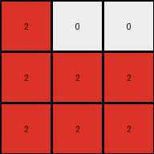
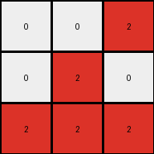
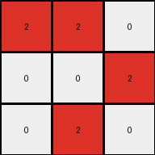
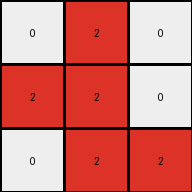
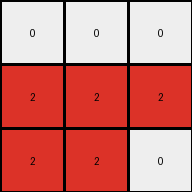

# fafffa47 • 005 • refine_dreamer

---

Previous Code:
```python
"""
1.  **Extract Subgrid:** Consider only the top 3x3 subgrid of the input grid. Ignore the rest of the input.
2. **Rotate Counter-Clockwise:** Rotate the top 3x3 subgrid by 90 degrees counter-clockwise.
3.  **Color Mapping:** Within this rotated 3x3 subgrid:
    *   Replace all maroon (9) pixels with red (2).
    *   Keep all white (0) pixels as white (0).
    *   All other colors in the original subgrid are not represented in the output (effectively becoming white (0) because the output grid starts filled with 0).
4. **Output** The result of steps 2 and 3 is the output.
"""

import numpy as np

def rotate_subgrid(grid):
    """Rotates a 3x3 subgrid 90 degrees counter-clockwise."""
    rotated_grid = np.zeros((3, 3), dtype=int)
    for i in range(3):
        for j in range(3):
            rotated_grid[j][2 - i] = grid[i][j]  # Corrected rotation logic
    return rotated_grid


def transform(input_grid):
    # initialize output_grid
    output_grid = np.zeros((3, 3), dtype=int)

    # Extract the top 3x3 subgrid.
    subgrid = input_grid[:3, :3]

    # Rotate the subgrid.
    rotated_subgrid = rotate_subgrid(subgrid)
    
    # change output pixels 
    for i in range(3):
        for j in range(3):
            if rotated_subgrid[i][j] == 9:
                output_grid[i][j] = 2
            elif rotated_subgrid[i][j] == 0:
                output_grid[i][j] = 0
                
    return output_grid
```

Train Set Results:

## Example 1:

Input:
```
0 9 9
0 9 9
9 9 9
0 1 0
0 0 1
1 1 1
```
Expected Output:
```
2 0 0
2 0 0
0 0 0
```
Transformed Output:
```
2 0 0
2 2 2
2 2 2
```

match: False
pixels_off: 5
size_correct: True
color_palette_correct: True
correct_pixel_counts: False

## Example 2:

Input:
```
9 0 9
0 9 9
0 0 9
1 0 1
1 0 0
1 0 0
```
Expected Output:
```
0 2 0
0 0 0
0 2 0
```
Transformed Output:
```
0 0 2
0 2 0
2 2 2
```

match: False
pixels_off: 5
size_correct: True
color_palette_correct: True
correct_pixel_counts: False

## Example 3:

Input:
```
0 9 0
9 0 9
9 0 0
0 0 0
0 0 1
1 0 0
```
Expected Output:
```
2 0 2
0 2 0
0 2 2
```
Transformed Output:
```
2 2 0
0 0 2
0 2 0
```

match: False
pixels_off: 5
size_correct: True
color_palette_correct: True
correct_pixel_counts: False

## Example 4:

Input:
```
0 0 9
9 9 9
0 9 0
1 0 0
0 1 1
0 0 1
```
Expected Output:
```
0 2 0
0 0 0
2 0 0
```
Transformed Output:
```
0 2 0
2 2 0
0 2 2
```

match: False
pixels_off: 5
size_correct: True
color_palette_correct: True
correct_pixel_counts: False

## Example 5:

Input:
```
0 9 0
0 9 9
0 9 9
0 0 0
1 1 1
1 0 1
```
Expected Output:
```
2 0 2
0 0 0
0 0 0
```
Transformed Output:
```
0 0 0
2 2 2
2 2 0
```

match: False
pixels_off: 7
size_correct: True
color_palette_correct: True
correct_pixel_counts: False
**INSTRUCTIONS**

The code above was generated based on observations from the first training
example

we have tested the transform function on each of the task example inputs and
compared with the expected output

review each of the examples provided and the results and consider how the
natural language program should be updated to accommodate this new knowledge

respond with the following deliverables:

- general assessment of the information provided and strategy for resolving the
  errors
- gather metrics about each of the examples and results - use code_execution to
  develop accurate reports on your assumptions
- a YAML block documenting facts - Focus on identifying objects, their properties, and the actions performed on them.
- a natural language program - Be as clear and concise as possible, providing a complete description of the transformation rule.


your responses should be considered as information in a report - not a
conversation
