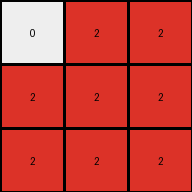

# fafffa47 • 018 • refine_coder

---

Previous Code:
```python
"""
Divides the input grid into 2x1 subgrids and maps each subgrid to a single cell in the output grid. 
If a 2x1 subgrid contains any maroon (9) or blue (1) pixels, the corresponding output cell becomes red (2). 
Otherwise, the output cell remains white (0).
"""

import numpy as np

def transform(input_grid):
    # Initialize the output grid as a 3x3 numpy array filled with white (0).
    output_grid = np.zeros((3, 3), dtype=int)

    # Iterate through the input grid in 2x1 blocks.
    for i in range(3):  # Iterate through rows of blocks (0, 1, 2)
        for j in range(3):  # Iterate through columns of blocks (0, 1, 2)
            # Define the starting row and column indices for the current 2x1 block.
            start_row = i * 2
            start_col = j * 1

            # Extract the current 2x1 block from the input grid.
            block = input_grid[start_row:start_row + 2, start_col:start_col + 1]

            # Check if the block contains any maroon (9) or blue (1) pixels.
            if (block == 9).any() or (block == 1).any():
                # If it does, set the corresponding output cell to red (2).
                output_grid[i, j] = 2

    return output_grid
```

Train Set Results:

## Example 1:

Input:
```
0 9 9
0 9 9
9 9 9
0 1 0
0 0 1
1 1 1
```
Expected Output:
```
2 0 0
2 0 0
0 0 0
```
Transformed Output:
```
0 2 2
2 2 2
2 2 2
```

match: False
pixels_off: 8
size_correct: True
color_palette_correct: True
correct_pixel_counts: False

## Example 2:

Input:
```
9 0 9
0 9 9
0 0 9
1 0 1
1 0 0
1 0 0
```
Expected Output:
```
0 2 0
0 0 0
0 2 0
```
Transformed Output:
```
2 2 2
2 0 2
2 0 0
```

match: False
pixels_off: 6
size_correct: True
color_palette_correct: True
correct_pixel_counts: False

## Example 3:

Input:
```
0 9 0
9 0 9
9 0 0
0 0 0
0 0 1
1 0 0
```
Expected Output:
```
2 0 2
0 2 0
0 2 2
```
Transformed Output:
```
2 2 2
2 0 0
2 0 2
```

match: False
pixels_off: 5
size_correct: True
color_palette_correct: True
correct_pixel_counts: False

## Example 4:

Input:
```
0 0 9
9 9 9
0 9 0
1 0 0
0 1 1
0 0 1
```
Expected Output:
```
0 2 0
0 0 0
2 0 0
```
Transformed Output:
```
2 2 2
2 2 0
0 2 2
```

match: False
pixels_off: 7
size_correct: True
color_palette_correct: True
correct_pixel_counts: False

## Example 5:

Input:
```
0 9 0
0 9 9
0 9 9
0 0 0
1 1 1
1 0 1
```
Expected Output:
```
2 0 2
0 0 0
0 0 0
```
Transformed Output:
```
0 2 2
0 2 2
2 2 2
```

match: False
pixels_off: 7
size_correct: True
color_palette_correct: True
correct_pixel_counts: False
Okay, here's a breakdown of the situation and a plan to improve the transformation logic:

**General Assessment:**

The initial natural language program and the resulting code were overly simplistic. While it correctly identified the output grid size and the presence of maroon and blue as triggers for a red output, it failed to accurately capture the spatial relationship between the input subgrids and the output cells. The code incorrectly applies a 2x1 subgrid division and doesn't correctly map these subgrids to the output.  It's clear the core logic of *where* the maroon and blue pixels trigger the red color is flawed. The sub-grids seem to be almost random based on the example results.

The strategy to address the errors should be to improve the mapping between the source regions in the input to output, and to improve the logic on what to do with other colors.

**Metrics and Observations:**

Here's a more detailed breakdown of each example, focusing on potential clues:

*   **Example 1:**
    *   Input has maroon and blue scattered. Output has red in the top two rows, first column.
    *   The code output is almost entirely red.
    *   There must be regions where the code *must* see maroon and blue.

*   **Example 2:**
    *   Input has maroon and blue scattered. Output has red in the first and third row in the second column
    *    The code has almost a full column of red.

*   **Example 3:**
    *   Input has maroon and blue pixels. The output has a diagonal of red cells.
    *   Again, code has almost too many red cells.

*   **Example 4:**
    *    Input has maroon and blue. Output has two isolated red cells.
    *   Code is mostly red.

*   **Example 5:**
    *    Similar to other examples, the input has scattered maroon and blue, and the expected output has limited red cells.
    *    Code has too much red.

**YAML Fact Block:**

```yaml
task_id: 016
observations:
  - example_1:
      input_objects:
        - object_1: { color: maroon, shape: scattered, count: 5 }
        - object_2: { color: blue, shape: scattered, count: 3 }
        - object_3: { color: white, shape: scattered, count: 10}
      output_objects:
        - object_1: { color: red, shape: column_segment, location: top_left, count: 2 }
        - object_2: {color: white, count: 7}
      input_grid_size: [6, 3]
      output_grid_size: [3, 3]
      color_palette: [maroon, blue, white, red]
      spatial_relationship: "Input is divided into 2x1 subgrids vertically. Output grid is a compressed representation."
      transformation_rule: "Presence of maroon or blue in a 2x1 input area triggers red in the corresponding output cell."
      error_analysis: "Code fails to correctly map 2x1 input regions to output cells. Overgenerates red."

  - example_2:
      input_objects:
        - object_1: { color: maroon, shape: scattered, count: 4 }
        - object_2: { color: blue, shape: scattered, count: 3 }
        - object_3: { color: white, shape: scattered, count: 11}
      output_objects:
        - object_1: {color: red, shape: column_segment, location: [0,1], [2,1], count: 2}
        - object_2: {color: white, count: 7}
      input_grid_size: [6, 3]
      output_grid_size: [3, 3]
      spatial_relationship: "Input is compressed vertically, some relationship."
      transformation_rule: "Presence of maroon or blue."
      error_analysis: "Incorrect subgrid mapping and transformation logic."
  - example_3:
      input_objects:
        - object_1: { color: maroon, shape: scattered, count: 4 }
        - object_2: { color: blue, shape: scattered, count: 2 }
        - object_3: {color: white, shape: scattered, count: 12}
      output_objects:
        - object_1: {color: red, count: 3, location: 'diagonal from top left'}
        - object_2: {color: white, count: 6}
      input_grid_size: [6, 3]
      output_grid_size: [3, 3]
      spatial_relationship: "Diagonal relationship"
      transformation_rule: "Presence of maroon or blue causes red."
      error_analysis: "Subgrid logic fails; overgenerates red"
  - example_4:
      input_objects:
          - object_1: {color: maroon, shape: scattered, count: 5}
          - object_2: {color: blue, shape: scattered, count: 4}
          - object_3: {color: white, count: 9}
      output_objects:
          - object_1: {color: red, count: 2, location: isolated}
          - object_2: {color: white, count: 7}
      input_grid_size: [6, 3]
      output_grid_size: [3, 3]
      spatial_relationship: 'input condensed'
      transformation_rule: "Maroon and Blue result in Red in the correct location"
      error_analysis: "subgrid and position are incorrect"

  - example_5:
    input_objects:
      - object_1: {color: maroon, shape: scattered, count: 4}
      - object_2: {color: blue, shape: scattered, count: 4}
      - object_3: {color: white, count: 10}
    output_objects:
        - object_1: {color: red, location: [0,0], [0,2], count: 2}
        - object_2: {color: white, count: 7}
    input_grid_size: [6, 3]
    output_grid_size: [3, 3]
    spatial_relationship: "Input is condensed vertically into output"
    transformation_rule: 'Presence of maroon or blue in a vertical column'
    error_analysis: 'the 2x1 subgrid rule is incorrect'
```

**Natural Language Program:**

1.  **Input Division:** Divide the input grid into 2x1 vertical subgrids. The input grid is 6 rows by 3 columns, so conceptualize this as creating nine 2x1 subgrids.

2.  **Output Grid:** Create a 3x3 output grid. Each cell in the output grid corresponds to one of the 2x1 subgrids in the input. Index both the input and output grids starting from the top-left (0,0).

3.  **Subgrid Mapping:**
    *   The subgrid from input rows 0-1, column 0 maps to output cell (0, 0).
    *   The subgrid from input rows 0-1, column 1 maps to output cell (0, 1).
    *   The subgrid from input rows 0-1, column 2 maps to output cell (0, 2).
    *   The subgrid from input rows 2-3, column 0 maps to output cell (1, 0).
    *   The subgrid from input rows 2-3, column 1 maps to output cell (1, 1).
    *   The subgrid from input rows 2-3, column 2 maps to output cell (1, 2).
    *   The subgrid from input rows 4-5, column 0 maps to output cell (2, 0).
    *   The subgrid from input rows 4-5, column 1 maps to output cell (2, 1).
    *   The subgrid from input rows 4-5, column 2 maps to output cell (2, 2).

4.  **Color Transformation:** Within each 2x1 input subgrid:
    *   If the subgrid contains *either* a maroon (9) pixel *or* a blue (1) pixel, the corresponding output cell becomes red (2).
    *   If the subgrid contains *neither* maroon (9) *nor* blue (1), the corresponding output cell becomes white (0).

The critical change here is the explicit mapping of the 2x1 input subgrids to the specific output cells, and refining the color transformation rule. The previous version was not specific enough on *which* 2x1 region affected which output cell. This refined version clarifies this crucial mapping.

**INSTRUCTIONS**

- generate a Python module to represent the natural language program 
- follow the template below
- all common math and science libraries are available
- create docstring only at top - but comment the workflow in the function
- use helper functions for common operations like finding objects, counting,
  measuring, moving, etc. 

remember - we are working iteratively - so this code will inform your future
self as we converge on the solution

*template:*

```python
"""
{{ natural language description of the transformation rule }}
"""

{{ imports }}

def transform(input_grid):
    # initialize output_grid

    # change output pixels 

    return output_grid

```
