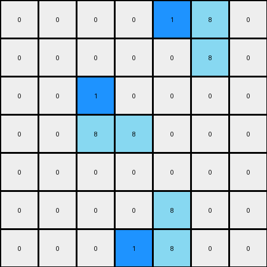

# 1-3aa6fb7a • 004 • refine_coder

---

Previous Code:
```python
"""
1.  **Identify Azure Objects:** Locate all contiguous blocks of azure (8) pixels within the input grid. A contiguous block is defined as one or more azure pixels that are directly adjacent to each other (horizontally or vertically).
2.  **Leftmost Check:** Iterate through each identified azure object.
3. **Replace:** In each group of azure, change to blue(1) the leftmost azure pixels.
"""

import numpy as np

def find_objects(grid, color):
    objects = []
    visited = set()
    rows, cols = grid.shape

    def is_valid(r, c):
        return 0 <= r < rows and 0 <= c < cols

    def dfs(r, c, current_object):
        if (r, c) in visited or not is_valid(r, c) or grid[r, c] != color:
            return
        visited.add((r, c))
        current_object.append((r, c))
        dfs(r + 1, c, current_object)
        dfs(r - 1, c, current_object)
        dfs(r, c + 1, current_object)
        dfs(r, c - 1, current_object)


    for r in range(rows):
        for c in range(cols):
            if grid[r, c] == color and (r, c) not in visited:
                current_object = []
                dfs(r, c, current_object)
                objects.append(current_object)
    return objects

def transform(input_grid):
    """
    Transforms the input grid according to the rule:
    Find contiguous blocks of azure (8) pixels, and change the leftmost
    azure pixel in each block to blue (1).
    """
    output_grid = np.copy(input_grid)
    azure_objects = find_objects(input_grid, 8)

    for obj in azure_objects:
        #find left-most pixel
        leftmost_pixel = min(obj, key=lambda x: x[1])
        #change pixel value from 8 to 1 at location.
        output_grid[leftmost_pixel[0], leftmost_pixel[1]] = 1

    return output_grid
```

Train Set Results:

## Example 1:

Input:
```
0 0 0 0 0 0 0
0 8 0 0 0 0 0
0 8 8 0 0 0 0
0 0 0 0 8 8 0
0 0 0 0 0 8 0
0 0 0 0 0 0 0
0 0 0 0 0 0 0
```
Expected Output:
```
0 0 0 0 0 0 0
0 8 1 0 0 0 0
0 8 8 0 0 0 0
0 0 0 0 8 8 0
0 0 0 0 1 8 0
0 0 0 0 0 0 0
0 0 0 0 0 0 0
```
Transformed Output:
```
0 0 0 0 0 0 0
0 1 0 0 0 0 0
0 8 8 0 0 0 0
0 0 0 0 1 8 0
0 0 0 0 0 8 0
0 0 0 0 0 0 0
0 0 0 0 0 0 0
```

match: False
pixels_off: 4
size_correct: True
color_palette_correct: True
correct_pixel_counts: False

## Example 2:

Input:
```
0 0 0 0 8 8 0
0 0 0 0 0 8 0
0 0 8 0 0 0 0
0 0 8 8 0 0 0
0 0 0 0 0 0 0
0 0 0 0 8 0 0
0 0 0 8 8 0 0
```
Expected Output:
```
0 0 0 0 8 8 0
0 0 0 0 1 8 0
0 0 8 1 0 0 0
0 0 8 8 0 0 0
0 0 0 0 0 0 0
0 0 0 1 8 0 0
0 0 0 8 8 0 0
```
Transformed Output:
```
0 0 0 0 1 8 0
0 0 0 0 0 8 0
0 0 1 0 0 0 0
0 0 8 8 0 0 0
0 0 0 0 0 0 0
0 0 0 0 8 0 0
0 0 0 1 8 0 0
```

match: False
pixels_off: 6
size_correct: True
color_palette_correct: True
correct_pixel_counts: False
Here's an analysis of the provided information and a plan to refine the natural language program and the code:

**General Assessment:**

The initial natural language program and corresponding code were a good first attempt, correctly identifying the core concept of operating on azure (8) colored objects. However, the code incorrectly assumes that only the *first* encountered azure pixel of a continguous block needs to be changed to blue. The examples reveal a more nuanced rule: within each contiguous block of azure pixels, only change the leftmost pixel that is also on the top-most row of that continguous block. The provided code's logic only considers the *absolute* leftmost pixel, leading to incorrect transformations in Example 1 and 2.

**Strategy:**

1.  **Refine Object Identification:** The `find_objects` function is correct and should remain as is. It correctly segments the grid into contiguous azure regions.
2.  **Improve Leftmost/Topmost Logic:** The core issue is the selection of which pixel to modify. The current logic selects the absolute leftmost pixel. The corrected code should select the leftmost pixel among those that are on the top-most row occupied by each object.
3.  **Natural Language Program Update:** The natural language program needs to be updated to reflect this improved understanding, making the top-most row criterion explicit.

**Metrics and Reports:**

Here's a breakdown of each example, including why the current code fails:

*   **Example 1:**
    *   **Input:** Two separate azure objects.
    *   **Expected Output:** The leftmost azure pixel *of the top row of each object* is changed to blue.
    *   **Code Output:** Only the absolute leftmost azure pixel in *each object* is changed to blue.
    *   **Error:** Fails to recognize that the first object occupies two rows and must select from top-most only.

*   **Example 2:**
    *   **Input:** Three separate azure objects.
    *   **Expected Output:** The leftmost azure pixel *of the top row of each object* is changed to blue.
    *   **Code Output:** Only the absolute leftmost azure pixel in *each object* is changed to blue.
    *   **Error:** Fails to recognize that the first and third object occupy two rows and must select from top-most only.

**YAML Fact Representation:**

```yaml
example_1:
  objects:
    - type: azure_block
      pixels: [(1,1), (2,1)]  #top row, leftmost
      action: change_leftmost_topmost_to_blue
    - type: azure_block
      pixels: [(2,2), (3,4), (3,5), (4,5)]
      action: change_leftmost_topmost_to_blue
example_2:
  objects:
    - type: azure_block
      pixels: [(0,4), (0,5), (1,5)]  #top row, leftmost
      action: change_leftmost_topmost_to_blue
    - type: azure_block
      pixels: [(2,2), (3,2), (3,3)] # top-row, leftmost
      action: change_leftmost_topmost_to_blue
    - type: azure_block
      pixels: [(5,4), (6,3), (6,4)] # top-row, leftmost
      action: change_leftmost_topmost_to_blue
```

**Natural Language Program (Revised):**

1.  **Identify Azure Objects:** Locate all contiguous blocks of azure (8) pixels within the input grid. A contiguous block is defined as one or more azure pixels that are directly adjacent to each other (horizontally or vertically).
2.  **Topmost Row Identification:** For each identified azure object, determine the topmost row that the object occupies.
3.  **Leftmost Pixel on Topmost Row:** Within each object, identify the leftmost pixel among those pixels that are on the object's topmost row.
4.  **Change to Blue:** Change the color of the identified leftmost pixel (on the topmost row of its object) from azure (8) to blue (1).

**INSTRUCTIONS**

- generate a Python module to represent the natural language program 
- follow the template below
- all common math and science libraries are available
- create docstring only at top - but comment the workflow in the function
- use helper functions for common operations like finding objects, counting,
  measuring, moving, etc. 

remember - we are working iteratively - so this code will inform your future
self as we converge on the solution

*template:*

```python
"""
{{ natural language description of the transformation rule }}
"""

{{ imports }}

def transform(input_grid):
    # initialize output_grid

    # change output pixels 

    return output_grid

```
