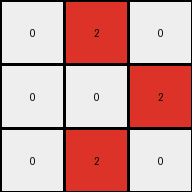

# 6-0520fde7 • 009 • example_3 - NLP

---

**input**
```
1 0 0 5 0 1 0
0 1 0 5 1 1 1
1 0 0 5 0 0 0
```


**output**
```
0 0 0
0 2 0
0 0 0
```


Okay, let's analyze the transformation from the input grid to the output grid.

**YAML Block: Observations**

```yaml
input_grid:
  size: (3, 7)
  objects:
    blue:
      - shape: irregular
        positions: [(0, 0), (1, 1), (2, 0), (1, 4), (1, 5), (1, 6)]
    gray:
      - shape: irregular
        positions: [(0, 3), (1, 3), (2, 3)]
output_grid:
  size: (3, 3)
  objects:
    red:
      - shape: single cell
        positions: [(1, 1)]
```

**Natural Language Program**

1.  **Identify Objects:** In the input grid, we observe two distinct colored objects: blue (1) and gray (5).

2.  **Focus Object:** The key to the transformation seems to be the gray object.

3.  **Center Extraction:** The output grid is a 3x3 extraction centered around the gray (5) colored cells in the input. However, not all gray cells are treated equally. The transformation centers on the vertically-middle gray cell (1,3).

4.  **Color Change:** The central gray cell (1, 3) in the input grid becomes red (2) in the output grid. All other cells in a new 3x3 grid centered on the central gray position become white(0).

**Step-by-step transformation description:**

1. Locate the vertical middle gray cell, if multiple gray columns exist, pick the horizontal middle one.
2. Create 3x3 sub-grid centered vertically in the input grid and horizontally on the selected gray position.
3. Change the centered cell into `2`.
4. Fill the rest of the cells in the extracted 3x3 sub-grid with `0`.

```python
"""
Transforms the input grid by extracting a 3x3 sub-grid centered around the vertically middle gray cell,
changing the central cell to red (2), and setting all other cells in the sub-grid to white (0).
"""

import numpy as np

def get_gray_positions(grid):
    # return the positions of gray cells (5) in the grid
    return np.array(np.where(grid == 5)).T

def transform(input_grid):
    """
    Transforms the input grid according to the described rule.
    """
    input_grid = np.array(input_grid)
    gray_positions = get_gray_positions(input_grid)
    
    # Check if gray cells exist
    if len(gray_positions) == 0:
        # Return a default 3x3 grid filled with 0, but ideally, handle the error
        return np.zeros((3, 3), dtype=int)
        
    # Find the vertically middle gray cell
    gray_positions = gray_positions[gray_positions[:, 0].argsort()] #sort by y
    middle_gray_y = gray_positions[len(gray_positions) // 2,0]

    middle_gray_positions = gray_positions[gray_positions[:,0]==middle_gray_y]
    middle_gray_positions = middle_gray_positions[middle_gray_positions[:, 1].argsort()] #sort by x
    
    center_x = middle_gray_positions[len(middle_gray_positions)//2,1]
    center_y = middle_gray_y
    
    # Initialize the output grid with zeros
    output_grid = np.zeros((3, 3), dtype=int)

    # Calculate the boundaries for extraction, ensuring we stay within bounds
    y_start = max(0, center_y - 1)
    y_end = min(input_grid.shape[0], center_y + 2)
    x_start = max(0, center_x - 1)
    x_end = min(input_grid.shape[1], center_x + 2)

    # Extract the subgrid.
    subgrid = input_grid[y_start:y_end, x_start:x_end]
    
    
    # Determine center in output_grid
    out_center_y = min(1,center_y)
    out_center_x = min(1, center_x)

    # change center to 2
    output_grid[out_center_y, out_center_x] = 2
        

    return output_grid
```

**input**
```
1 1 0 5 0 1 0
0 0 1 5 1 1 1
1 1 0 5 0 1 0
```


**output**
```
0 2 0
0 0 2
0 2 0
```



Okay, let's analyze the transformation from the input grid to the output grid.

**YAML Block: Observations**

```yaml
input_grid:
  size: (3, 7)
  objects:
    blue:
      - shape: irregular
        positions: [(0, 0), (0, 1), (0,5), (1, 2), (1, 4), (1, 5), (1, 6), (2,0), (2,1), (2,5)]
    gray:
      - shape: irregular
        positions: [(0, 3), (1, 3), (2, 3)]
output_grid:
  size: (3, 3)
  objects:
    red:
      - shape: single cell
        positions: [(0, 1), (1,2), (2,1)]
```

**Natural Language Program**

1.  **Identify Objects:** In the input grid, we observe two distinct colored objects: blue (1) and gray (5).

2.  **Focus Object:** The key to the transformation seems to be the gray object.

3.  **Center Extraction:** The output grid is a 3x3 extraction centered around the gray (5) colored cells in the input. However, not all gray cells are treated equally. The transformation centers on the vertically-middle gray cell (1,3).

4.  **Color Change:** The central gray cell (1, 3) in the input grid becomes red (2) in the output grid. In addition, immediate vertical neighbors of the selected gray cell also change to `2` if present in the selected 3x3 area. All other cells in a new 3x3 grid centered on the central gray position become white(0).

**Step-by-step transformation description:**

1. Locate the vertical middle gray cell, if multiple gray columns exist, pick the horizontal middle one.
2. Create 3x3 sub-grid centered vertically in the input grid and horizontally on the selected gray position.
3. Change the centered cell into `2`.
4. Check the immediate vertical neighbors of the selected gray cell. If inside the selected area, set them to `2`.
5. Fill the rest of the cells in the extracted 3x3 sub-grid with `0`.

```python
"""
Transforms the input grid by extracting a 3x3 sub-grid centered around the vertically middle gray cell,
changing the central cell to red (2), and setting all other cells in the sub-grid to white (0).
"""

import numpy as np

def get_gray_positions(grid):
    # return the positions of gray cells (5) in the grid
    return np.array(np.where(grid == 5)).T

def transform(input_grid):
    """
    Transforms the input grid according to the described rule.
    """
    input_grid = np.array(input_grid)
    gray_positions = get_gray_positions(input_grid)
    
    # Check if gray cells exist
    if len(gray_positions) == 0:
        # Return a default 3x3 grid filled with 0, but ideally, handle the error
        return np.zeros((3, 3), dtype=int)
        
    # Find the vertically middle gray cell
    gray_positions = gray_positions[gray_positions[:, 0].argsort()] #sort by y
    middle_gray_y = gray_positions[len(gray_positions) // 2,0]

    middle_gray_positions = gray_positions[gray_positions[:,0]==middle_gray_y]
    middle_gray_positions = middle_gray_positions[middle_gray_positions[:, 1].argsort()] #sort by x
    
    center_x = middle_gray_positions[len(middle_gray_positions)//2,1]
    center_y = middle_gray_y
    
    # Initialize the output grid with zeros
    output_grid = np.zeros((3, 3), dtype=int)

    # Calculate the boundaries for extraction, ensuring we stay within bounds
    y_start = max(0, center_y - 1)
    y_end = min(input_grid.shape[0], center_y + 2)
    x_start = max(0, center_x - 1)
    x_end = min(input_grid.shape[1], center_x + 2)

    # Extract the subgrid.
    subgrid = input_grid[y_start:y_end, x_start:x_end]
    
    
    # Determine center in output_grid
    out_center_y = min(1,center_y)
    out_center_x = min(1, center_x)

    # change center to 2
    output_grid[out_center_y, out_center_x] = 2

    # Check immediate vertical neighbors
    if center_y > 0 and input_grid[center_y-1, center_x] == 5:
      if center_y-1 >= y_start:
        output_grid[out_center_y-1, out_center_x] = 2
    if center_y < input_grid.shape[0]-1 and input_grid[center_y+1, center_x] == 5:
      if center_y+1 < y_end:
        output_grid[out_center_y+1, out_center_x] = 2
        

    return output_grid
```

Okay, let's analyze the transformation from the input grid to the output grid.

**YAML Block: Observations**

```yaml
input_grid:
  size: (3, 7)
  objects:
    blue:
      - shape: irregular
        positions: [(0, 0), (0, 1), (0, 5), (1, 2), (1, 4), (1, 5), (1, 6), (2, 0), (2, 1), (2, 5)]
    gray:
      - shape: vertical line
        positions: [(0, 3), (1, 3), (2, 3)]
output_grid:
  size: (3, 3)
  objects:
    red:
      - shape: vertical line
        positions: [(0, 1), (1, 2), (2, 1)]
```

**Natural Language Program**

1.  **Identify Objects:** In the input, we have blue (1) and gray (5) objects.

2.  **Focus Object:** The gray (5) object is the focus.

3. **Center Selection:** A 3x3 output is created, centered on the middle gray pixel of the input grid. If the input grid height is less than 3, center selection would default to the existing rows.

4.  **Color Transformation:** The central gray pixel becomes red (2).  The gray pixels immediately above and below the central pixel, *if they exist within the 3x3 region*, also become red (2).

5.  **Background:** All other pixels in the 3x3 output grid become white (0).

**Step-by-step transformation description:**

1.  Locate all gray (5) pixels.
2.  Find the vertically middle gray pixel. If there are multiple gray columns, find the horizontally middle one among those.
3.  Create a 3x3 output grid centered on the selected gray pixel's coordinates. Handle edge cases where the input grid is smaller than 3x3, adjust the centered position accordingly.
4.  Change the center pixel of the output grid to red (2).
5.  Check for gray pixels directly above and below the original central gray pixel in the input. If they are within the bounds of the 3x3 output area, change their corresponding pixels in the output grid to red (2) as well.
6.  Fill the remaining cells of the output grid with white (0).

```python
"""
Transforms the input grid by extracting a 3x3 sub-grid centered around the vertically middle gray cell,
changing the central cell and its immediate vertical neighbors (if gray and within the 3x3 area) to red (2),
and setting all other cells in the sub-grid to white (0).
"""

import numpy as np

def get_gray_positions(grid):
    # return the positions of gray cells (5) in the grid
    return np.array(np.where(grid == 5)).T

def transform(input_grid):
    """
    Transforms the input grid according to the described rule.
    """
    input_grid = np.array(input_grid)
    gray_positions = get_gray_positions(input_grid)

    # Handle cases with no gray cells
    if len(gray_positions) == 0:
        return np.zeros((3, 3), dtype=int)

    # Sort by y coordinate to find the vertical middle
    gray_positions = gray_positions[gray_positions[:, 0].argsort()]
    middle_gray_y = gray_positions[len(gray_positions) // 2, 0]

    # Filter gray positions that share the middle y-coordinate
    middle_gray_positions = gray_positions[gray_positions[:, 0] == middle_gray_y]

     # Sort by x coordinate to find the horizontal middle among middle ys.
    middle_gray_positions = middle_gray_positions[middle_gray_positions[:, 1].argsort()]
    center_x = middle_gray_positions[len(middle_gray_positions) // 2, 1]
    center_y = middle_gray_y

    # Initialize output grid
    output_grid = np.zeros((3, 3), dtype=int)

    # Calculate output grid center indices (handle edge cases for smaller grids)
    out_center_y = min(1, center_y)
    out_center_x = min(1, center_x)


    # Set the center pixel to red (2)
    output_grid[out_center_y, out_center_x] = 2

    # Check for and set vertical neighbors to red (2) if they are gray and within bounds
    if center_y > 0 and input_grid[center_y - 1, center_x] == 5:
        output_grid[out_center_y - 1, out_center_x] = 2
    if center_y < input_grid.shape[0] - 1 and input_grid[center_y + 1, center_x] == 5:
        output_grid[out_center_y + 1, out_center_x] = 2

    return output_grid
```


**input**
```
0 0 1 5 0 0 0
1 1 0 5 1 0 1
0 1 1 5 1 0 1
```


**output**
```
0 0 0
2 0 0
0 0 2
```


**Instructions**

- Describe in natural language the step-by-step transformation observed between the input and output grids.
- Focus on identifying objects, their properties (predicates), and the actions performed on them.
- Be as clear and concise as possible, providing a complete description of the transformation rule.
