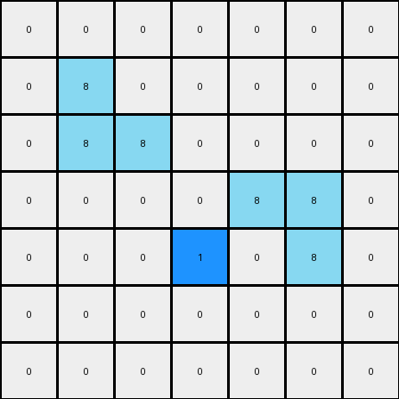
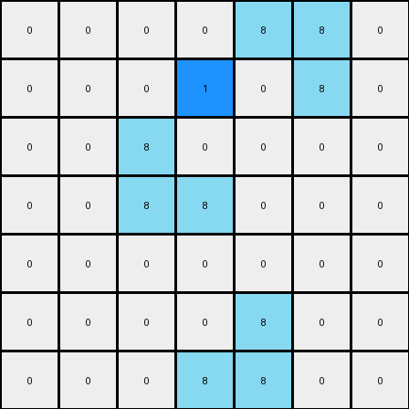

# 1-3aa6fb7a • 007 • refine_code - NLP

---

Previous Code:
```python
import numpy as np

def find_objects(grid, color):
    """Finds objects of a specific color in the grid."""
    objects = []
    visited = set()

    def dfs(row, col):
        """Depth-first search to find contiguous regions."""
        if (row, col) in visited or not (0 <= row < grid.shape[0] and 0 <= col < grid.shape[1]) or grid[row, col] != color:
            return []
        visited.add((row, col))
        region = [(row, col)]
        region.extend(dfs(row + 1, col))
        region.extend(dfs(row - 1, col))
        region.extend(dfs(row, col + 1))
        region.extend(dfs(row, col - 1))
        return region

    for i in range(grid.shape[0]):
        for j in range(grid.shape[1]):
            if grid[i, j] == color and (i, j) not in visited:
                objects.append(dfs(i, j))
    return objects

def transform(input_grid):
    """Transforms the input grid according to the described rule.  Azure (color 8) objects are identified, and blue (color 1) cells are placed adjacent to specific azure objects based on their shape and location. The logic prioritizes placements to avoid duplicates."""
    output_grid = np.copy(input_grid)
    azure_objects = find_objects(input_grid, 8)
    blue_placed = set()  # Keep track of where blue cells have been placed.

    # Iterate through azure objects to find L-shapes and single cells
    for obj in azure_objects:
        min_row = min(r for r, c in obj)
        min_col = min(c for r, c in obj)
        max_row = max(r for r,c in obj)
        max_col = max(c for r,c in obj)

        # Check for "L" shape:  [[8, 8], [0, 8]] or [[0,8],[8,8]] (top of L)
        if ( (min_row, min_col) in obj and (min_row, min_col + 1) in obj and
             (min_row + 1, min_col) not in obj and (min_row +1, min_col + 1) in obj
             and (min_row, min_col-1) not in obj ):

            if (min_row+1, min_col-1) not in blue_placed:
              output_grid[min_row+1, min_col - 1] = 1
              blue_placed.add((min_row+1, min_col -1))
              continue #Prioritize

        # Check for "L" shape: [[8, 8], [8, 0]] (top of L)
        if ( (min_row, min_col) in obj and (min_row, min_col + 1) in obj and
             (min_row + 1, min_col) in obj and (min_row +1, min_col + 1) not in obj
             and (min_row, min_col+2) not in obj ):
             if (min_row, min_col+2) not in blue_placed:
                output_grid[min_row, min_col + 2] = 1
                blue_placed.add((min_row, min_col+2))
                continue #Prioritize


        # Check for single azure cells
        if len(obj) == 1:
            row, col = obj[0]
            # Check left neighbor, then right neighbor. Prioritize left placement
            if col > 0 and input_grid[row, col - 1] == 0:
                if (row, col - 1) not in blue_placed:
                    output_grid[row, col - 1] = 1
                    blue_placed.add((row, col - 1))
                    continue #Prioritize

            elif col < input_grid.shape[1] - 1 and input_grid[row, col + 1] == 0:
                if (row, col + 1) not in blue_placed:
                    output_grid[row, col + 1] = 1
                    blue_placed.add((row, col + 1))
                    continue #Prioritize


    return output_grid
```

Train Set Results:

**Example 1:**
Input:
```
0 0 0 0 0 0 0
0 8 0 0 0 0 0
0 8 8 0 0 0 0
0 0 0 0 8 8 0
0 0 0 0 0 8 0
0 0 0 0 0 0 0
0 0 0 0 0 0 0
```
Expected Output:
```
0 0 0 0 0 0 0
0 8 1 0 0 0 0
0 8 8 0 0 0 0
0 0 0 0 8 8 0
0 0 0 0 1 8 0
0 0 0 0 0 0 0
0 0 0 0 0 0 0
```
Transformed Output:
```
0 0 0 0 0 0 0
0 8 0 0 0 0 0
0 8 8 0 0 0 0
0 0 0 0 8 8 0
0 0 0 1 0 8 0
0 0 0 0 0 0 0
0 0 0 0 0 0 0
```

Status: False

**Example 2:**
Input:
```
0 0 0 0 8 8 0
0 0 0 0 0 8 0
0 0 8 0 0 0 0
0 0 8 8 0 0 0
0 0 0 0 0 0 0
0 0 0 0 8 0 0
0 0 0 8 8 0 0
```
Expected Output:
```
0 0 0 0 8 8 0
0 0 0 0 1 8 0
0 0 8 1 0 0 0
0 0 8 8 0 0 0
0 0 0 0 0 0 0
0 0 0 1 8 0 0
0 0 0 8 8 0 0
```
Transformed Output:
```
0 0 0 0 8 8 0
0 0 0 1 0 8 0
0 0 8 0 0 0 0
0 0 8 8 0 0 0
0 0 0 0 0 0 0
0 0 0 0 8 0 0
0 0 0 8 8 0 0
```

Status: False
**Instructions**

- Describe in natural language the step-by-step transformation observed between the input and output grids.
- Focus on identifying objects, their properties (predicates), and the actions performed on them.
- Be as clear and concise as possible, providing a complete description of the transformation rule.
