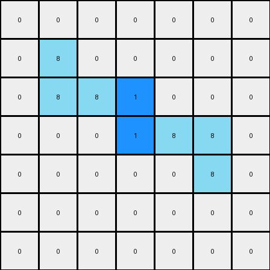
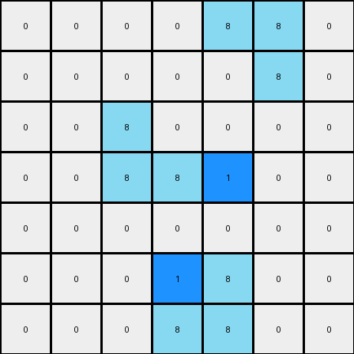

# 1-3aa6fb7a • 003 • refine_code - NLP

---


Previous Code:
```python
"""
The transformation rule can be described as follows:

1.  **Identify Azure Objects:** Locate all azure (color 8) objects in the input grid. There are two distinct shapes formed by azure colored cells: two cells forming a vertical line, and two cells forming a horizontal line.

2.  **Preserve Azure Objects:** Copy all azure colored areas to the output grid, in their respective locations.

3.  **Introduce Blue Pixel, Top:** Identify the azure object with the upper-leftmost coordinate. Add a blue (color 1) pixel to the right of its upper-rightmost coordinate.

4.  **Introduce Blue Pixel, Bottom:** Identify the azure object with the bottom-leftmost coordinate. Add a blue pixel (color 1) to the left of its bottom-leftmost coordinate.

In summary, the transformation preserves the azure objects and introduces two blue pixels that are placed according to the described rules.
"""

import numpy as np

def find_objects(grid, color):
    objects = []
    visited = set()

    def dfs(r, c, current_object):
        if (r, c) in visited or r < 0 or r >= grid.shape[0] or c < 0 or c >= grid.shape[1] or grid[r, c] != color:
            return
        visited.add((r, c))
        current_object.append((r, c))
        dfs(r + 1, c, current_object)
        dfs(r - 1, c, current_object)
        dfs(r, c + 1, current_object)
        dfs(r, c - 1, current_object)

    for r in range(grid.shape[0]):
        for c in range(grid.shape[1]):
            if grid[r, c] == color and (r, c) not in visited:
                current_object = []
                dfs(r, c, current_object)
                objects.append(current_object)
    return objects

def transform(input_grid):
    # Initialize output grid as a copy of the input grid
    output_grid = np.copy(input_grid)

    # Find azure objects
    azure_objects = find_objects(input_grid, 8)

    # Sort objects by upper-leftmost coordinate, then by bottom-leftmost
    azure_objects.sort(key=lambda obj: (min(y for x, y in obj), min(x for x,y in obj)))

    # Add blue pixel for the top object
    if len(azure_objects) >= 1:
        top_object = azure_objects[0]
        #find upper-rightmost coordinate in the first object
        top_rightmost = max(top_object, key=lambda x: (x[1], -x[0]))

        # Add blue pixel to its right, ensuring not exceed boundary
        if(top_rightmost[1] + 1 < output_grid.shape[1]):
            output_grid[top_rightmost[0], top_rightmost[1] + 1] = 1

    #add blue pixel for the second object
    if len(azure_objects) >= 2:
        bottom_object = azure_objects[1]

        # Find the bottom-leftmost coordinate in second object
        bottom_leftmost = min(bottom_object, key=lambda x: (x[0],x[1]))

        #add blue pixel to the left of its downmost coordinate, ensuring not exceed boundary
        if(bottom_leftmost[0] < output_grid.shape[0] and bottom_leftmost[1] -1 >= 0):
            output_grid[bottom_leftmost[0] , bottom_leftmost[1]-1] = 1

    return output_grid
```

Train Set Results:

**Example 1:**
Input:
```
0 0 0 0 0 0 0
0 8 0 0 0 0 0
0 8 8 0 0 0 0
0 0 0 0 8 8 0
0 0 0 0 0 8 0
0 0 0 0 0 0 0
0 0 0 0 0 0 0
```
Expected Output:
```
0 0 0 0 0 0 0
0 8 1 0 0 0 0
0 8 8 0 0 0 0
0 0 0 0 8 8 0
0 0 0 0 1 8 0
0 0 0 0 0 0 0
0 0 0 0 0 0 0
```
Transformed Output:
```
0 0 0 0 0 0 0
0 8 0 0 0 0 0
0 8 8 1 0 0 0
0 0 0 1 8 8 0
0 0 0 0 0 8 0
0 0 0 0 0 0 0
0 0 0 0 0 0 0
```

Status: False

**Example 2:**
Input:
```
0 0 0 0 8 8 0
0 0 0 0 0 8 0
0 0 8 0 0 0 0
0 0 8 8 0 0 0
0 0 0 0 0 0 0
0 0 0 0 8 0 0
0 0 0 8 8 0 0
```
Expected Output:
```
0 0 0 0 8 8 0
0 0 0 0 1 8 0
0 0 8 1 0 0 0
0 0 8 8 0 0 0
0 0 0 0 0 0 0
0 0 0 1 8 0 0
0 0 0 8 8 0 0
```
Transformed Output:
```
0 0 0 0 8 8 0
0 0 0 0 0 8 0
0 0 8 0 0 0 0
0 0 8 8 1 0 0
0 0 0 0 0 0 0
0 0 0 1 8 0 0
0 0 0 8 8 0 0
```

Status: False

**Instructions**

- Describe in natural language the step-by-step transformation observed between the input and output grids.
- Focus on identifying objects, their properties (predicates), and the actions performed on them.
- Be as clear and concise as possible, providing a complete description of the transformation rule.
