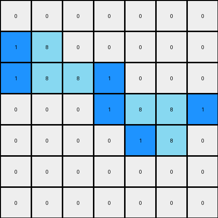
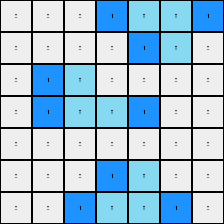

# 1-3aa6fb7a • 007 • refine_code - NLP

---

Previous Code:
```python
"""
The transformation rule is as follows:
1. Identify all azure (color 8) pixels in the input grid.
2. For each identified pixel, check its immediate left or right. If it is empty and not occupied by other color, then place a blue (color 1) there.
"""

import numpy as np

def find_pixels(grid, color):
    """
    Find pixels of specified color.
    """
    pixels = []
    rows, cols = grid.shape
    for r in range(rows):
        for c in range(cols):
            if grid[r, c] == color:
                pixels.append((r, c))
    return pixels

def transform(input_grid):
    """
    Transforms the input grid according to the specified rule:
    1. Find all pixels of azure color.
    2. Add one blue pixel at the left or the right of each of these pixels
    """
    # Initialize output grid as a copy of the input grid
    output_grid = np.copy(input_grid)

    # Find all pixels of color 8 (azure)
    azure_pixels = find_pixels(input_grid, 8)

    # For each azure pixel, place a blue pixel (color 1) to the left or right
    for pixel in azure_pixels:
        r, c = pixel
        if c - 1 >= 0 and output_grid[r, c - 1] == 0 :  # Check left side
            output_grid[r, c - 1] = 1
            continue
        if c + 1 < output_grid.shape[1] and output_grid[r, c+1] == 0:  # Check right side and bounds
            output_grid[r, c + 1] = 1


    return output_grid
```

Train Set Results:

**Example 1:**
Input:
```
0 0 0 0 0 0 0
0 8 0 0 0 0 0
0 8 8 0 0 0 0
0 0 0 0 8 8 0
0 0 0 0 0 8 0
0 0 0 0 0 0 0
0 0 0 0 0 0 0
```
Expected Output:
```
0 0 0 0 0 0 0
0 8 1 0 0 0 0
0 8 8 0 0 0 0
0 0 0 0 8 8 0
0 0 0 0 1 8 0
0 0 0 0 0 0 0
0 0 0 0 0 0 0
```
Transformed Output:
```
0 0 0 0 0 0 0
1 8 0 0 0 0 0
1 8 8 1 0 0 0
0 0 0 1 8 8 1
0 0 0 0 1 8 0
0 0 0 0 0 0 0
0 0 0 0 0 0 0
```

Status: False

**Example 2:**
Input:
```
0 0 0 0 8 8 0
0 0 0 0 0 8 0
0 0 8 0 0 0 0
0 0 8 8 0 0 0
0 0 0 0 0 0 0
0 0 0 0 8 0 0
0 0 0 8 8 0 0
```
Expected Output:
```
0 0 0 0 8 8 0
0 0 0 0 1 8 0
0 0 8 1 0 0 0
0 0 8 8 0 0 0
0 0 0 0 0 0 0
0 0 0 1 8 0 0
0 0 0 8 8 0 0
```
Transformed Output:
```
0 0 0 1 8 8 1
0 0 0 0 1 8 0
0 1 8 0 0 0 0
0 1 8 8 1 0 0
0 0 0 0 0 0 0
0 0 0 1 8 0 0
0 0 1 8 8 1 0
```

Status: False
**Instructions**

- Describe in natural language the step-by-step transformation observed between the input and output grids.
- Focus on identifying objects, their properties (predicates), and the actions performed on them.
- Be as clear and concise as possible, providing a complete description of the transformation rule.
