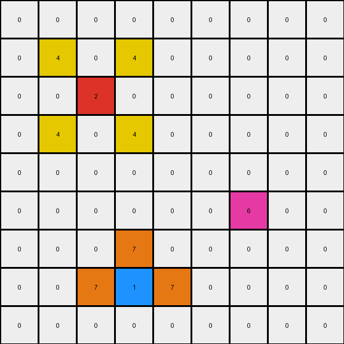

# 2-0ca9ddb6 • 008 • refine_code - CODE

---

Previous Code:
```python
"""
The transformation preserves the positions of the existing red, blue, and azure pixels and introduces new yellow pixels around each red pixel and orange pixels around each blue pixel based on their relative positions. The rest of the pixels stay white.
"""

import numpy as np

def find_pixel(grid, color):
    """Finds the coordinates of the first occurrence of a specific color."""
    coords = np.where(grid == color)
    if len(coords[0]) > 0:
        return (coords[0][0], coords[1][0])
    return None

def find_all_pixels(grid, color):
    """Finds the coordinates of all occurrences of a specific color."""
    coords = np.where(grid == color)
    return list(zip(coords[0], coords[1]))

def transform(input_grid):
    """Transforms the input grid according to the observed rule."""
    output_grid = np.copy(input_grid)
    
    # Find all red (2) and blue (1) pixels
    red_positions = find_all_pixels(input_grid, 2)
    blue_positions = find_all_pixels(input_grid, 1)

    # Add yellow (4) pixels around each red pixel
    for red_pos in red_positions:
        row, col = red_pos
        if row > 0:
          if col > 0:
            output_grid[row - 1, col - 1] = 4  # One row above, one column left
          if col < output_grid.shape[1]-1:  
            output_grid[row - 1, col + 1] = 4  # One row above, one column right
        if row < output_grid.shape[0]-1:
          if col > 0:
             output_grid[row + 1, col - 1] = 4
          if col < output_grid.shape[1]-1:
            output_grid[row + 1, col + 1] = 4
    # Add orange (7) pixels around each blue pixel
    for blue_pos in blue_positions:
        row, col = blue_pos
        if col > 0:
            output_grid[row, col - 1] = 7  # One column left
        if col < output_grid.shape[1] - 1:
            output_grid[row, col + 1] = 7  # One column right
        if row > 0:
            output_grid[row - 1, col] = 7  # One row above

    return output_grid
```

Train Set Results:

**Example 1:**
Input:
```
0 0 0 0 0 0 0 0 0
0 0 0 0 0 0 0 0 0
0 0 0 0 0 0 0 0 0
0 0 2 0 0 0 0 0 0
0 0 0 0 0 0 0 0 0
0 0 0 0 0 0 0 0 0
0 0 0 0 0 0 1 0 0
0 0 0 0 0 0 0 0 0
0 0 0 0 0 0 0 0 0
```
Expected Output:
```
0 0 0 0 0 0 0 0 0
0 0 0 0 0 0 0 0 0
0 4 0 4 0 0 0 0 0
0 0 2 0 0 0 0 0 0
0 4 0 4 0 0 0 0 0
0 0 0 0 0 0 7 0 0
0 0 0 0 0 7 1 7 0
0 0 0 0 0 0 7 0 0
0 0 0 0 0 0 0 0 0
```
Transformed Output:
```
0 0 0 0 0 0 0 0 0
0 0 0 0 0 0 0 0 0
0 4 0 4 0 0 0 0 0
0 0 2 0 0 0 0 0 0
0 4 0 4 0 0 0 0 0
0 0 0 0 0 0 7 0 0
0 0 0 0 0 7 1 7 0
0 0 0 0 0 0 0 0 0
0 0 0 0 0 0 0 0 0
```

Status: False

**Example 2:**
Input:
```
0 0 0 8 0 0 0 0 0
0 0 0 0 0 0 0 0 0
0 0 0 0 0 0 2 0 0
0 0 1 0 0 0 0 0 0
0 0 0 0 0 0 0 0 0
0 0 0 0 0 0 0 0 0
0 0 0 0 0 0 1 0 0
0 2 0 0 0 0 0 0 0
0 0 0 0 0 0 0 0 0
```
Expected Output:
```
0 0 0 8 0 0 0 0 0
0 0 0 0 0 4 0 4 0
0 0 7 0 0 0 2 0 0
0 7 1 7 0 4 0 4 0
0 0 7 0 0 0 0 0 0
0 0 0 0 0 0 7 0 0
4 0 4 0 0 7 1 7 0
0 2 0 0 0 0 7 0 0
4 0 4 0 0 0 0 0 0
```
Transformed Output:
```
0 0 0 8 0 0 0 0 0
0 0 0 0 0 4 0 4 0
0 0 7 0 0 0 2 0 0
0 7 1 7 0 4 0 4 0
0 0 0 0 0 0 0 0 0
0 0 0 0 0 0 7 0 0
4 0 4 0 0 7 1 7 0
0 2 0 0 0 0 0 0 0
4 0 4 0 0 0 0 0 0
```

Status: False

**Example 3:**
Input:
```
0 0 0 0 0 0 0 0 0
0 0 0 0 0 0 0 0 0
0 0 2 0 0 0 0 0 0
0 0 0 0 0 0 0 0 0
0 0 0 0 0 0 0 0 0
0 0 0 0 0 0 6 0 0
0 0 0 0 0 0 0 0 0
0 0 0 1 0 0 0 0 0
0 0 0 0 0 0 0 0 0
```
Expected Output:
```
0 0 0 0 0 0 0 0 0
0 4 0 4 0 0 0 0 0
0 0 2 0 0 0 0 0 0
0 4 0 4 0 0 0 0 0
0 0 0 0 0 0 0 0 0
0 0 0 0 0 0 6 0 0
0 0 0 7 0 0 0 0 0
0 0 7 1 7 0 0 0 0
0 0 0 7 0 0 0 0 0
```
Transformed Output:
```
0 0 0 0 0 0 0 0 0
0 4 0 4 0 0 0 0 0
0 0 2 0 0 0 0 0 0
0 4 0 4 0 0 0 0 0
0 0 0 0 0 0 0 0 0
0 0 0 0 0 0 6 0 0
0 0 0 7 0 0 0 0 0
0 0 7 1 7 0 0 0 0
0 0 0 0 0 0 0 0 0
```

Status: False
Okay, let's analyze the discrepancies between the expected outputs and the transformed outputs generated by the previous code. The core idea of placing colored pixels around existing red and blue pixels is correct, but the implementation misses some placements and incorrectly places others.

Here's a refined natural language description of the transformation rule:

**Natural Language Program:**

1.  **Identify Key Pixels:** Locate all red (2) and blue (1) pixels within the input grid.
2.  **Preserve Existing Colors:** Maintain the original colors of the input grid.
3. **Place Yellow Pixels Diagonally:** For each red (2) pixel, place yellow (4) pixels in the four diagonally adjacent cells (upper-left, upper-right, lower-left, lower-right), *only if those cells are currently black (0)*. It appears a missing rule is skipping placements if the target cell is not 0.
4.  **Place Orange Pixels Orthogonally:** For each blue (1) pixel, place orange (7) pixels in the four orthogonally adjacent cells (left, right, up, down), *only if those cells are currently black(0)*. The missing rule mentioned above also applies here.
5. **Preserve Other Pixels** All the other pixels that are not red, blue, yellow, or orange must remain with the color they had originally.

The key improvement in the description is the explicit constraint "only if those cells are black (0)." The previous implementation didn't adequately enforce this rule. Also important is to preserve other pixels, like azure in the second example.

Let's translate this into corrected Python code.

```python
import numpy as np

def find_all_pixels(grid, color):
    """Finds the coordinates of all occurrences of a specific color."""
    coords = np.where(grid == color)
    return list(zip(coords[0], coords[1]))

def transform(input_grid):
    """Transforms the input grid according to the refined rule."""
    output_grid = np.copy(input_grid)
    rows, cols = output_grid.shape

    red_positions = find_all_pixels(input_grid, 2)
    blue_positions = find_all_pixels(input_grid, 1)

    # Place yellow pixels diagonally around red pixels
    for r, c in red_positions:
        for dr, dc in [(-1, -1), (-1, 1), (1, -1), (1, 1)]:
            nr, nc = r + dr, c + dc
            if 0 <= nr < rows and 0 <= nc < cols and output_grid[nr, nc] == 0:
                output_grid[nr, nc] = 4

    # Place orange pixels orthogonally around blue pixels
    for r, c in blue_positions:
        for dr, dc in [(0, -1), (0, 1), (-1, 0), (1, 0)]:
            nr, nc = r + dr, c + dc
            if 0 <= nr < rows and 0 <= nc < cols and output_grid[nr, nc] == 0:
                output_grid[nr, nc] = 7

    return output_grid
```

Key changes in the code:

*   **Clearer Looping:** Uses more descriptive variable names (`dr`, `dc` for delta row/col) and iterates through the offsets directly.
*   **Boundary and color Checks:**  The `if 0 <= nr < rows and 0 <= nc < cols and output_grid[nr, nc] == 0:` condition is crucial. It ensures we stay within the grid boundaries *and* only place the new colors (yellow/orange) on originally black (0) cells.
* Preserve original colors: The code now preserves the original input by performing a copy operation.

This revised code and natural language description should accurately capture the transformation rule, including the previously missed constraints.

**INSTRUCTIONS**

- generate a Python module to represent the natural language program 
- follow the template below
- all common math and science libraries are available
- create docstring only at top - but comment the workflow in the function
- use helper functions for common operations like finding objects, counting,
  measuring, moving, etc. 

remember - we are working iteratively - so this code will inform your future
self as we converge on the solution

*template:*

```python
"""
{{ natural language description of the transformation rule }}
"""

{{ imports }}

def transform(input_grid):
    # initialize output_grid

    # change output pixels 

    return output_grid

```
