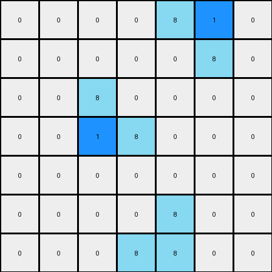

# 1-3aa6fb7a • 003 • refine_code - NLP

---

Previous Code:
```python
"""
The transformation rule is to keep the position and shape of L-shapes azure objects, and to add one blue cell to fill their inner empty corner.
"""

import numpy as np

def find_l_shapes(grid, color):
    """
    Finds L-shaped objects of a specific color in the grid.
    Returns a list of coordinates representing the corners of the L-shapes.
    """
    l_shapes = []
    rows, cols = grid.shape
    for r in range(rows - 1):
        for c in range(cols - 1):
            if grid[r, c] == color:
                # Check for different orientations of L-shapes
                if grid[r + 1, c] == color and grid[r, c + 1] == color:
                    l_shapes.append(((r, c), (r + 1, c), (r, c + 1)))
                elif grid[r + 1, c] == color and grid[r + 1, c + 1] == color:
                    l_shapes.append(((r, c), (r + 1, c), (r + 1, c + 1)))
                elif grid[r, c + 1] == color and grid[r + 1, c + 1] == color:
                    l_shapes.append(((r, c), (r, c + 1), (r + 1, c + 1)))
                elif c>0 and grid[r+1,c] == color and grid[r+1,c-1] == color:
                    l_shapes.append(((r, c), (r + 1, c), (r + 1, c - 1)))
    return l_shapes

def transform(input_grid):
    """
    Transforms the input grid according to the rule:
    - Keeps the position and shape of L-shaped azure (8) objects.
    - Adds one blue (1) cell to fill their inner empty corner.
    """
    # Initialize output_grid as a copy of input_grid
    output_grid = input_grid.copy()
    
    # Find L-shapes of color 8 (azure)
    l_shapes = find_l_shapes(input_grid, 8)
    
    # Fill the inner empty corner of each L-shape with color 1 (blue)
    for l_shape in l_shapes:
        # Determine the inner corner based on the L-shape orientation
        (r1, c1), (r2, c2), (r3, c3) = l_shape

        if r1==r2 and c1<c2 and r3>r1:
          output_grid[r1, c1+1] = 1
        elif r1==r2 and c1>c2 and r3>r1:
          output_grid[r1, c1-1] = 1
        elif c1==c2 and r1>r2 and c3>c2:
          output_grid[r1-1,c1] = 1
        elif c1==c2 and r1<r2 and c3>c2:
          output_grid[r1+1,c1] = 1    

        
    return output_grid
```

Train Set Results:

**Example 1:**
Input:
```
0 0 0 0 0 0 0
0 8 0 0 0 0 0
0 8 8 0 0 0 0
0 0 0 0 8 8 0
0 0 0 0 0 8 0
0 0 0 0 0 0 0
0 0 0 0 0 0 0
```
Expected Output:
```
0 0 0 0 0 0 0
0 8 1 0 0 0 0
0 8 8 0 0 0 0
0 0 0 0 8 8 0
0 0 0 0 1 8 0
0 0 0 0 0 0 0
0 0 0 0 0 0 0
```
Transformed Output:
```
0 0 0 0 0 0 0
0 8 0 0 0 0 0
0 1 8 0 0 0 0
0 0 0 0 8 1 0
0 0 0 0 0 8 0
0 0 0 0 0 0 0
0 0 0 0 0 0 0
```

Status: False

**Example 2:**
Input:
```
0 0 0 0 8 8 0
0 0 0 0 0 8 0
0 0 8 0 0 0 0
0 0 8 8 0 0 0
0 0 0 0 0 0 0
0 0 0 0 8 0 0
0 0 0 8 8 0 0
```
Expected Output:
```
0 0 0 0 8 8 0
0 0 0 0 1 8 0
0 0 8 1 0 0 0
0 0 8 8 0 0 0
0 0 0 0 0 0 0
0 0 0 1 8 0 0
0 0 0 8 8 0 0
```
Transformed Output:
```
0 0 0 0 8 1 0
0 0 0 0 0 8 0
0 0 8 0 0 0 0
0 0 1 8 0 0 0
0 0 0 0 0 0 0
0 0 0 0 8 0 0
0 0 0 8 8 0 0
```

Status: False
**Instructions**

- Describe in natural language the step-by-step transformation observed between the input and output grids.
- Focus on identifying objects, their properties (predicates), and the actions performed on them.
- Be as clear and concise as possible, providing a complete description of the transformation rule.
