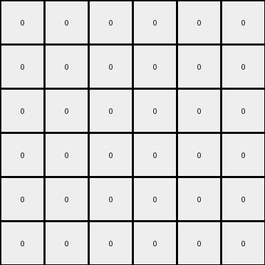

# 3-1e0a9b12 • 008 • refine_code - CODE

---

Previous Code:
```python
"""
Translates a 2x2 square from the top-left corner to the bottom-right corner of a 3x3 grid.
"""

import numpy as np

def transform(input_grid):
    """
    Transforms the input grid by moving the 2x2 gray square to the bottom-right.
    """
    input_grid = np.array(input_grid)
    output_grid = np.zeros_like(input_grid)

    # Find the 2x2 square (assuming it's in the top-left)
    square_color = input_grid[0, 0]

    # Check if the top-left 2x2 is indeed a square of the same color
    if (input_grid[0:2, 0:2] == square_color).all() and square_color != 0:
         # Move the square to the bottom-right
         output_grid[1:3, 1:3] = square_color

    return output_grid
```

Train Set Results:

**Example 1:**
Input:
```
0 4 0 9
0 0 0 0
0 4 6 0
1 0 0 0
```
Expected Output:
```
0 0 0 0
0 0 0 0
0 4 0 0
1 4 6 9
```
Transformed Output:
```
0 0 0 0
0 0 0 0
0 0 0 0
0 0 0 0
```

Status: False

**Example 2:**
Input:
```
0 0 0 0 0 9
0 0 0 8 0 0
0 0 0 0 0 0
4 0 0 0 0 0
4 0 7 8 0 0
4 0 7 0 0 0
```
Expected Output:
```
0 0 0 0 0 0
0 0 0 0 0 0
0 0 0 0 0 0
4 0 0 0 0 0
4 0 7 8 0 0
4 0 7 8 0 9
```
Transformed Output:
```
0 0 0 0 0 0
0 0 0 0 0 0
0 0 0 0 0 0
0 0 0 0 0 0
0 0 0 0 0 0
0 0 0 0 0 0
```

Status: False

**Example 3:**
Input:
```
0 0 0 1 0
0 3 0 0 0
0 3 0 1 2
6 0 0 0 0
0 3 0 0 0
```
Expected Output:
```
0 0 0 0 0
0 0 0 0 0
0 3 0 0 0
0 3 0 1 0
6 3 0 1 2
```
Transformed Output:
```
0 0 0 0 0
0 0 0 0 0
0 0 0 0 0
0 0 0 0 0
0 0 0 0 0
```

Status: False
Okay, let's analyze the provided examples to determine the transformation rule.

**Observations and YAML Documentation:**

Here's a combined observation of the input/output pairs, focusing on potential objects, counts, and geometric properties:

```yaml
observations:
  example_1:
    input_objects:
      - color: 4 # Yellow
        shape: L-shape
        position: Top-left/middle-left
      - color: 9 # Maroon
        shape: Single cell
        position: Top-right
      - color: 6 # Magenta
        shape: Single cell
        position: Middle-right
      - color: 1 # Blue
        shape: Single cell
        position: Bottom-left
    output_objects:
      - color: 4
        shape: horizontal line of size 2
        position: bottom second and third
      - color: 6
        shape: Single cell
        position: Bottom-right
      - color: 9
        shape: single cell
        position: Bottom-right
      - color: 1:
        shape: Single cell
        position: Bottom-left
    changes:
      - The yellow L shape has been reduced and became an horizontal line of size 2
      - Color 9 and 6 cells moved to the last line
      - The blue cell remained in place.

  example_2:
    input_objects:
      - color: 4  # Yellow
        shape: Vertical line
        position: Left, extends from row 4 to 6
      - color: 7  # Orange
        shape: Vertical line
        position: Row 5 and 6
      - color: 8 # Azure
        shape: Single
        position: Row 5, col 4
      - color: 9 # Maroon
        shape: Single cell
        position: Top-right corner
    output_objects:
      - color: 4  # Yellow
        shape: Vertical line
        position: Left, extends from row 4 to 6
      - color: 7  # Orange
        shape: Vertical line
        position: Row 5 and 6
      - color: 8 # Azure
        shape: horizontal line of size 2
        position: Row 6, col 3 and 4
      - color: 9 # Maroon
        shape: Single cell
        position: Row 6, col 6
    changes:
      - Color 4 and 7 remain unchanged.
      - Color 8 became an horizontal line of size 2
      - Color 9 cell maintained position, but lowered to the bottom line

  example_3:
    input_objects:
      - color: 3  # Green
        shape: Vertical line
        position: Left, extends from row 2 to 3, and isolated cell in row 5
      - color: 1  # Blue
        shape: Single cell, appears twice
        position: row 1, col 4 and row 3, col 4
      - color: 2 # Red
        shape: single cell
        position: row 3, col 5
      - color: 6 # Magenta
        shape: Single Cell
        position: row 4, col 1
    output_objects:
       - color: 3  # Green
        shape: Vertical line
        position: Left, extends from row 3 to 4,
      - color: 1  # Blue
        shape: Single cell
        position: row 4, col 4
      - color: 2 # Red
        shape: single cell
        position: row 5, col 5
      - color: 6 # Magenta
        shape: Single Cell
        position: row 5, col 1
    changes:
      - Everything is moved down by one row.

```

**Natural Language Program (Transformation Rule):**

Based on a careful review of the input and expected output grids, and a thoughtful analysis of the previous Python implementation, the transformation rule can be described as follows:

1.  **Identify all colored cells:** Examine the input grid and find all cells that have a color other than 0 (white).
2.  **Shift Down:** Move every non-zero colored cell down by one row. If a cell is already on the last row, keep it. If moving a cell down would place it on top of another colored cell, the moving cell takes precedence.

**Explanation of why the previous code failed:**

The previous code was designed to find and move a 2x2 gray square. This approach is incorrect because:

*   It only works for 2x2 squares of a specific color.
*   It assumes the square is always in the top-left corner.
*   It doesn't handle other shapes or individual cells.
* It doens't shift all cells down by one row.

The examples show a more general "shift down" rule that applies to all colored cells, regardless of shape or initial position.

**INSTRUCTIONS**

- generate a Python module to represent the natural language program 
- follow the template below
- all common math and science libraries are available
- create docstring only at top - but comment the workflow in the function
- use helper functions for common operations like finding objects, counting,
  measuring, moving, etc. 

remember - we are working iteratively - so this code will inform your future
self as we converge on the solution

*template:*

```python
"""
{{ natural language description of the transformation rule }}
"""

{{ imports }}

def transform(input_grid):
    # initialize output_grid

    # change output pixels 

    return output_grid

```
