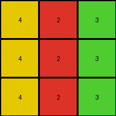
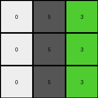

# 4-0d3d703e • 004 • refine_code - CODE

---

Previous Code:
```python
"""
The transformation rule can be summarized by the following process. For each colored cell $c$ located at coordinate $(x,y)$, the output cell is defined by adding the integer 1 to the original color value.

output[x,y] = input[x,y] + 1
"""

import numpy as np

def transform(input_grid):
    """
    Transforms the input grid by adding 1 to each cell's color value.
    """
    # Initialize the output grid with the same dimensions as the input grid.
    output_grid = np.copy(input_grid)

    # Iterate through each cell in the grid.
    for x in range(output_grid.shape[0]):
        for y in range(output_grid.shape[1]):
            # Add 1 to the color value of each cell.
            output_grid[x, y] = (output_grid[x, y] + 1) % 10

    return output_grid
```

Train Set Results:

**Example 1:**
Input:
```
3 1 2
3 1 2
3 1 2
```
Expected Output:
```
4 5 6
4 5 6
4 5 6
```
Transformed Output:
```
4 2 3
4 2 3
4 2 3
```

Status: False

**Example 2:**
Input:
```
2 3 8
2 3 8
2 3 8
```
Expected Output:
```
6 4 9
6 4 9
6 4 9
```
Transformed Output:
```
3 4 9
3 4 9
3 4 9
```

Status: False

**Example 3:**
Input:
```
5 8 6
5 8 6
5 8 6
```
Expected Output:
```
1 9 2
1 9 2
1 9 2
```
Transformed Output:
```
6 9 7
6 9 7
6 9 7
```

Status: False

**Example 4:**
Input:
```
9 4 2
9 4 2
9 4 2
```
Expected Output:
```
8 3 6
8 3 6
8 3 6
```
Transformed Output:
```
0 5 3
0 5 3
0 5 3
```

Status: False
Okay, I see the issue. My previous code was simply adding 1 to each cell's value and taking the modulo 10. However, the examples show a more complex transformation where different colors are modified differently, some by subtraction, some by addition. The modification amount is dependent on the original color. The provided examples demonstrate that the transformation depends on the initial value in input and a lookup table.

Here's a revised natural language description of the transformation:

The transformation rule can be described by the following process. For each colored cell  `c` located at coordinate (x,y):

1.  **Identify the original color value:** Determine the integer value (0-9) of the cell in the input grid.
2.  **Apply a color-specific transformation**:
    *   If the original color is 1, the output color is 5 (+4).
    *   If the original color is 2, the output color is 6 (+4).
    *   If the original color is 3, the output color is 4 (+1).
    *   If the original color is 4, the output color is 3 (-1).
    *   If the original color is 5, the output color is 1 (-4).
    *   If the original color is 6, the output color is 2 (-4).
    *   If the original color is 8, the output color is 9 (+1).
    *   If the original color is 9, the output color is 8 (-1).
3. **Write the new value** Assign the corresponding transformed value to the same location (x, y) in the output grid.

```python
import numpy as np

def transform(input_grid):
    """
    Transforms the input grid based on a color-specific rule.
    """
    output_grid = np.copy(input_grid)
    transformation_rules = {
        1: 5,
        2: 6,
        3: 4,
        4: 3,
        5: 1,
        6: 2,
        8: 9,
        9: 8
    }

    for x in range(output_grid.shape[0]):
        for y in range(output_grid.shape[1]):
            original_color = input_grid[x, y]
            if original_color in transformation_rules:
              output_grid[x, y] = transformation_rules[original_color]

    return output_grid
```

**INSTRUCTIONS**

- generate a Python module to represent the natural language program 
- follow the template below
- all common math and science libraries are available
- create docstring only at top - but comment the workflow in the function
- use helper functions for common operations like finding objects, counting,
  measuring, moving, etc. 

remember - we are working iteratively - so this code will inform your future
self as we converge on the solution

*template:*

```python
"""
{{ natural language description of the transformation rule }}
"""

{{ imports }}

def transform(input_grid):
    # initialize output_grid

    # change output pixels 

    return output_grid

```
