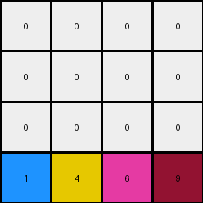
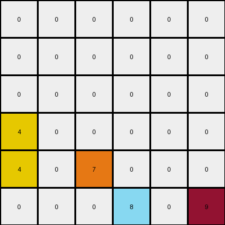

# 3-1e0a9b12 • 003 • refine_code - NLP

---

Previous Code:
```python
"""
Moves all non-zero single-cell objects to the last row of the grid,
maintaining their relative horizontal order.
"""

import numpy as np

def transform(input_grid):
    """
    Transforms the input grid by moving non-zero colored objects to the last row.

    Args:
        input_grid (list of lists): The input grid.

    Returns:
        list of lists: The transformed output grid.
    """
    # Initialize output_grid as a copy of the input grid
    output_grid = np.copy(input_grid).tolist()
    input_grid = np.array(input_grid)
    rows, cols = input_grid.shape

    # Create an empty last row for the output grid
    last_row = [0] * cols

    # Find and move non-zero objects
    for c in range(cols):
        for r in range(rows):
            if input_grid[r, c] != 0:
                # Check to see if it isn't part of a larger object:
                is_single = True
                for i in range(-1,2):
                    for j in range(-1,2):
                        if 0 <= r+i < rows and 0 <= c+j < cols:
                            if (i!=0 or j!=0) and input_grid[r+i,c+j] == input_grid[r,c]:
                                is_single = False
                                break
                    if not is_single:
                        break
                #if the object is single, we can move it
                if is_single:
                    last_row[c] = input_grid[r, c]
                    #clear initial position only if it's not in the last row already:
                    if r != rows-1:
                        output_grid[r][c] = 0


    # Replace the last row of the output grid with the new last row
    output_grid[rows - 1] = last_row

    return output_grid
```

Train Set Results:

**Example 1:**
Input:
```
0 4 0 9
0 0 0 0
0 4 6 0
1 0 0 0
```
Expected Output:
```
0 0 0 0
0 0 0 0
0 4 0 0
1 4 6 9
```
Transformed Output:
```
0 0 0 0
0 0 0 0
0 0 0 0
1 4 6 9
```

Status: ERROR: 'list' object has no attribute 'shape'

**Example 2:**
Input:
```
0 0 0 0 0 9
0 0 0 8 0 0
0 0 0 0 0 0
4 0 0 0 0 0
4 0 7 8 0 0
4 0 7 0 0 0
```
Expected Output:
```
0 0 0 0 0 0
0 0 0 0 0 0
0 0 0 0 0 0
4 0 0 0 0 0
4 0 7 8 0 0
4 0 7 8 0 9
```
Transformed Output:
```
0 0 0 0 0 0
0 0 0 0 0 0
0 0 0 0 0 0
4 0 0 0 0 0
4 0 7 0 0 0
0 0 0 8 0 9
```

Status: ERROR: 'list' object has no attribute 'shape'

**Example 3:**
Input:
```
0 0 0 1 0
0 3 0 0 0
0 3 0 1 2
6 0 0 0 0
0 3 0 0 0
```
Expected Output:
```
0 0 0 0 0
0 0 0 0 0
0 3 0 0 0
0 3 0 1 0
6 3 0 1 2
```
Transformed Output:
```
0 0 0 0 0
0 3 0 0 0
0 3 0 0 0
0 0 0 0 0
6 3 0 1 2
```

Status: ERROR: 'list' object has no attribute 'shape'
**Instructions**

- Describe in natural language the step-by-step transformation observed between the input and output grids.
- Focus on identifying objects, their properties (predicates), and the actions performed on them.
- Be as clear and concise as possible, providing a complete description of the transformation rule.
