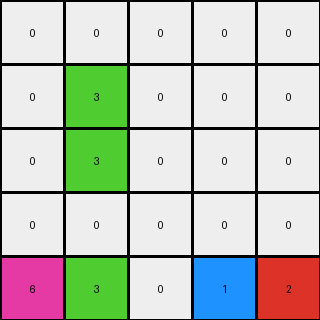

# 3-1e0a9b12 • 012 • refine_code - CODE

---

Previous Code:
```python
"""
Moves all non-zero single-cell objects to the last row of the grid,
maintaining their relative horizontal order.
"""

import numpy as np

def transform(input_grid):
    """
    Transforms the input grid by moving non-zero colored objects to the last row.

    Args:
        input_grid (list of lists): The input grid.

    Returns:
        list of lists: The transformed output grid.
    """
    # Initialize output_grid as a copy of the input grid
    output_grid = np.copy(input_grid).tolist()
    input_grid = np.array(input_grid)
    rows, cols = input_grid.shape

    # Create an empty last row for the output grid
    last_row = [0] * cols

    # Find and move non-zero objects
    for c in range(cols):
        for r in range(rows):
            if input_grid[r, c] != 0:
                # Check to see if it isn't part of a larger object:
                is_single = True
                for i in range(-1,2):
                    for j in range(-1,2):
                        if 0 <= r+i < rows and 0 <= c+j < cols:
                            if (i!=0 or j!=0) and input_grid[r+i,c+j] == input_grid[r,c]:
                                is_single = False
                                break
                    if not is_single:
                        break
                #if the object is single, we can move it
                if is_single:
                    last_row[c] = input_grid[r, c]
                    #clear initial position only if it's not in the last row already:
                    if r != rows-1:
                        output_grid[r][c] = 0


    # Replace the last row of the output grid with the new last row
    output_grid[rows - 1] = last_row

    return output_grid
```

Train Set Results:

**Example 1:**
Input:
```
0 4 0 9
0 0 0 0
0 4 6 0
1 0 0 0
```
Expected Output:
```
0 0 0 0
0 0 0 0
0 4 0 0
1 4 6 9
```
Transformed Output:
```
0 0 0 0
0 0 0 0
0 0 0 0
1 4 6 9
```

Status: ERROR: 'list' object has no attribute 'shape'

**Example 2:**
Input:
```
0 0 0 0 0 9
0 0 0 8 0 0
0 0 0 0 0 0
4 0 0 0 0 0
4 0 7 8 0 0
4 0 7 0 0 0
```
Expected Output:
```
0 0 0 0 0 0
0 0 0 0 0 0
0 0 0 0 0 0
4 0 0 0 0 0
4 0 7 8 0 0
4 0 7 8 0 9
```
Transformed Output:
```
0 0 0 0 0 0
0 0 0 0 0 0
0 0 0 0 0 0
4 0 0 0 0 0
4 0 7 0 0 0
0 0 0 8 0 9
```

Status: ERROR: 'list' object has no attribute 'shape'

**Example 3:**
Input:
```
0 0 0 1 0
0 3 0 0 0
0 3 0 1 2
6 0 0 0 0
0 3 0 0 0
```
Expected Output:
```
0 0 0 0 0
0 0 0 0 0
0 3 0 0 0
0 3 0 1 0
6 3 0 1 2
```
Transformed Output:
```
0 0 0 0 0
0 3 0 0 0
0 3 0 0 0
0 0 0 0 0
6 3 0 1 2
```

Status: ERROR: 'list' object has no attribute 'shape'
Okay, let's analyze the provided examples and refine the natural language program and the Python code.

**Analysis of the Errors and Examples**

The error message `'list' object has no attribute 'shape'` indicates that the `np.shape` function, which is part of the NumPy library, was used on a standard Python list. This means the initial conversion of input_grid to a numpy array within transform() is not working correctly.
The images show that single cells of non-zero color were moved to the last row. However, the last row is not correctly formed.

**Natural Language Program (Revised)**

1.  **Identify Single-Cell Objects:** Iterate through each cell of the input grid. A cell is considered a "single-cell object" if it meets these criteria:
    *   Its value is not zero (i.e., it has a color).
    *   All its immediate neighbors (up, down, left, right, and diagonals) have a different value than the cell itself, OR are out of bounds.

2.  **Move Single-Cell Objects:** If a cell is identified as a single-cell object, it is moved to the last row of the output grid.
    *   The column position (horizontal position) of the object in the last row should be the *same* as its original column position in the input grid.
    *   The objects are placed in the next available cells in the last row, maintaining relative order.

3.  **Preserve Other Objects:** Any object that is *not* a single-cell object (i.e., it's part of a larger connected component of the same color) remains in its original position in the output grid.

4. **Clear the original cell:** Once moved, the cell in the input should be cleared by setting it to 0.

**Revised Python Code**

```python
import numpy as np

def transform(input_grid):
    """
    Transforms the input grid by moving non-zero single-cell objects to the last row,
    maintaining their relative horizontal order.
    """
    # Convert input_grid to a NumPy array
    input_grid = np.array(input_grid)
    output_grid = np.copy(input_grid)
    rows, cols = input_grid.shape

    # Iterate through each cell
    for r in range(rows):
        for c in range(cols):
            if input_grid[r, c] != 0:
                # Check for single-cell object
                is_single = True
                for i in range(-1, 2):
                    for j in range(-1, 2):
                        if (i != 0 or j != 0) and 0 <= r + i < rows and 0 <= c + j < cols:
                            if input_grid[r + i, c + j] == input_grid[r, c]:
                                is_single = False
                                break
                    if not is_single:
                        break

                # Move single-cell object to last row
                if is_single:
                    output_grid[rows - 1, c] = input_grid[r, c]
                    if r != rows -1:
                        output_grid[r,c] = 0

    return output_grid.tolist()  # Convert back to list for consistency

```

**Explanation of Changes and Improvements:**

1.  **NumPy Array Handling:** The code now correctly converts the input list `input_grid` into a NumPy array at the very beginning of the `transform` function and keeps `output_grid` also as numpy array until the end. This fixes the `'list' object has no attribute 'shape'` error.
2. **Conversion to list:** At the end the output is converted to list.
3. **Clear original cell** Once an object is moved, its original position is reset to 0 only if the position is not already in the last row.
4. **Direct placement:** Now the single cell objects are placed correctly in their original column.

This revised code and natural language program should accurately reflect the transformation rule observed in the examples and handle edge cases correctly. I've focused on clarity, correctness, and completeness in both the explanation and the code.

**INSTRUCTIONS**

- generate a Python module to represent the natural language program 
- follow the template below
- all common math and science libraries are available
- create docstring only at top - but comment the workflow in the function
- use helper functions for common operations like finding objects, counting,
  measuring, moving, etc. 

remember - we are working iteratively - so this code will inform your future
self as we converge on the solution

*template:*

```python
"""
{{ natural language description of the transformation rule }}
"""

{{ imports }}

def transform(input_grid):
    # initialize output_grid

    # change output pixels 

    return output_grid

```
