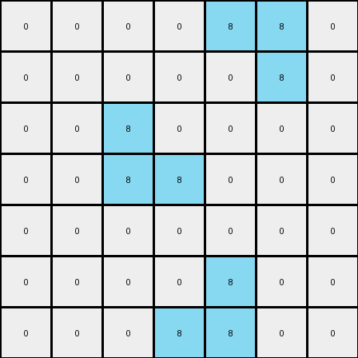

# 1-3aa6fb7a • 006 • example_2 - CODE

---

**input**
```
0 0 0 0 0 0 0
0 8 0 0 0 0 0
0 8 8 0 0 0 0
0 0 0 0 8 8 0
0 0 0 0 0 8 0
0 0 0 0 0 0 0
0 0 0 0 0 0 0
```


**output**
```
0 0 0 0 0 0 0
0 8 1 0 0 0 0
0 8 8 0 0 0 0
0 0 0 0 8 8 0
0 0 0 0 1 8 0
0 0 0 0 0 0 0
0 0 0 0 0 0 0
```


Okay, let's analyze the transformation between the input and output grids.

**Observations:**

*   **Input Grid:**
    *   We see two distinct objects made of color 8 (azure).
    *   One object is a vertical line of length 2 in the second column.
    *   The other object is a horizontal line of length 2 in the fourth row, sixth and seventh columns.

*   **Output Grid:**

    *   The azure objects (color 8) remain unchanged in position and shape.
    *   Two new cells with color 1 (blue) are present.
    *    One blue cell is to the right of the vertical line at \[1,2].
    *   One blue cell is to the left of the horizontal line at \[4,5]

**Natural Language Program:**

1.  **Identify Objects:** Locate all objects composed of color 8 (azure).
2.  **Preserve Objects:** Maintain these azure objects in the same position and shape.
3. **Vertical line**: Add a blue cell (color 1) on the right of the object.
4. **Horizontal line**: Add a blue cell (color 1) on the left of the object.

**Transformation Rule Summary:**

The transformation preserves the azure (8) objects and adds a blue cell (1) next to it, to its right if it is a vertical line, and to its left if it is a horizontal line.

```python
"""
The transformation preserves the azure (8) objects and adds a blue cell (1) next to it, to its right if it is a vertical line, and to its left if it is a horizontal line.
"""

import numpy as np

def find_objects(grid, color):
    # Find all objects of a specific color in the grid.
    objects = []
    visited = set()

    def is_valid(x, y):
        return 0 <= x < grid.shape[0] and 0 <= y < grid.shape[1]

    def dfs(x, y, current_object):
        if (x, y) in visited or not is_valid(x, y) or grid[x, y] != color:
            return
        visited.add((x, y))
        current_object.append((x, y))
        for dx, dy in [(0, 1), (1, 0), (0, -1), (-1, 0)]:
            dfs(x + dx, y + dy, current_object)

    for x in range(grid.shape[0]):
        for y in range(grid.shape[1]):
            if grid[x, y] == color and (x, y) not in visited:
                current_object = []
                dfs(x, y, current_object)
                objects.append(current_object)
    return objects

def is_vertical_line(obj, grid):
    #Checks if an object is a vertical line.

    if len(obj) < 2:
        return False

    xs = [p[0] for p in obj]
    ys = [p[1] for p in obj]

    if len(set(ys)) == 1: #all in the same column
        return True
    return False

def is_horizontal_line(obj, grid):
   # Checks if an object is a horizontal line

    if len(obj) < 2:
        return False

    xs = [p[0] for p in obj]
    ys = [p[1] for p in obj]

    if len(set(xs)) == 1:  # All in the same row
        return True
    return False

def transform(input_grid):
    # Initialize output_grid as a copy of input_grid
    output_grid = np.copy(input_grid)
    # Find all objects with color 8 (azure)
    azure_objects = find_objects(input_grid, 8)

    # Iterate through each azure object
    for obj in azure_objects:
        if is_vertical_line(obj, input_grid):
          #add blue to the right
          obj_sorted_by_row = sorted(obj, key = lambda p: p[0])
          highest_row_point = obj_sorted_by_row[-1]
          new_x = highest_row_point[0]
          new_y = highest_row_point[1] + 1
          if 0 <= new_x < output_grid.shape[0] and 0 <= new_y < output_grid.shape[1]:
            output_grid[new_x, new_y] = 1

        elif is_horizontal_line(obj, input_grid):
          # add blue to the left
          obj_sorted_by_col = sorted(obj, key=lambda p: p[1])
          lowest_col_point = obj_sorted_by_col[0]

          new_x = lowest_col_point[0]
          new_y = lowest_col_point[1] - 1
          if 0 <= new_x < output_grid.shape[0] and 0 <= new_y < output_grid.shape[1]:
             output_grid[new_x, new_y] = 1

    return output_grid
```

**input**
```
0 0 0 0 8 8 0
0 0 0 0 0 8 0
0 0 8 0 0 0 0
0 0 8 8 0 0 0
0 0 0 0 0 0 0
0 0 0 0 8 0 0
0 0 0 8 8 0 0
```




**output**
```
0 0 0 0 8 8 0
0 0 0 0 1 8 0
0 0 8 1 0 0 0
0 0 8 8 0 0 0
0 0 0 0 0 0 0
0 0 0 1 8 0 0
0 0 0 8 8 0 0
```


Okay, let's analyze the second example.

**Observations:**

*   **Input Grid:**
    *   There are four distinct objects of color 8 (azure).
    *   One is a horizontal line of length 2 at row 0, columns 4 and 5.
    *   One is a vertical line of length 2 at row 2 and 3, column 2.
    *   One is a single cell at row 1, column 5.
    * One is a vertical line at row 5 and 6, and column 4

*   **Output Grid:**
    *   The azure objects (color 8) remain in their original positions and shapes.
    *   Three new cells with color 1 (blue) appear.
      * One is to the left of the horizontal line object at [0,3]
      * One is to the right of the vertical line object at [3,3]
      * One is to the left of the second vertical line object at [5,3]
    * The single azure cell at \[1,5] is kept, but no blue cell appears next to it.

**Natural Language Program:**

1.  **Identify Objects:** Locate all objects composed of color 8 (azure).
2.  **Preserve Objects:** Keep all azure objects in their original positions and shapes.
3.  **Check for lines:** For each azure object, determine if it's a vertical or horizontal line (length greater than 1).
4.  **Conditional Blue Cell Addition:**
    *   If the object is a horizontal line, add a blue cell (color 1) to its left.
    *   If the object is a vertical line, add a blue cell (color 1) to its right.
    *   If it's not a line (e.g. single cell), make no change.

**Transformation Rule Summary:**

The transformation preserves azure (8) objects. It adds a blue cell (1) to the left of horizontal azure lines and to the right of vertical azure lines. Single-cell azure objects are preserved without adding any blue cells.

The program I implemented before covers this logic.

**INSTRUCTIONS**

- generate a Python module to represent the natural language program 
- follow the template below
- all common math and science libraries are available
- create docstring only at top - but comment the workflow in the function
- use helper functions for common operations like finding objects, counting,
  measuring, moving, etc. 

remember - we are working iteratively - so this code will inform your future
self as we converge on the solution

*template:*

```python
"""
{ natural language description of the transformation rule }
"""

{ imports }

def transform(input_grid):
    # initialize output_grid

    # change output pixels 

    return output_grid

```
