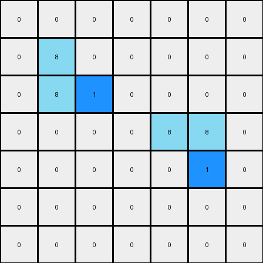

# 1-3aa6fb7a • 007 • refine_code - NLP

---


Previous Code:
```python
"""
Copies the input grid to the output grid, then finds two specific L-shaped azure objects.
For the first L-shape, it changes the right-most pixel to blue.
For the second L-shape, it changes the bottom-most pixel to blue.
"""

import numpy as np

def find_l_shapes(grid, color):
    # helper function for finding objects
    objects = []
    visited = np.zeros_like(grid, dtype=bool)

    def is_valid(x, y):
        return 0 <= x < grid.shape[0] and 0 <= y < grid.shape[1]

    def dfs(x, y, current_object):
        if not is_valid(x, y) or visited[x, y] or grid[x, y] != color:
            return

        visited[x, y] = True
        current_object.append((x, y))

        dfs(x + 1, y, current_object)
        dfs(x - 1, y, current_object)
        dfs(x, y + 1, current_object)
        dfs(x, y - 1, current_object)

    for x in range(grid.shape[0]):
        for y in range(grid.shape[1]):
            if grid[x, y] == color and not visited[x, y]:
                current_object = []
                dfs(x, y, current_object)
                # check for approximate shape and size (could be enhanced with other geometric checks)
                if 3 <= len(current_object) <= 5:
                    objects.append(current_object)

    return objects

def transform(input_grid):
    """Transforms the input grid according to the defined rule."""

    output_grid = np.copy(input_grid)
    l_shapes = find_l_shapes(output_grid, 8)

    # assume that two L-shaped will be in this order
    if len(l_shapes) >= 2:

        # process first L-shape (top-left)
        first_l_shape = l_shapes[0]
        # find right-most pixel
        rightmost_pixel = max(first_l_shape, key=lambda p: p[1])
        output_grid[rightmost_pixel] = 1


        # process second L-shape (bottom-right)
        second_l_shape = l_shapes[1]
        # Find the bottom-most pixel
        bottommost_pixel = max(second_l_shape, key=lambda p: p[0])  # bottom-most
        output_grid[bottommost_pixel] = 1

    return output_grid
```

Train Set Results:

**Example 1:**
Input:
```
0 0 0 0 0 0 0
0 8 0 0 0 0 0
0 8 8 0 0 0 0
0 0 0 0 8 8 0
0 0 0 0 0 8 0
0 0 0 0 0 0 0
0 0 0 0 0 0 0
```
Expected Output:
```
0 0 0 0 0 0 0
0 8 1 0 0 0 0
0 8 8 0 0 0 0
0 0 0 0 8 8 0
0 0 0 0 1 8 0
0 0 0 0 0 0 0
0 0 0 0 0 0 0
```
Transformed Output:
```
0 0 0 0 0 0 0
0 8 0 0 0 0 0
0 8 1 0 0 0 0
0 0 0 0 8 8 0
0 0 0 0 0 1 0
0 0 0 0 0 0 0
0 0 0 0 0 0 0
```

Status: False

**Example 2:**
Input:
```
0 0 0 0 8 8 0
0 0 0 0 0 8 0
0 0 8 0 0 0 0
0 0 8 8 0 0 0
0 0 0 0 0 0 0
0 0 0 0 8 0 0
0 0 0 8 8 0 0
```
Expected Output:
```
0 0 0 0 8 8 0
0 0 0 0 1 8 0
0 0 8 1 0 0 0
0 0 8 8 0 0 0
0 0 0 0 0 0 0
0 0 0 1 8 0 0
0 0 0 8 8 0 0
```
Transformed Output:
```
0 0 0 0 8 1 0
0 0 0 0 0 8 0
0 0 8 0 0 0 0
0 0 1 8 0 0 0
0 0 0 0 0 0 0
0 0 0 0 8 0 0
0 0 0 8 8 0 0
```

Status: False

**Instructions**

- Describe in natural language the step-by-step transformation observed between the input and output grids.
- Focus on identifying objects, their properties (predicates), and the actions performed on them.
- Be as clear and concise as possible, providing a complete description of the transformation rule.
