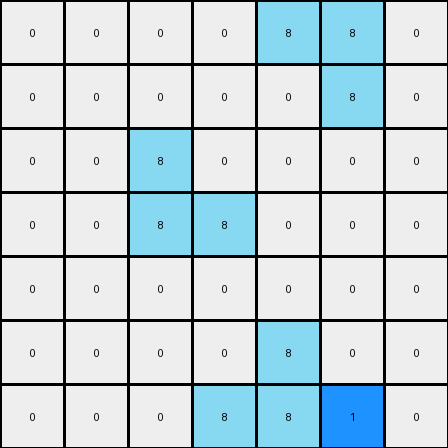

# 1-3aa6fb7a • 004 • refine_code - NLP

---

Previous Code:
```python
import numpy as np

def find_2x1_vertical_rectangles(grid, color):
    """
    Finds the coordinates of 2x1 vertical rectangles of the specified color.
    Returns a list of tuples, where each tuple contains the top and bottom coordinates of a rectangle.
    """
    rectangles = []
    rows, cols = grid.shape
    for r in range(rows - 1):
        for c in range(cols):
            if grid[r, c] == color and grid[r + 1, c] == color:
                rectangles.append(((r, c), (r + 1, c)))
    return rectangles

def transform(input_grid):
    """
    Transforms the input grid according to the refined rule.
    """
    output_grid = np.copy(input_grid)
    azure_rectangles = find_2x1_vertical_rectangles(output_grid, 8)

    for top_coord, bottom_coord in azure_rectangles:
        #Conditional Blue Placement - Right
        r_top, c_top = top_coord
        r_bot, c_bot = bottom_coord
        if (c_top + 1 < output_grid.shape[1] and
            c_bot + 1 < output_grid.shape[1] and
            output_grid[r_top, c_top + 1] == 8 and
            output_grid[r_bot, c_bot + 1] == 8):
                if c_top -1 >= 0:
                    output_grid[r_top,c_top-1] = 1

        #Conditional Blue Placement - Left
        if (c_bot - 1 >= 0 and
            output_grid[r_bot,c_bot-1] == 8):
             if c_bot + 1 < output_grid.shape[1]:
                output_grid[r_bot,c_bot+1] = 1
    return output_grid
```

Train Set Results:

**Example 1:**
Input:
```
0 0 0 0 0 0 0
0 8 0 0 0 0 0
0 8 8 0 0 0 0
0 0 0 0 8 8 0
0 0 0 0 0 8 0
0 0 0 0 0 0 0
0 0 0 0 0 0 0
```
Expected Output:
```
0 0 0 0 0 0 0
0 8 1 0 0 0 0
0 8 8 0 0 0 0
0 0 0 0 8 8 0
0 0 0 0 1 8 0
0 0 0 0 0 0 0
0 0 0 0 0 0 0
```
Transformed Output:
```
0 0 0 0 0 0 0
0 8 0 0 0 0 0
0 8 8 0 0 0 0
0 0 0 0 8 8 0
0 0 0 0 0 8 0
0 0 0 0 0 0 0
0 0 0 0 0 0 0
```

Status: False

**Example 2:**
Input:
```
0 0 0 0 8 8 0
0 0 0 0 0 8 0
0 0 8 0 0 0 0
0 0 8 8 0 0 0
0 0 0 0 0 0 0
0 0 0 0 8 0 0
0 0 0 8 8 0 0
```
Expected Output:
```
0 0 0 0 8 8 0
0 0 0 0 1 8 0
0 0 8 1 0 0 0
0 0 8 8 0 0 0
0 0 0 0 0 0 0
0 0 0 1 8 0 0
0 0 0 8 8 0 0
```
Transformed Output:
```
0 0 0 0 8 8 0
0 0 0 0 0 8 0
0 0 8 0 0 0 0
0 0 8 8 0 0 0
0 0 0 0 0 0 0
0 0 0 0 8 0 0
0 0 0 8 8 1 0
```

Status: False
**Instructions**

- Describe in natural language the step-by-step transformation observed between the input and output grids.
- Focus on identifying objects, their properties (predicates), and the actions performed on them.
- Be as clear and concise as possible, providing a complete description of the transformation rule.
