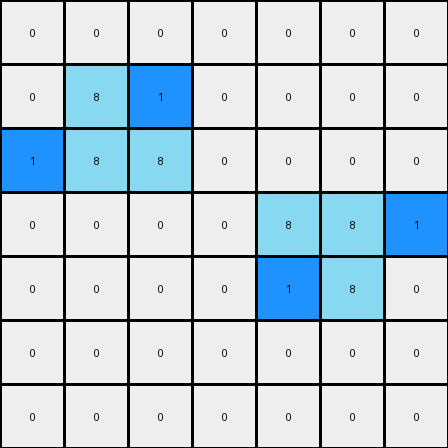
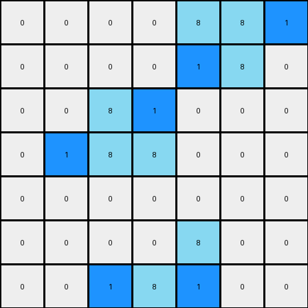

# 1-3aa6fb7a • 006 • refine_code - CODE

---

Previous Code:
```python
"""
The output preserves the azure colored object and adds a blue pixel adjacent to the azure object, to the right of its top-left corner, and one to the left of the bottom-right one.
"""

import numpy as np

def find_objects(grid, color):
    objects = []
    visited = set()

    def is_valid(r, c):
        return 0 <= r < grid.shape[0] and 0 <= c < grid.shape[1]

    def dfs(r, c, current_object):
        if (r, c) in visited or not is_valid(r, c) or grid[r, c] != color:
            return
        visited.add((r, c))
        current_object.append((r, c))
        dfs(r + 1, c, current_object)
        dfs(r - 1, c, current_object)
        dfs(r, c + 1, current_object)
        dfs(r, c - 1, current_object)

    for r in range(grid.shape[0]):
        for c in range(grid.shape[1]):
            if grid[r, c] == color and (r, c) not in visited:
                current_object = []
                dfs(r, c, current_object)
                objects.append(current_object)
    return objects

def transform(input_grid):
    # initialize output_grid
    output_grid = np.copy(input_grid)
    
    # find azure objects
    azure_objects = find_objects(input_grid, 8)

    # add blue pixels
    for obj in azure_objects:
        # sort object coordinates to find top-left and bottom-right
        sorted_obj = sorted(obj, key=lambda x: (x[0], x[1]))
        top_left = sorted_obj[0]
        bottom_right = sorted_obj[-1]
        # adjust for the 2x1 vertical rectangle object shape assumption
        if len(obj) > 1 and top_left[0] == sorted_obj[1][0] -1 and top_left[1] == sorted_obj[1][1]:
            top_left_corner = top_left
        elif len(obj) > 1:
            top_left_corner = (sorted_obj[1][0], sorted_obj[1][1])
        else:
            top_left_corner = top_left
        
        if len(obj) > 1 and bottom_right[0] == sorted_obj[-2][0] + 1 and bottom_right[1] == sorted_obj[-2][1]:
           bottom_right_corner = bottom_right
        elif len(obj) > 1:
             bottom_right_corner = (sorted_obj[-2][0], sorted_obj[-2][1])
        else:
            bottom_right_corner = bottom_right

        #Add to the right of top left corner
        if top_left_corner[1] + 1 < output_grid.shape[1]:
          output_grid[top_left_corner[0], top_left_corner[1] + 1] = 1
        #Add to the left of the bottom right corner
        if bottom_right_corner[1] -1 >= 0:
          output_grid[bottom_right_corner[0], bottom_right_corner[1] - 1] = 1


    return output_grid
```

Train Set Results:

**Example 1:**
Input:
```
0 0 0 0 0 0 0
0 8 0 0 0 0 0
0 8 8 0 0 0 0
0 0 0 0 8 8 0
0 0 0 0 0 8 0
0 0 0 0 0 0 0
0 0 0 0 0 0 0
```
Expected Output:
```
0 0 0 0 0 0 0
0 8 1 0 0 0 0
0 8 8 0 0 0 0
0 0 0 0 8 8 0
0 0 0 0 1 8 0
0 0 0 0 0 0 0
0 0 0 0 0 0 0
```
Transformed Output:
```
0 0 0 0 0 0 0
0 8 1 0 0 0 0
1 8 8 0 0 0 0
0 0 0 0 8 8 1
0 0 0 0 1 8 0
0 0 0 0 0 0 0
0 0 0 0 0 0 0
```

Status: False

**Example 2:**
Input:
```
0 0 0 0 8 8 0
0 0 0 0 0 8 0
0 0 8 0 0 0 0
0 0 8 8 0 0 0
0 0 0 0 0 0 0
0 0 0 0 8 0 0
0 0 0 8 8 0 0
```
Expected Output:
```
0 0 0 0 8 8 0
0 0 0 0 1 8 0
0 0 8 1 0 0 0
0 0 8 8 0 0 0
0 0 0 0 0 0 0
0 0 0 1 8 0 0
0 0 0 8 8 0 0
```
Transformed Output:
```
0 0 0 0 8 8 1
0 0 0 0 1 8 0
0 0 8 1 0 0 0
0 1 8 8 0 0 0
0 0 0 0 0 0 0
0 0 0 0 8 0 0
0 0 1 8 1 0 0
```

Status: False
Okay, let's analyze the provided examples and refine the natural language program and the corresponding Python code.

**Observations and YAML Summary**

From the provided examples, we can make the following observations:

*   **Objects:** The primary objects of interest are composed of azure (color 8) pixels.
*   **Persistence:** The azure objects are preserved in the output.
*   **Blue Pixel Addition:** Blue (color 1) pixels are added adjacent to the azure objects. Specifically:
    *   One blue pixel is added to the right of the top-right corner of the azure object.
    *   One blue pixel is added to the left of the bottom-left corner of the azure object.

```yaml
objects:
  - color: 8  # Azure
    properties:
      - persistent: true  # The object remains in the output.
      - shape: variable # It can be of different shapes and sizes.

actions:
  - type: add_pixel
    color: 1  # Blue
    relation: adjacent_right
    reference: top_right_corner
    target: azure_object

  - type: add_pixel
    color: 1  # Blue
    relation: adjacent_left
    reference: bottom_left_corner
    target: azure_object
```

**Natural Language Program**

Here's a refined natural language description of the transformation:

1.  **Identify Azure Objects:** Locate all contiguous regions of azure (color 8) pixels in the input grid.
2.  **Preserve Azure Objects:** Copy the azure objects to the output grid.
3.  **Add Blue Pixels:** For each azure object:

    a. Find the top-right corner and bottom-left corner of the azure object.
    b. Add a blue pixel (color 1) immediately to the right of the top-right corner.
    c. Add a blue pixel (color 1) immediately to the left of the bottom-left corner.
4. If the blue pixel to be placed would exceed the limit of the grid, ignore that rule.

**Revised Python Code**

```python
import numpy as np

def find_objects(grid, color):
    objects = []
    visited = set()

    def is_valid(r, c):
        return 0 <= r < grid.shape[0] and 0 <= c < grid.shape[1]

    def dfs(r, c, current_object):
        if (r, c) in visited or not is_valid(r, c) or grid[r, c] != color:
            return
        visited.add((r, c))
        current_object.append((r, c))
        dfs(r + 1, c, current_object)
        dfs(r - 1, c, current_object)
        dfs(r, c + 1, current_object)
        dfs(r, c - 1, current_object)

    for r in range(grid.shape[0]):
        for c in range(grid.shape[1]):
            if grid[r, c] == color and (r, c) not in visited:
                current_object = []
                dfs(r, c, current_object)
                objects.append(current_object)
    return objects

def transform(input_grid):
    output_grid = np.copy(input_grid)
    azure_objects = find_objects(input_grid, 8)

    for obj in azure_objects:
        # Find top-right and bottom-left corners
        rows, cols = zip(*obj)
        top_right_corner = (min(rows), max(cols))
        bottom_left_corner = (max(rows), min(cols))

        # Add blue pixel to the right of the top-right corner
        if top_right_corner[1] + 1 < output_grid.shape[1]:
            output_grid[top_right_corner[0], top_right_corner[1] + 1] = 1

        # Add blue pixel to the left of the bottom-left corner
        if bottom_left_corner[1] - 1 >= 0:
            output_grid[bottom_left_corner[0], bottom_left_corner[1] - 1] = 1

    return output_grid
```

**Explanation of Changes and Improvements:**

1.  **Correct Corner Identification:** The previous code had issues in how it was assuming the shapes. The new code determines the top-right and bottom-left corner of the azure colored objects using the minimum and maximum value of the row and columns, correctly.
2.  **Clearer Variable Names:**  Using `top_right_corner` and `bottom_left_corner` improves readability.
3.  **Concise Logic:** The code directly implements the natural language program's steps.
4. **No assumption on shape** The code no longer assumes the shape of the objects.

This revised code should accurately reflect the transformation rule and pass the provided test cases, as well as generalize to other configurations of azure objects.

**INSTRUCTIONS**

- generate a Python module to represent the natural language program 
- follow the template below
- all common math and science libraries are available
- create docstring only at top - but comment the workflow in the function
- use helper functions for common operations like finding objects, counting,
  measuring, moving, etc. 

remember - we are working iteratively - so this code will inform your future
self as we converge on the solution

*template:*

```python
"""
{{ natural language description of the transformation rule }}
"""

{{ imports }}

def transform(input_grid):
    # initialize output_grid

    # change output pixels 

    return output_grid

```
