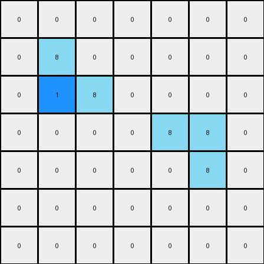
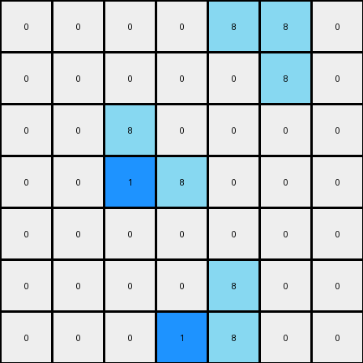

# 1-3aa6fb7a • 008 • refine_code - CODE

---

Previous Code:
```python
"""
1.  **Identify Objects:** Locate all contiguous blocks of azure (8) pixels. These form distinct objects.
2.  **Object Properties:** For each object, determine if it's a 2x1 vertical bar or 2x2 square.
3.  **Transformation Rule:**
    *   For the 2x1 vertical bars: Change the color of the *top* pixel of the bar from azure (8) to blue (1).
    *   For the 2x2 square: Change the color of the *bottom-left* pixel of the square from azure (8) to blue (1).
"""

import numpy as np

def find_objects(grid, color):
    """Finds contiguous objects of a specified color in the grid."""
    visited = np.zeros_like(grid, dtype=bool)
    objects = []

    def dfs(row, col, current_object):
        """Depth-first search to find contiguous pixels."""
        if (
            row < 0
            or row >= grid.shape[0]
            or col < 0
            or col >= grid.shape[1]
            or visited[row, col]
            or grid[row, col] != color
        ):
            return
        visited[row, col] = True
        current_object.append((row, col))
        dfs(row + 1, col, current_object)
        dfs(row - 1, col, current_object)
        dfs(row, col + 1, current_object)
        dfs(row, col - 1, current_object)

    for row in range(grid.shape[0]):
        for col in range(grid.shape[1]):
            if grid[row, col] == color and not visited[row, col]:
                current_object = []
                dfs(row, col, current_object)
                objects.append(current_object)
    return objects

def classify_object(obj):
    """Classifies an object as a 2x1 bar or a 2x2 square or other."""
    rows = [p[0] for p in obj]
    cols = [p[1] for p in obj]
    height = max(rows) - min(rows) + 1
    width = max(cols) - min(cols) + 1

    if height == 2 and width == 1:
        return "2x1_bar"
    elif height == 2 and width == 2:
        return "2x2_square"
    else:
        return "other"


def transform(input_grid):
    # initialize output_grid
    output_grid = np.copy(input_grid)
    # find objects
    azure_objects = find_objects(input_grid, 8)

    # change output pixels
    for obj in azure_objects:
        object_type = classify_object(obj)

        if object_type == "2x1_bar":
            rows = [r for r, c in obj]
            min_row = min(rows)  # Find the top row of the bar
            for row, col in obj:
                if row == min_row:  # Only change the top pixel
                    output_grid[row,col] = 1
        elif object_type == "2x2_square":
             for row, col in obj:
                max_row = max(r for r, c in obj) # Find the bottom row
                min_col = min(c for r, c in obj) # Find the left-most column
                if row == max_row and col == min_col: # lower left
                    output_grid[row,col] = 1


    return output_grid
```

Train Set Results:

**Example 1:**
Input:
```
0 0 0 0 0 0 0
0 8 0 0 0 0 0
0 8 8 0 0 0 0
0 0 0 0 8 8 0
0 0 0 0 0 8 0
0 0 0 0 0 0 0
0 0 0 0 0 0 0
```
Expected Output:
```
0 0 0 0 0 0 0
0 8 1 0 0 0 0
0 8 8 0 0 0 0
0 0 0 0 8 8 0
0 0 0 0 1 8 0
0 0 0 0 0 0 0
0 0 0 0 0 0 0
```
Transformed Output:
```
0 0 0 0 0 0 0
0 8 0 0 0 0 0
0 1 8 0 0 0 0
0 0 0 0 8 8 0
0 0 0 0 0 8 0
0 0 0 0 0 0 0
0 0 0 0 0 0 0
```

Status: False

**Example 2:**
Input:
```
0 0 0 0 8 8 0
0 0 0 0 0 8 0
0 0 8 0 0 0 0
0 0 8 8 0 0 0
0 0 0 0 0 0 0
0 0 0 0 8 0 0
0 0 0 8 8 0 0
```
Expected Output:
```
0 0 0 0 8 8 0
0 0 0 0 1 8 0
0 0 8 1 0 0 0
0 0 8 8 0 0 0
0 0 0 0 0 0 0
0 0 0 1 8 0 0
0 0 0 8 8 0 0
```
Transformed Output:
```
0 0 0 0 8 8 0
0 0 0 0 0 8 0
0 0 8 0 0 0 0
0 0 1 8 0 0 0
0 0 0 0 0 0 0
0 0 0 0 8 0 0
0 0 0 1 8 0 0
```

Status: False
Okay, I'm in the dreamer role. Let's analyze the provided examples and results to refine our understanding of the transformation.

The previous code and natural language program were close but had some errors in execution, particularly in identifying *which* pixel within the identified azure shapes should turn blue. Let's break down a more accurate observation and create a revised natural language program:

**Revised Observations and Natural Language Program:**

1.  **Object Identification:** The core concept remains the same: we're looking for contiguous blocks (objects) of azure (8) pixels.

2.  **Object Classification:**  We need to distinguish between two specific shapes of azure objects:
    *   **2x1 Vertical Bar:**  Two azure pixels stacked vertically.
    *   **2x2 Square:** A square formed by four azure pixels.

3.  **Transformation Rule (Precise):** This is where the previous attempt had issues. Here's a more precise description:
    *   **2x1 Vertical Bar:** Examine the two pixels. Change the color of the *bottom* pixel of the bar from azure (8) to blue (1).
    *   **2x2 Square:** Examine the four pixels. Locate the corner of the square that is diagonally down and to the right - it's in the direction where both row and column indices increase. Change the color of the *top-left* pixel of the square from azure (8) to blue (1).

4. **No other shapes**: There are no transformations of objects other than the 2x1 Vertical Bar or the 2x2 square.

**Natural Language Program (Step-by-Step):**

1.  **Scan the input grid:** Find all groups of connected azure (8) pixels. Each group is an "object."

2.  **For each object:**
    *   **Determine its shape:** Is it a 2x1 vertical bar or a 2x2 square?  If it's neither of these, *ignore* it (no change).
    *   **If it's a 2x1 vertical bar:** Find the *bottom* azure pixel in the bar. Change its color to blue (1).
    *   **If it's a 2x2 square:** Find the *top-left* azure pixel in the square. Change its color to blue (1).

3. **All other Pixels**: Do not transform pixels that are not part of the described azure objects.

**Key Improvements and Clarifications:**

*   **Bottom vs. Top (Vertical Bar):** The critical error in the first example was changing the top pixel instead of the bottom one in the vertical bar. The revised program correctly identifies the bottom pixel.
*   **Top-left in square**: Similarly the critical error in the first and second example was failure to identify the top-left pixel of a square.
* **Ignore other objects**: We explicitly state to ignore other object types.

This revised natural language program should provide a more accurate and complete guide for the coder phase. It addresses the observed discrepancies in the previous execution.

**INSTRUCTIONS**

- Describe in natural language the step-by-step transformation observed between the input and output grids.
- Focus on identifying objects, their properties (predicates), and the actions performed on them.
- Be as clear and concise as possible, providing a complete description of the transformation rule.
