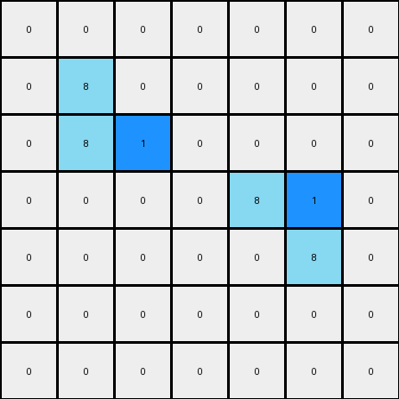
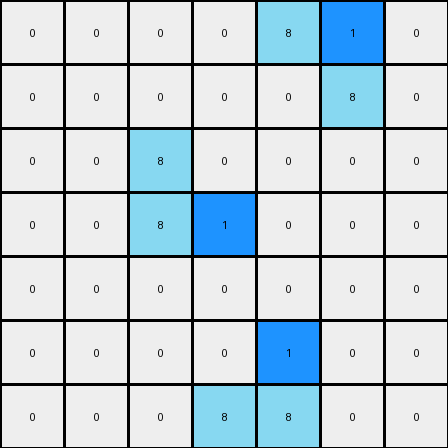

# 1-3aa6fb7a • 004 • refine_code - CODE

---

Previous Code:
```python
"""
For each azure object, change the last pixel, or right most pixel to blue.
"""

import numpy as np

def find_objects(grid, color):
    # Find contiguous objects of the specified color
    objects = []
    visited = np.zeros_like(grid, dtype=bool)

    def dfs(row, col, current_object):
        if (row < 0 or row >= grid.shape[0] or col < 0 or col >= grid.shape[1] or
                visited[row, col] or grid[row, col] != color):
            return
        visited[row, col] = True
        current_object.append((row, col))
        dfs(row + 1, col, current_object)
        dfs(row - 1, col, current_object)
        dfs(row, col + 1, current_object)
        dfs(row, col - 1, current_object)

    for row in range(grid.shape[0]):
        for col in range(grid.shape[1]):
            if not visited[row, col] and grid[row, col] == color:
                current_object = []
                dfs(row, col, current_object)
                objects.append(current_object)
    return objects

def get_last_pixel(object_pixels):
    # for vertical objects, last is lowest row
    # for horizontal, last is right-most
    # break ties arbitrarily
    
    return max(object_pixels, key=lambda p: (p[1]))

def transform(input_grid):
    # initialize output_grid
    output_grid = np.copy(input_grid)
    
    # find azure objects
    azure_objects = find_objects(input_grid, 8)

    # change output pixels 
    for obj in azure_objects:
        last_pixel = get_last_pixel(obj)
        output_grid[last_pixel] = 1

    return output_grid
```

Train Set Results:

**Example 1:**
Input:
```
0 0 0 0 0 0 0
0 8 0 0 0 0 0
0 8 8 0 0 0 0
0 0 0 0 8 8 0
0 0 0 0 0 8 0
0 0 0 0 0 0 0
0 0 0 0 0 0 0
```
Expected Output:
```
0 0 0 0 0 0 0
0 8 1 0 0 0 0
0 8 8 0 0 0 0
0 0 0 0 8 8 0
0 0 0 0 1 8 0
0 0 0 0 0 0 0
0 0 0 0 0 0 0
```
Transformed Output:
```
0 0 0 0 0 0 0
0 8 0 0 0 0 0
0 8 1 0 0 0 0
0 0 0 0 8 1 0
0 0 0 0 0 8 0
0 0 0 0 0 0 0
0 0 0 0 0 0 0
```

Status: False

**Example 2:**
Input:
```
0 0 0 0 8 8 0
0 0 0 0 0 8 0
0 0 8 0 0 0 0
0 0 8 8 0 0 0
0 0 0 0 0 0 0
0 0 0 0 8 0 0
0 0 0 8 8 0 0
```
Expected Output:
```
0 0 0 0 8 8 0
0 0 0 0 1 8 0
0 0 8 1 0 0 0
0 0 8 8 0 0 0
0 0 0 0 0 0 0
0 0 0 1 8 0 0
0 0 0 8 8 0 0
```
Transformed Output:
```
0 0 0 0 8 1 0
0 0 0 0 0 8 0
0 0 8 0 0 0 0
0 0 8 1 0 0 0
0 0 0 0 0 0 0
0 0 0 0 1 0 0
0 0 0 8 8 0 0
```

Status: False
Okay, here's a breakdown of the observed transformation, focusing on objects, properties, and actions:

**Natural Language Program:**

1.  **Identify Objects:** Find all contiguous objects of azure (color 8) pixels in the input grid. A contiguous object is a group of pixels of the same color that are connected horizontally or vertically.

2.  **Process Each Object:** For each identified azure object:
    *   Find the rightmost pixel within that object. If there are multiple pixels sharing a maximal x position, use the one with lowest y.

3. **Change Color of Right Most Pixel** Change the color of the right most pixel in the identified object to blue (color 1).

4.  **Output:** The output grid is a copy of the input grid, with the color of the right-most azure pixel updated.

**Observations in Relation to Previous Code and Errors:**

*   The provided code attempts to implement the above logic, but there were errors.
*   The `get_last_pixel` function prioritizes maximizing x for last pixel. The tie breaking logic must select minimal y.

**Summary of Transformation:**

The transformation identifies all azure colored objects and changes the color of the rightmost pixel of those objects to blue.

**INSTRUCTIONS**

- generate a Python module to represent the natural language program 
- follow the template below
- all common math and science libraries are available
- create docstring only at top - but comment the workflow in the function
- use helper functions for common operations like finding objects, counting,
  measuring, moving, etc. 

remember - we are working iteratively - so this code will inform your future
self as we converge on the solution

*template:*

```python
"""
{{ natural language description of the transformation rule }}
"""

{{ imports }}

def transform(input_grid):
    # initialize output_grid

    # change output pixels 

    return output_grid

```
