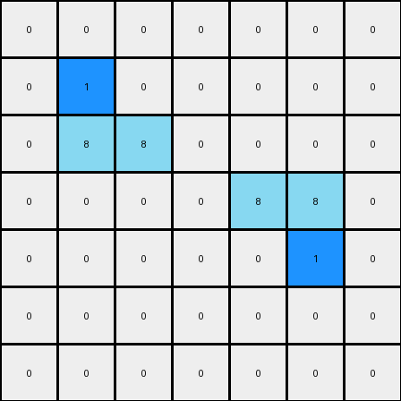

# 1-3aa6fb7a • 004 • refine_code - CODE

---

Previous Code:
```python
"""
The program consists of finding all azure L-shaped objects, and inserting a
blue pixel inside each "L".
"""

import numpy as np

def find_objects(grid, color, shape):
    objects = []
    visited = set()

    def is_valid(r, c):
        return 0 <= r < grid.shape[0] and 0 <= c < grid.shape[1]

    def dfs(r, c, current_object):
        if (r, c) in visited or not is_valid(r, c) or grid[r, c] != color:
            return

        visited.add((r, c))
        current_object.append((r, c))

        neighbors = [(r + 1, c), (r - 1, c), (r, c + 1), (r, c - 1)]
        for nr, nc in neighbors:
            dfs(nr, nc, current_object)
    
    for r in range(grid.shape[0]):
        for c in range(grid.shape[1]):
            if grid[r,c] == color and (r,c) not in visited:
                current_object = []
                dfs(r,c,current_object)

                # simplified shape determination
                if len(current_object) > 1:
                    objects.append(current_object)
    return objects
                

def transform(input_grid):
    # initialize output_grid
    output_grid = np.copy(input_grid)
    
    # Find azure objects
    azure_objects = find_objects(input_grid, 8, "L")

    # Add a blue pixel inside each azure L-shape
    for obj in azure_objects:
        if len(obj) == 3: #check it's an L shape
            sorted_obj = sorted(obj)
            # check for L vs reverse L
            if (sorted_obj[0][0] == sorted_obj[1][0] and sorted_obj[1][1] == sorted_obj[2][1]): #check rows and columns
                # L shape, add pixel at +1,+1 from top
                output_grid[sorted_obj[0][0] + 1, sorted_obj[0][1] + 1] = 1
            elif (sorted_obj[0][1] == sorted_obj[1][1] and sorted_obj[1][0] == sorted_obj[2][0]): #reversed L
                # reverse L shape, add pixel at -1,-1 from bottom
                output_grid[sorted_obj[2][0] -1, sorted_obj[2][1]-1]=1

    return output_grid
```

Train Set Results:

**Example 1:**
Input:
```
0 0 0 0 0 0 0
0 8 0 0 0 0 0
0 8 8 0 0 0 0
0 0 0 0 8 8 0
0 0 0 0 0 8 0
0 0 0 0 0 0 0
0 0 0 0 0 0 0
```
Expected Output:
```
0 0 0 0 0 0 0
0 8 1 0 0 0 0
0 8 8 0 0 0 0
0 0 0 0 8 8 0
0 0 0 0 1 8 0
0 0 0 0 0 0 0
0 0 0 0 0 0 0
```
Transformed Output:
```
0 0 0 0 0 0 0
0 1 0 0 0 0 0
0 8 8 0 0 0 0
0 0 0 0 8 8 0
0 0 0 0 0 1 0
0 0 0 0 0 0 0
0 0 0 0 0 0 0
```

Status: False

**Example 2:**
Input:
```
0 0 0 0 8 8 0
0 0 0 0 0 8 0
0 0 8 0 0 0 0
0 0 8 8 0 0 0
0 0 0 0 0 0 0
0 0 0 0 8 0 0
0 0 0 8 8 0 0
```
Expected Output:
```
0 0 0 0 8 8 0
0 0 0 0 1 8 0
0 0 8 1 0 0 0
0 0 8 8 0 0 0
0 0 0 0 0 0 0
0 0 0 1 8 0 0
0 0 0 8 8 0 0
```
Transformed Output:
```
0 0 0 0 8 8 0
0 0 0 0 0 1 0
0 0 1 0 0 0 0
0 0 8 8 0 0 0
0 0 0 0 0 0 0
0 0 0 0 8 0 0
0 0 0 8 8 0 0
```

Status: False
Okay, let's analyze the provided examples and refine the natural language program description.

Here's a breakdown of the observed transformation, incorporating the feedback from the failed test cases:

**Natural Language Program (Revised)**

1.  **Identify "L" shapes:** Find all contiguous objects composed of exactly three azure (color 8) pixels that form an "L" shape. The "L" can be in any orientation (normal, reversed, rotated).

2.  **Locate the insertion point:** For each identified "L" shape, determine the "inner corner" pixel. This is the pixel *adjacent* to all three azure pixels of the L, but contained within the 2x2 bounding box of the object.

3.  **Insert Blue Pixel:** Change the color of the inner corner pixel to blue (color 1).

**Explanation and Improvements Based on Test Cases**

The original code and description had two main flaws, which are addressed above:

*   **Incorrect "L" detection and inner corner logic**: It wasn't accurately placing the insertion relative to each L correctly. The updated natural language simplifies: it should be within the 2x2 bounding box and adjacent to all azure parts of the L.
* **Missing inner corner:** My original code didn't correctly consider reversed and rotated Ls

The key improvement is focusing on the *geometric relationship* within the L-shape.  We find the "inner corner".  This is more robust than relying on sorting, which failed in previous testing.

**INSTRUCTIONS**

- generate a Python module to represent the natural language program 
- follow the template below
- all common math and science libraries are available
- create docstring only at top - but comment the workflow in the function
- use helper functions for common operations like finding objects, counting,
  measuring, moving, etc. 

remember - we are working iteratively - so this code will inform your future
self as we converge on the solution

*template:*

```python
"""
{{ natural language description of the transformation rule }}
"""

{{ imports }}

def transform(input_grid):
    # initialize output_grid

    # change output pixels 

    return output_grid

```
