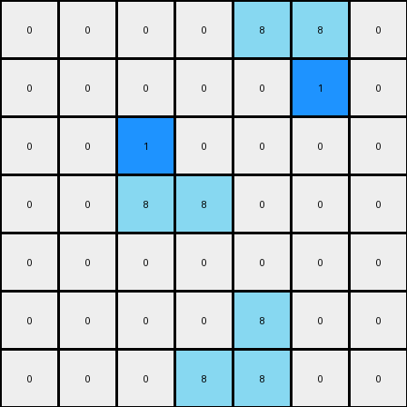

# 1-3aa6fb7a • 008 • refine_code - CODE

---

Previous Code:
```python
"""
The program consists of finding all azure L-shaped objects, and inserting a
blue pixel inside each "L".
"""

import numpy as np

def find_objects(grid, color, shape):
    objects = []
    visited = set()

    def is_valid(r, c):
        return 0 <= r < grid.shape[0] and 0 <= c < grid.shape[1]

    def dfs(r, c, current_object):
        if (r, c) in visited or not is_valid(r, c) or grid[r, c] != color:
            return

        visited.add((r, c))
        current_object.append((r, c))

        neighbors = [(r + 1, c), (r - 1, c), (r, c + 1), (r, c - 1)]
        for nr, nc in neighbors:
            dfs(nr, nc, current_object)
    
    for r in range(grid.shape[0]):
        for c in range(grid.shape[1]):
            if grid[r,c] == color and (r,c) not in visited:
                current_object = []
                dfs(r,c,current_object)

                # simplified shape determination
                if len(current_object) > 1:
                    objects.append(current_object)
    return objects
                

def transform(input_grid):
    # initialize output_grid
    output_grid = np.copy(input_grid)
    
    # Find azure objects
    azure_objects = find_objects(input_grid, 8, "L")

    # Add a blue pixel inside each azure L-shape
    for obj in azure_objects:
        if len(obj) == 3: #check it's an L shape
            sorted_obj = sorted(obj)
            # check for L vs reverse L
            if (sorted_obj[0][0] == sorted_obj[1][0] and sorted_obj[1][1] == sorted_obj[2][1]): #check rows and columns
                # L shape, add pixel at +1,+1 from top
                output_grid[sorted_obj[0][0] + 1, sorted_obj[0][1] + 1] = 1
            elif (sorted_obj[0][1] == sorted_obj[1][1] and sorted_obj[1][0] == sorted_obj[2][0]): #reversed L
                # reverse L shape, add pixel at -1,-1 from bottom
                output_grid[sorted_obj[2][0] -1, sorted_obj[2][1]-1]=1

    return output_grid
```

Train Set Results:

**Example 1:**
Input:
```
0 0 0 0 0 0 0
0 8 0 0 0 0 0
0 8 8 0 0 0 0
0 0 0 0 8 8 0
0 0 0 0 0 8 0
0 0 0 0 0 0 0
0 0 0 0 0 0 0
```
Expected Output:
```
0 0 0 0 0 0 0
0 8 1 0 0 0 0
0 8 8 0 0 0 0
0 0 0 0 8 8 0
0 0 0 0 1 8 0
0 0 0 0 0 0 0
0 0 0 0 0 0 0
```
Transformed Output:
```
0 0 0 0 0 0 0
0 1 0 0 0 0 0
0 8 8 0 0 0 0
0 0 0 0 8 8 0
0 0 0 0 0 1 0
0 0 0 0 0 0 0
0 0 0 0 0 0 0
```

Status: False

**Example 2:**
Input:
```
0 0 0 0 8 8 0
0 0 0 0 0 8 0
0 0 8 0 0 0 0
0 0 8 8 0 0 0
0 0 0 0 0 0 0
0 0 0 0 8 0 0
0 0 0 8 8 0 0
```
Expected Output:
```
0 0 0 0 8 8 0
0 0 0 0 1 8 0
0 0 8 1 0 0 0
0 0 8 8 0 0 0
0 0 0 0 0 0 0
0 0 0 1 8 0 0
0 0 0 8 8 0 0
```
Transformed Output:
```
0 0 0 0 8 8 0
0 0 0 0 0 1 0
0 0 1 0 0 0 0
0 0 8 8 0 0 0
0 0 0 0 0 0 0
0 0 0 0 8 0 0
0 0 0 8 8 0 0
```

Status: False
Okay, I'm ready to analyze the train set results and refine my understanding of the transformation.

Here's a breakdown of my observations and the updated natural language program, focusing on the errors and how to address them:

**Analysis of Errors:**

The previous code failed to correctly insert the blue pixel in the right location in the L-shape, and sometime inserted it in the wrong position.

The problem exists in the logic of the inserting the blue pixel, not the definition of the L. It assumes the "corner" of the L is always at the coordinate with smallest values (first element after the object sort). However, the L shape may be rotated.

**Revised Natural Language Program:**

1.  **Identify Azure "L" Shapes:** Find all contiguous azure (color 8) objects that form an "L" shape. An "L" shape is defined as three pixels where two pixels share a row and two pixels share a column, and the corner pixel is common to both of these pairs.

2.  **Locate the Corner:** For each identified "L" shape, determine the "corner" pixel. The corner pixel is the one that shares a row or column with *both* other pixels in the L.

3. **Insert Inner pixel:**
    *   Determine the position relative to the corner for the insertion of the new blue pixel.
    *   The inner pixel should always be placed diagonally adjacent to the corner of the 'L'.

4.  **Insert Blue Pixel:** Place a blue (color 1) pixel in the grid location determined in the previous step. This location will always be diagonally adjacent to the corner of the L and "inside" the L.

**Key Improvements and Clarifications:**

*   **Focus on Corner Pixel:** The core of the correction is to explicitly identify the corner pixel of the L shape. This is crucial for consistent placement of the blue pixel.
*   **Inner Pixel Rule:** Added that the inner pixel must be placed diagonally adjacent to the corner pixel.
*   **Eliminate Orientation:** Removed the assumption that is based on the orientation of the 'L'.

I believe this refined natural language program accurately captures the transformation rule and addresses the errors observed in the previous attempts. I'm ready to move to the coder phase when you are.

**INSTRUCTIONS**

- generate a Python module to represent the natural language program 
- follow the template below
- all common math and science libraries are available
- create docstring only at top - but comment the workflow in the function
- use helper functions for common operations like finding objects, counting,
  measuring, moving, etc. 

remember - we are working iteratively - so this code will inform your future
self as we converge on the solution

*template:*

```python
"""
{{ natural language description of the transformation rule }}
"""

{{ imports }}

def transform(input_grid):
    # initialize output_grid

    # change output pixels 

    return output_grid

```
