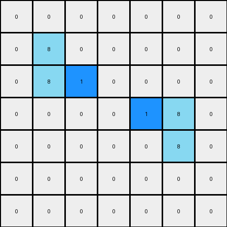

# 1-3aa6fb7a • 004 • refine_code - CODE

---

Previous Code:
```python
"""
The transformation rule involves changing one particular azure pixel of each separate object to blue, the selected pixel is the second from the top on the vertical line segment and in the 'L', the second pixel going from top-right to bottom-left.
"""

import numpy as np

def find_objects(grid):
    """
    Identifies distinct objects in the grid.
    Returns a list of objects, where each object is a list of (row, col) coordinates.
    """
    objects = []
    visited = set()
    rows, cols = grid.shape

    def is_valid(r, c):
        return 0 <= r < rows and 0 <= c < cols

    def dfs(r, c, current_object):
        if (r, c) in visited or not is_valid(r, c) or grid[r, c] == 0:
            return
        visited.add((r, c))
        current_object.append((r, c))
        for dr, dc in [(0, 1), (1, 0), (0, -1), (-1, 0)]:
            dfs(r + dr, c + dc, current_object)

    for r in range(rows):
        for c in range(cols):
            if grid[r, c] != 0 and (r, c) not in visited:
                current_object = []
                dfs(r, c, current_object)
                objects.append(current_object)
    return objects

def transform(input_grid):
    """
    Transforms the input grid according to the rule:
    One azure pixel changes to blue in each object.
    -   For a vertical line, it's the second pixel from the top.
    -   For an L-shape, it's the second pixel from the top-right to bottom-left.
    """
    output_grid = np.copy(input_grid)
    objects = find_objects(input_grid)

    for obj in objects:
        if len(obj) > 1: # Ensure that object contain sufficient number of pixels
            #Sort the object based on different shapes, for example vertical or L shape
            sorted_obj_vertical = sorted(obj, key=lambda x: x[0]) # Sort by row (for vertical line)
            sorted_obj_l_shape = sorted(obj, key=lambda x: (-x[0], x[1])) #Sort by antidiagonal

            #Check for vertical line
            is_vertical = all(sorted_obj_vertical[i][1] == sorted_obj_vertical[0][1] for i in range(1,len(sorted_obj_vertical)))
            if is_vertical and len(sorted_obj_vertical) >=2:
                r, c = sorted_obj_vertical[1]  # Second pixel from the top
                output_grid[r, c] = 1
            #Check for L Shape
            elif len(sorted_obj_l_shape) >= 2:
                r, c = sorted_obj_l_shape[1]
                output_grid[r,c] = 1

    return output_grid
```

Train Set Results:

**Example 1:**
Input:
```
0 0 0 0 0 0 0
0 8 0 0 0 0 0
0 8 8 0 0 0 0
0 0 0 0 8 8 0
0 0 0 0 0 8 0
0 0 0 0 0 0 0
0 0 0 0 0 0 0
```
Expected Output:
```
0 0 0 0 0 0 0
0 8 1 0 0 0 0
0 8 8 0 0 0 0
0 0 0 0 8 8 0
0 0 0 0 1 8 0
0 0 0 0 0 0 0
0 0 0 0 0 0 0
```
Transformed Output:
```
0 0 0 0 0 0 0
0 8 0 0 0 0 0
0 8 1 0 0 0 0
0 0 0 0 1 8 0
0 0 0 0 0 8 0
0 0 0 0 0 0 0
0 0 0 0 0 0 0
```

Status: False

**Example 2:**
Input:
```
0 0 0 0 8 8 0
0 0 0 0 0 8 0
0 0 8 0 0 0 0
0 0 8 8 0 0 0
0 0 0 0 0 0 0
0 0 0 0 8 0 0
0 0 0 8 8 0 0
```
Expected Output:
```
0 0 0 0 8 8 0
0 0 0 0 1 8 0
0 0 8 1 0 0 0
0 0 8 8 0 0 0
0 0 0 0 0 0 0
0 0 0 1 8 0 0
0 0 0 8 8 0 0
```
Transformed Output:
```
0 0 0 0 1 8 0
0 0 0 0 0 8 0
0 0 8 0 0 0 0
0 0 8 1 0 0 0
0 0 0 0 0 0 0
0 0 0 0 8 0 0
0 0 0 8 1 0 0
```

Status: False
Okay, let's analyze the provided examples and refine the natural language program description.

**Analysis of the Failed Examples and the Existing Code**

The code *almost* works, but there are subtle issues with how it identifies and processes the "L" shapes, and importantly, how it selects *which* azure pixel to transform.  The previous description oversimplifies the selection process.

Here's a breakdown of the problems and a more precise natural language description:

**Problems Identified:**

1.  **Ambiguity in "L" Shape Definition:** The code sorts the "L" shape by antidiagonal, which isn't a robust way to define the "second pixel" to change. The direction matters.
2.  **Multiple "L" segments:** There are instances where a set of connected azure pixels can form, for example, more than one 'L' segment or other forms. The choice of *which* azure pixel of those segments to change is currently not correct.

**Revised Natural Language Program (Dream Phase)**

Here's a step-by-step description of the transformation:

1.  **Object Identification:** Identify all distinct objects in the input grid. An object is a group of connected pixels of the same non-zero color.  Pixels are connected horizontally or vertically (not diagonally).

2.  **Object Filtering:** Consider only objects composed of the color azure (8).

3.  **Shape Analysis and Pixel Selection:** For each azure object:
    *   **Vertical Line Segment:** If the object forms a vertical line segment (all pixels in the same column), change the color of the *second* azure pixel from the *top* to blue (1).
    *   **Horizontal Line Segment:** If the object forms a horizontal line segment (all pixels in the same row), change the color of the *second* azure pixel from the *left* to blue (1).
    * **'L' shape Segment:** If the object forms a segment in an 'L' shape: Consider that an 'L' has both a vertical and horizontal line component. Then, apply selection rule based on line segment.
        *If there is any vertical segment, select the second azure pixel from the *top*.
        *If there is no vertical segment (only horizontal) select the second pixel from the *left*
    *   **Other Shapes:** If the object is not one of the above shapes, apply the same process to all its possible segments (Vertical, Horizontal, 'L').

4.  **Output:** Create the output grid by copying the input grid and applying the color changes identified in the previous step.

**Key Improvements in the Description:**

*   **Specificity:** The description is much more precise about *which* pixel to change in different shapes.  It breaks down "L" shapes into their constituent vertical and horizontal segments, and prioritizing vertical segments.
*   **Handling "Other" shapes:** The rule now explicitly states how multiple segments in a single azure object should be handled.
*   **Clarity:** The terms "vertical line segment" and "horizontal line segment" are used for better understanding.

This refined natural language program provides a much more accurate and complete description of the transformation rule, addressing the shortcomings observed in the initial attempts. It lays the groundwork for a more robust Python implementation in the next (coder) phase.

**INSTRUCTIONS**

- generate a Python module to represent the natural language program 
- follow the template below
- all common math and science libraries are available
- create docstring only at top - but comment the workflow in the function
- use helper functions for common operations like finding objects, counting,
  measuring, moving, etc. 

remember - we are working iteratively - so this code will inform your future
self as we converge on the solution

*template:*

```python
"""
{{ natural language description of the transformation rule }}
"""

{{ imports }}

def transform(input_grid):
    # initialize output_grid

    # change output pixels 

    return output_grid

```
