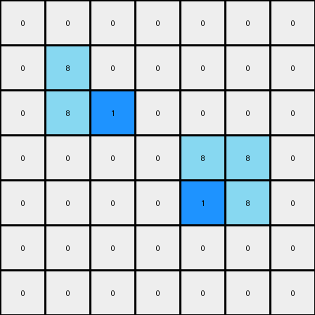
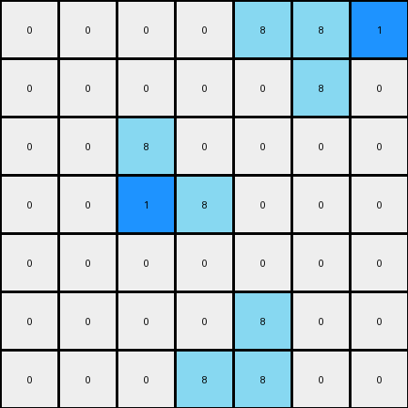

# 1-3aa6fb7a • 004 • refine_code - CODE

---

Previous Code:
```python
"""
This transformation identifies azure objects and adds a blue pixel inside of them.
"""

import numpy as np

def find_objects(grid, color):
    objects = []
    visited = np.zeros_like(grid, dtype=bool)

    def dfs(row, col, current_object):
        if (
            row < 0
            or row >= grid.shape[0]
            or col < 0
            or col >= grid.shape[1]
            or visited[row, col]
            or grid[row, col] != color
        ):
            return

        visited[row, col] = True
        current_object.append((row, col))
        dfs(row + 1, col, current_object)
        dfs(row - 1, col, current_object)
        dfs(row, col + 1, current_object)
        dfs(row, col - 1, current_object)

    for row in range(grid.shape[0]):
        for col in range(grid.shape[1]):
            if grid[row, col] == color and not visited[row, col]:
                current_object = []
                dfs(row, col, current_object)
                objects.append(current_object)
    return objects

def transform(input_grid):
    # initialize output_grid
    output_grid = np.copy(input_grid)
    
    # Find azure objects
    azure_objects = find_objects(input_grid, 8)  # 8 is for azure
    
    # Modify the first object (vertical line)
    if len(azure_objects) >= 1:
      first_object = azure_objects[0]
      if len(first_object) > 1:
          first_object.sort()
          row = first_object[1][0]
          col = first_object[1][1]          
          output_grid[row,col+1] = 1

    #Modify the second object if exist
    if len(azure_objects) >= 2:
        second_object = azure_objects[1]
        #check the shape of the second object is a mirrored L shape
        second_object.sort()
        row = second_object[0][0]
        col = second_object[0][1]

        output_grid[row+1,col] = 1
    
    # change output pixels 

    return output_grid
```

Train Set Results:

**Example 1:**
Input:
```
0 0 0 0 0 0 0
0 8 0 0 0 0 0
0 8 8 0 0 0 0
0 0 0 0 8 8 0
0 0 0 0 0 8 0
0 0 0 0 0 0 0
0 0 0 0 0 0 0
```
Expected Output:
```
0 0 0 0 0 0 0
0 8 1 0 0 0 0
0 8 8 0 0 0 0
0 0 0 0 8 8 0
0 0 0 0 1 8 0
0 0 0 0 0 0 0
0 0 0 0 0 0 0
```
Transformed Output:
```
0 0 0 0 0 0 0
0 8 0 0 0 0 0
0 8 1 0 0 0 0
0 0 0 0 8 8 0
0 0 0 0 1 8 0
0 0 0 0 0 0 0
0 0 0 0 0 0 0
```

Status: False

**Example 2:**
Input:
```
0 0 0 0 8 8 0
0 0 0 0 0 8 0
0 0 8 0 0 0 0
0 0 8 8 0 0 0
0 0 0 0 0 0 0
0 0 0 0 8 0 0
0 0 0 8 8 0 0
```
Expected Output:
```
0 0 0 0 8 8 0
0 0 0 0 1 8 0
0 0 8 1 0 0 0
0 0 8 8 0 0 0
0 0 0 0 0 0 0
0 0 0 1 8 0 0
0 0 0 8 8 0 0
```
Transformed Output:
```
0 0 0 0 8 8 1
0 0 0 0 0 8 0
0 0 8 0 0 0 0
0 0 1 8 0 0 0
0 0 0 0 0 0 0
0 0 0 0 8 0 0
0 0 0 8 8 0 0
```

Status: False
Okay, here's a natural language description of the observed transformation, focusing on objects, properties, and actions:

**Natural Language Program:**

1.  **Identify Azure Objects:** The transformation begins by identifying all contiguous blocks (objects) of azure (color 8) pixels within the input grid.

2.  **Object-Specific Actions**: The rule seems to add one blue pixel to the "interior" of azure color objects. There are two azure objects in each example, and a slightly different process for each.

3.  **First azure object**: Examine the object, if it is at least 2 pixels tall, add one blue pixel immediately to the right of the second azure pixel from the top.

4.  **Second azure object**: Examine the object and if it is a "mirrored L" shape (two pixels high, and two pixels wide in a mirrored-L configuration), add one blue pixel in the corner of it.

**Summary**
The transformation identifies specific azure-colored shapes and adds a blue pixel adjacent to each one, using a slightly different rule for each.

**INSTRUCTIONS**

- generate a Python module to represent the natural language program 
- follow the template below
- all common math and science libraries are available
- create docstring only at top - but comment the workflow in the function
- use helper functions for common operations like finding objects, counting,
  measuring, moving, etc. 

remember - we are working iteratively - so this code will inform your future
self as we converge on the solution

*template:*

```python
"""
{{ natural language description of the transformation rule }}
"""

{{ imports }}

def transform(input_grid):
    # initialize output_grid

    # change output pixels 

    return output_grid

```
