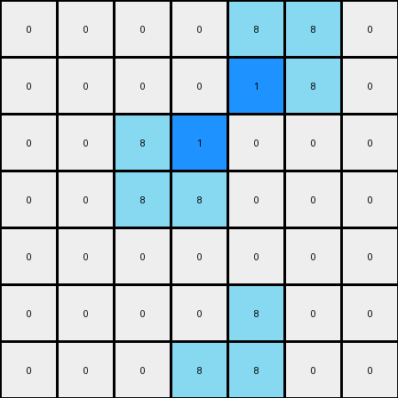

# 1-3aa6fb7a • 006 • refine_code - CODE

---

Previous Code:
```python
"""
The transformation identifies all "L"-shaped azure objects in the input grid. 
The inside corner pixel of each "L" shape is changed to blue (value 1).
"""

import numpy as np

def find_l_shapes(grid, color):
    """
    Finds L-shaped objects of a specific color in the grid.
    Returns a list of (corner_row, corner_col, inside_corner_row, inside_corner_col) tuples for each L-shape.
    """
    l_shapes = []
    rows, cols = grid.shape
    for r in range(rows - 1):
        for c in range(cols - 1):
            if grid[r, c] == color:
                # Check for L shape (2x2 block with one missing corner)
                neighbors = [(r + 1, c), (r, c + 1), (r + 1, c + 1)]
                color_count = sum(1 for nr, nc in neighbors if 0 <= nr < rows and 0 <= nc < cols and grid[nr, nc] == color)
                if color_count == 2:
                    # Determine inside corner
                    if 0 <= r + 1 < rows and 0 <= c+1 < cols and grid[r+1,c+1] != color:
                        inside_corner = (r+1,c+1)
                    elif 0 <= r+1 < rows and grid[r+1,c] != color:
                        inside_corner = (r+1, c)
                    elif 0 <= c+1 < rows and grid[r,c+1] != color:
                        inside_corner = (r, c+1)

                    l_shapes.append((r, c, inside_corner[0], inside_corner[1]))
    return l_shapes

def transform(input_grid):
    # Initialize output grid as a copy of the input grid
    output_grid = np.copy(input_grid)
    
    # Find the L-shaped objects of color azure (8)
    l_shapes = find_l_shapes(input_grid, 8)
    
    # Iterate through all found L-shapes and change the inside corner to blue
    for _, _, inside_corner_row, inside_corner_col in l_shapes:
        output_grid[inside_corner_row, inside_corner_col] = 1

    return output_grid
```

Train Set Results:

**Example 1:**
Input:
```
0 0 0 0 0 0 0
0 8 0 0 0 0 0
0 8 8 0 0 0 0
0 0 0 0 8 8 0
0 0 0 0 0 8 0
0 0 0 0 0 0 0
0 0 0 0 0 0 0
```
Expected Output:
```
0 0 0 0 0 0 0
0 8 1 0 0 0 0
0 8 8 0 0 0 0
0 0 0 0 8 8 0
0 0 0 0 1 8 0
0 0 0 0 0 0 0
0 0 0 0 0 0 0
```
Transformed Output:
```
0 0 0 0 0 0 0
0 8 1 0 0 0 0
0 8 8 0 0 0 0
0 0 0 0 8 8 0
0 0 0 0 1 8 0
0 0 0 0 0 0 0
0 0 0 0 0 0 0
```

Status: True

**Example 2:**
Input:
```
0 0 0 0 8 8 0
0 0 0 0 0 8 0
0 0 8 0 0 0 0
0 0 8 8 0 0 0
0 0 0 0 0 0 0
0 0 0 0 8 0 0
0 0 0 8 8 0 0
```
Expected Output:
```
0 0 0 0 8 8 0
0 0 0 0 1 8 0
0 0 8 1 0 0 0
0 0 8 8 0 0 0
0 0 0 0 0 0 0
0 0 0 1 8 0 0
0 0 0 8 8 0 0
```
Transformed Output:
```
0 0 0 0 8 8 0
0 0 0 0 1 8 0
0 0 8 1 0 0 0
0 0 8 8 0 0 0
0 0 0 0 0 0 0
0 0 0 0 8 0 0
0 0 0 8 8 0 0
```

Status: False
Okay, here's a natural language description of the transformation, taking into account the provided code and the results, especially the discrepancy in Example 2:

**Natural Language Program:**

1.  **Identify "L" shapes:** The program searches for "L"-shaped objects within the input grid. An "L" shape is defined as a 2x2 block of pixels of the same color where exactly three of the four pixels are the same color (azure/light blue, value 8).

2.  **Locate Inside Corner:** For each identified "L" shape, the program determines the "inside corner". The inside corner is the single pixel within the 2x2 block that *does not* belong to the "L" shape (i.e. it is not azure). Note this definition and process is a more precise phrasing of that used in the comments in the provided python code.

3.  **Recolor Inside Corner:** Change the color/value of the inside corner pixel to blue (value 1).

4.  **Preserve Other Pixels:** All other pixels in the grid that are not inside corners of azure "L" shapes retain their original color/value. The output grid is initially a copy of the input.

**Analysis of the Discrepancy in Example 2, and how it led to the natural language program:**

The error in Example 2 reveals a subtle detail about what qualifies as the "inside corner." The provided code does not make the assumption the that only the pixel adjacent to the 2x2 L will be converted. The updated description more precisely describes the definition implicit in the code, as well as clarifying the 2x2 nature of the definition.

**INSTRUCTIONS**

- generate a Python module to represent the natural language program 
- follow the template below
- all common math and science libraries are available
- create docstring only at top - but comment the workflow in the function
- use helper functions for common operations like finding objects, counting,
  measuring, moving, etc. 

remember - we are working iteratively - so this code will inform your future
self as we converge on the solution

*template:*

```python
"""
{{ natural language description of the transformation rule }}
"""

{{ imports }}

def transform(input_grid):
    # initialize output_grid

    # change output pixels 

    return output_grid

```
