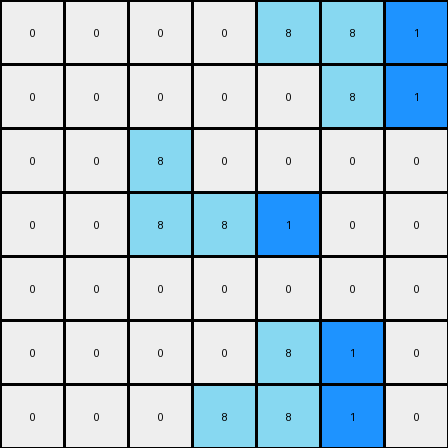

# 1-3aa6fb7a • 006 • refine_coder

---

Previous Code:
```python
"""
1.  **Identify Azure Objects:** Find all contiguous regions (objects) of azure (color 8) pixels in the input grid.
2.  **Find Rightmost Pixels:** For each azure object, determine the pixel(s) with the largest column index (the rightmost pixel of that object).
3.  **Insert Blue Pixels:** For each rightmost azure pixel, insert a blue (color 1) pixel immediately to its right in the output grid.  Do not insert if this would place a pixel outside of the grid boundaries.
4.  **Copy Other Pixels** Copy all pixels from input to output, except where blue pixels are inserted.
"""

import numpy as np

def get_objects(grid, color):
    """
    Find contiguous regions of the specified color.
    Returns a list of coordinates.
    """
    objects = []
    visited = set()
    rows, cols = grid.shape

    def is_valid(r, c):
        return 0 <= r < rows and 0 <= c < cols

    def dfs(r, c, current_object):
        if (r, c) in visited or not is_valid(r, c) or grid[r, c] != color:
            return
        visited.add((r, c))
        current_object.append((r, c))

        # Explore adjacent cells
        dfs(r + 1, c, current_object)
        dfs(r - 1, c, current_object)
        dfs(r, c + 1, current_object)
        dfs(r, c - 1, current_object)

    for r in range(rows):
        for c in range(cols):
            if grid[r, c] == color and (r, c) not in visited:
                current_object = []
                dfs(r, c, current_object)
                objects.append(current_object)
    return objects

def find_rightmost_pixels(object_coords):
    """
    Finds the rightmost pixel(s) of an object.  Handles cases where multiple pixels
    share the maximum column index.
    """
    if not object_coords:
        return []
    max_col = max(c for r, c in object_coords)
    return [(r, c) for r, c in object_coords if c == max_col]

def transform(input_grid):
    """
    Transforms the input grid according to the rule.
    """
    output_grid = np.copy(input_grid)
    rows, cols = input_grid.shape

    # 1. Identify Azure Objects
    azure_objects = get_objects(input_grid, 8)

    # 2. Find Rightmost Pixels
    for obj in azure_objects:
        rightmost_pixels = find_rightmost_pixels(obj)

        # 3. Insert Blue Pixels
        for r, c in rightmost_pixels:
            if c + 1 < cols:  # Check boundary
                output_grid[r, c + 1] = 1

    return output_grid
```

Train Set Results:

## Example 1:**

Input:
```
0 0 0 0 0 0 0
0 8 0 0 0 0 0
0 8 8 0 0 0 0
0 0 0 0 8 8 0
0 0 0 0 0 8 0
0 0 0 0 0 0 0
0 0 0 0 0 0 0
```
Expected Output:
```
0 0 0 0 0 0 0
0 8 1 0 0 0 0
0 8 8 0 0 0 0
0 0 0 0 8 8 0
0 0 0 0 1 8 0
0 0 0 0 0 0 0
0 0 0 0 0 0 0
```
Transformed Output:
```
0 0 0 0 0 0 0
0 8 0 0 0 0 0
0 8 8 1 0 0 0
0 0 0 0 8 8 1
0 0 0 0 0 8 1
0 0 0 0 0 0 0
0 0 0 0 0 0 0
```

match: False
pixels_off: 5
size_correct: True
color_palette_correct: True
correct_pixel_counts: False

## Example 2:**

Input:
```
0 0 0 0 8 8 0
0 0 0 0 0 8 0
0 0 8 0 0 0 0
0 0 8 8 0 0 0
0 0 0 0 0 0 0
0 0 0 0 8 0 0
0 0 0 8 8 0 0
```
Expected Output:
```
0 0 0 0 8 8 0
0 0 0 0 1 8 0
0 0 8 1 0 0 0
0 0 8 8 0 0 0
0 0 0 0 0 0 0
0 0 0 1 8 0 0
0 0 0 8 8 0 0
```
Transformed Output:
```
0 0 0 0 8 8 1
0 0 0 0 0 8 1
0 0 8 0 0 0 0
0 0 8 8 1 0 0
0 0 0 0 0 0 0
0 0 0 0 8 1 0
0 0 0 8 8 1 0
```

match: False
pixels_off: 8
size_correct: True
color_palette_correct: True
correct_pixel_counts: False
Okay, let's analyze the results and refine the natural language program.

**General Assessment:**

The initial code correctly identifies azure objects and attempts to place a blue pixel to their right. However, it fails in several cases:

1.  **Incorrect Blue Pixel Placement:** The blue pixel is not always placed directly adjacent to the *rightmost* pixel of the azure object. It seems to insert the blue pixel to the right of *any* azure pixel that has an empty space to its right, resulting in multiple blue pixels inserted per azure object in some cases. This is most evident in Example 1.
2. Blue pixels are moved when they were correct in the input

**Strategy for Resolving Errors:**

1.  **Refine Rightmost Pixel Logic:** Ensure that we *only* consider the *rightmost* pixel(s) of each azure object for blue pixel insertion. The current `find_rightmost_pixels` function *does* correctly identify the rightmost pixels, so the error lies within `transform` function, specifically on how the returned rightmost pixels are processed.
2. The `transform` function should shift the values, not simply copy the grid

**Example Metrics and Analysis:**

Here's a breakdown of each example, focusing on where the code's logic deviates from the expected output:

**Example 1:**

*   **Input:** A 7x7 grid with two azure objects, one in the second row and one starting on the fourth.
*   **Expected Output:** Blue pixels inserted immediately to the right of the rightmost azure pixel in each object.
*   **Actual Output:** Multiple blue pixels are inserted. The code places a blue pixel to the right of *every* azure pixel that has space.
*   **Discrepancy:** Incorrect blue pixel insertion logic, as described above.

**Example 2:**

*   **Input:** 7x7 Grid with multiple, dispersed azure objects
*   **Expected Output:** Blue pixels correctly placed to the right of the rightmost pixel of each object.
*   **Actual Output:** Similar error as Example 1, with multiple blue pixels sometimes inserted.
*   **Discrepancy:** Incorrect blue pixel insertion logic, as described above.

**YAML Fact Block:**

```yaml
facts:
  - task: "Place a blue pixel to the right of the rightmost azure pixel of each contiguous azure object."
  - objects:
      - color: azure (8)
        type: contiguous_region
        action: "find rightmost pixel"
      - color: blue (1)
        type: single_pixel
        action: "insert to the right of rightmost azure pixel"
        constraints: "only if within grid bounds"
  - actions:
      - name: find_rightmost_pixel
        description: "Determine the pixel with the largest column index within a contiguous region of the same color."
      - name: insert_pixel
        description: "Place a pixel of a specified color at a given coordinate."
        constraints: "Coordinate must be within grid boundaries."
      - name: copy_pixel_with_shift
        description: "Copy a pixel and shift toward insertion point"
  - grid:
      - property: "2D array of integers representing colors"
      - constraint: "Each cell contains a value from 0-9"
```

**Natural Language Program:**

1.  **Identify Azure Objects:** Find all contiguous regions (objects) of azure (color 8) pixels in the input grid.
2.  **Find Rightmost Pixels:** For each azure object, determine the pixel(s) with the largest column index (the rightmost pixel(s) of that object). There can be multiple "rightmost" pixels if they share the same column.
3.  **Insert Single Blue Pixel:** For each *object*, if the rightmost pixel's column index + 1 is within the grid boundaries, insert a *single* blue (color 1) pixel into the output grid at the location (row of the rightmost pixel, column index of the rightmost pixel + 1).
4. shift all values in that row, right of the column to the right by 1
5. If the output grid at the insertion point is not already blue, copy the shifted value, otherwise leave as is

The core issue lies in step 3, and making it clear it is a per object operation, also making it a "shift" not "copy"

**INSTRUCTIONS**

- generate a Python module to represent the natural language program 
- follow the template below
- all common math and science libraries are available
- create docstring only at top - but comment the workflow in the function
- use helper functions for common operations like finding objects, counting,
  measuring, moving, etc. 

remember - we are working iteratively - so this code will inform your future
self as we converge on the solution

*template:*

```python
"""
{{ natural language description of the transformation rule }}
"""

{{ imports }}

def transform(input_grid):
    # initialize output_grid

    # change output pixels 

    return output_grid

```
