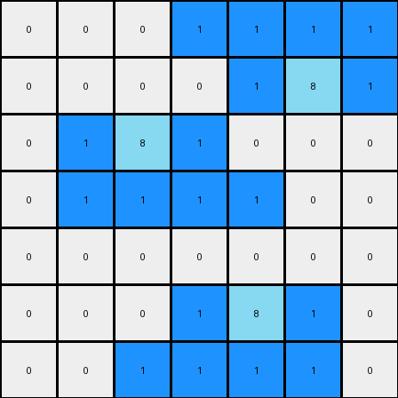

# 1-3aa6fb7a • 003 • refine_dreamer

---


Previous Code:
```python
"""
1.  **Identify** all pixels with the value `8` (azure) in the input grid.
2.  **Preserve** all of these azure pixels in their original positions in the output grid.
3. **Introduce** a blue pixel (value 1) to the right of the azure pixel
4. **Introduce** a blue pixel to the left of the azure pixel.
5.  **Fill** all other positions in the output grid with `0` (white).
"""

import numpy as np

def get_positions(grid, value):
    return np.argwhere(grid == value)

def transform(input_grid):
    # Initialize output_grid with zeros (white)
    output_grid = np.zeros_like(input_grid)
    
    # Get positions of azure pixels (value 8)
    azure_positions = get_positions(input_grid, 8)
    
    # Preserve azure pixels in the output grid
    for pos in azure_positions:
        output_grid[pos[0], pos[1]] = 8

    # Introduce blue pixels (value 1) adjacent to azure pixels
    for pos in azure_positions:
        # to the right
        if pos[1] + 1 < output_grid.shape[1]:
          output_grid[pos[0],pos[1] + 1] = 1
        # to the left
        if pos[1] - 1 >= 0:
          output_grid[pos[0], pos[1] - 1] = 1
    
    return output_grid
```

Train Set Results:

## Example 1:**

Input:
```
0 0 0 0 0 0 0
0 8 0 0 0 0 0
0 8 8 0 0 0 0
0 0 0 0 8 8 0
0 0 0 0 0 8 0
0 0 0 0 0 0 0
0 0 0 0 0 0 0
```
Expected Output:
```
0 0 0 0 0 0 0
0 8 1 0 0 0 0
0 8 8 0 0 0 0
0 0 0 0 8 8 0
0 0 0 0 1 8 0
0 0 0 0 0 0 0
0 0 0 0 0 0 0
```
Transformed Output:
```
0 0 0 0 0 0 0
1 8 1 0 0 0 0
1 1 1 1 0 0 0
0 0 0 1 1 1 1
0 0 0 0 1 8 1
0 0 0 0 0 0 0
0 0 0 0 0 0 0
```

match: False
pixels_off: 10
size_correct: True
color_palette_correct: True
correct_pixel_counts: False

## Example 2:**

Input:
```
0 0 0 0 8 8 0
0 0 0 0 0 8 0
0 0 8 0 0 0 0
0 0 8 8 0 0 0
0 0 0 0 0 0 0
0 0 0 0 8 0 0
0 0 0 8 8 0 0
```
Expected Output:
```
0 0 0 0 8 8 0
0 0 0 0 1 8 0
0 0 8 1 0 0 0
0 0 8 8 0 0 0
0 0 0 0 0 0 0
0 0 0 1 8 0 0
0 0 0 8 8 0 0
```
Transformed Output:
```
0 0 0 1 1 1 1
0 0 0 0 1 8 1
0 1 8 1 0 0 0
0 1 1 1 1 0 0
0 0 0 0 0 0 0
0 0 0 1 8 1 0
0 0 1 1 1 1 0
```

match: False
pixels_off: 15
size_correct: True
color_palette_correct: True
correct_pixel_counts: False

**INSTRUCTIONS**

The code above was generated based on observations from the first training
example

we have tested the transform function on each of the task example inputs and
compared with the expected output

review each of the examples provided and the results and consider how the
natural language program should be updated to accommodate this new knowledge

respond with the following deliverables:

- general assessment of the information provided and strategy for resolving the
  errors
- gather metrics about each of the examples and results - use code_execution to
  develop accurate reports on your assumptions
- a YAML block documenting facts - Focus on identifying objects, their properties, and the actions performed on them.
- a natural language program - Be as clear and concise as possible, providing a complete description of the transformation rule.


your responses should be considered as information in a report - not a
conversation
