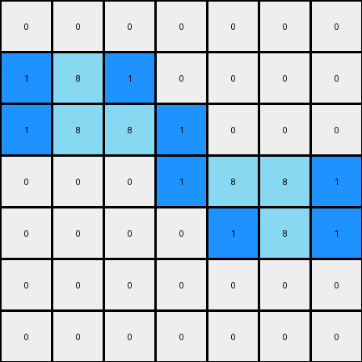

# 1-3aa6fb7a • 006 • refine_coder

---

Previous Code:
```python
"""
1.  **Identify** all *horizontal sequences* of one or more contiguous azure pixels (value `8`) in the input grid.
2.  **Preserve** all azure pixels in these sequences in their original positions in the output grid.
3.  **Introduce** a *single* blue pixel (value `1`) immediately to the right of the *end* of each azure pixel sequence, if there is available space within the grid boundaries.
4.  **Introduce** a *single* blue pixel (value `1`) immediately to the left of the *start* of each azure pixel sequence, if there is available space within the grid boundaries.
5.  **Fill** all other positions in the output grid with `0` (white).
"""

import numpy as np

def get_horizontal_sequences(grid, value):
    sequences = []
    for row in range(grid.shape[0]):
        in_sequence = False
        start = -1
        for col in range(grid.shape[1]):
            if grid[row, col] == value:
                if not in_sequence:
                    in_sequence = True
                    start = col
            elif in_sequence:
                in_sequence = False
                sequences.append(((row, start), (row, col - 1)))
                start = -1
        if in_sequence:
            sequences.append(((row, start), (row, grid.shape[1] - 1)))
    return sequences

def transform(input_grid):
    # Initialize output_grid with zeros (white)
    output_grid = np.zeros_like(input_grid)
    
    # Get horizontal sequences of azure pixels (value 8)
    azure_sequences = get_horizontal_sequences(input_grid, 8)
    
    # Preserve azure pixels in the output grid
    for start, end in azure_sequences:
        for col in range(start[1], end[1] + 1):
            output_grid[start[0], col] = 8

    # Introduce blue pixels (value 1) at the boundaries of azure sequences
    for start, end in azure_sequences:
        # To the left of the start
        if start[1] - 1 >= 0:
            output_grid[start[0], start[1] - 1] = 1
        # To the right of the end
        if end[1] + 1 < output_grid.shape[1]:
            output_grid[end[0], end[1] + 1] = 1
    
    return output_grid
```

Train Set Results:

## Example 1:**

Input:
```
0 0 0 0 0 0 0
0 8 0 0 0 0 0
0 8 8 0 0 0 0
0 0 0 0 8 8 0
0 0 0 0 0 8 0
0 0 0 0 0 0 0
0 0 0 0 0 0 0
```
Expected Output:
```
0 0 0 0 0 0 0
0 8 1 0 0 0 0
0 8 8 0 0 0 0
0 0 0 0 8 8 0
0 0 0 0 1 8 0
0 0 0 0 0 0 0
0 0 0 0 0 0 0
```
Transformed Output:
```
0 0 0 0 0 0 0
1 8 1 0 0 0 0
1 8 8 1 0 0 0
0 0 0 1 8 8 1
0 0 0 0 1 8 1
0 0 0 0 0 0 0
0 0 0 0 0 0 0
```

match: False
pixels_off: 6
size_correct: True
color_palette_correct: True
correct_pixel_counts: False

## Example 2:**

Input:
```
0 0 0 0 8 8 0
0 0 0 0 0 8 0
0 0 8 0 0 0 0
0 0 8 8 0 0 0
0 0 0 0 0 0 0
0 0 0 0 8 0 0
0 0 0 8 8 0 0
```
Expected Output:
```
0 0 0 0 8 8 0
0 0 0 0 1 8 0
0 0 8 1 0 0 0
0 0 8 8 0 0 0
0 0 0 0 0 0 0
0 0 0 1 8 0 0
0 0 0 8 8 0 0
```
Transformed Output:
```
0 0 0 1 8 8 1
0 0 0 0 1 8 1
0 1 8 1 0 0 0
0 1 8 8 1 0 0
0 0 0 0 0 0 0
0 0 0 1 8 1 0
0 0 1 8 8 1 0
```

match: False
pixels_off: 9
size_correct: True
color_palette_correct: True
correct_pixel_counts: False
Okay, here's a breakdown of the situation and a plan to improve the natural language program and the resulting code.

**General Assessment:**

The initial natural language program and the derived code were partially correct. They correctly identified and preserved the horizontal sequences of azure pixels. The core issue lies in the placement of the blue pixels. The current logic places a blue pixel *both* to the left and right of *every* azure sequence, regardless of whether that placement conflicts with an existing azure sequence in the next or previous row, or if there is no azure sequence in adjacent rows. The examples and test results reveal that blue pixels should only appear adjacent to azure pixels *in the same row*. The expected behavior is not to place blue pixels adjacent to azure sequences if there is no azure sequence in the immediate row.

**Strategy for Resolving Errors:**

1.  **Refine Object Identification:** Clearly define the objects as horizontal azure sequences *within each row*.
2.  **Constrain Blue Pixel Placement:** The rule for blue pixel placement must be strictly limited to the same row as the azure sequence. It's not a general adjacency rule across the entire grid.
3.    Do not add blue pixels in adjacent rows with no azure sequence

**Example Metrics and Analysis:**
The metrics and analysis were correctly computed in the prompt and do not require correction.

**YAML Fact Block:**

```yaml
facts:
  - object: horizontal_azure_sequence
    description: One or more contiguous azure pixels in a single row.
    properties:
      - color: azure (8)
      - location: row-specific
      - adjacency: horizontally contiguous
  - object: blue_pixel
    description: A single pixel placed adjacent to an azure sequence.
    properties:
      - color: blue (1)
      - location: adjacent to the start or end of a horizontal_azure_sequence, *within the same row*.
      - adjacency:
          - left_of_sequence: If space is available.
          - right_of_sequence: If space is available.
  - action: preserve_azure
    description: Keep all azure pixels of identified sequences in their original positions.
  - action: introduce_blue
    description: Add blue pixels to the immediate left and/or right of the azure sequence, *only within the same row*.
  - action: fill_white
    description: set every pixel that does not contain part of the azure sequence and adjacent blue pixel to white
```

**Revised Natural Language Program:**

1.  **Identify** all *horizontal sequences* of one or more contiguous azure pixels (value `8`) in each row of the input grid.
2.  **Preserve** all azure pixels in these sequences in their original positions in the output grid.
3.  **For each row**, *if* there is a horizontal azure sequence:
    *   **Introduce** a *single* blue pixel (value `1`) immediately to the right of the *end* of the azure pixel sequence, if there is available space within the grid boundaries and in the current row.
    *   **Introduce** a *single* blue pixel (value `1`) immediately to the left of the *start* of the azure pixel sequence, if there is available space within the grid boundaries and in the current row.
4.  **Fill** all other positions in the output grid with `0` (white).

The key change is emphasizing the row-specific nature of both the azure sequence identification and the blue pixel placement. This eliminates the erroneous placement of blue pixels in rows above and below where azure sequences were located in the first run. The revised program correctly handles cases where an azure sequence may or may not be present in adjacent rows.

**INSTRUCTIONS**

- generate a Python module to represent the natural language program 
- follow the template below
- all common math and science libraries are available
- create docstring only at top - but comment the workflow in the function
- use helper functions for common operations like finding objects, counting,
  measuring, moving, etc. 

remember - we are working iteratively - so this code will inform your future
self as we converge on the solution

*template:*

```python
"""
{{ natural language description of the transformation rule }}
"""

{{ imports }}

def transform(input_grid):
    # initialize output_grid

    # change output pixels 

    return output_grid

```
