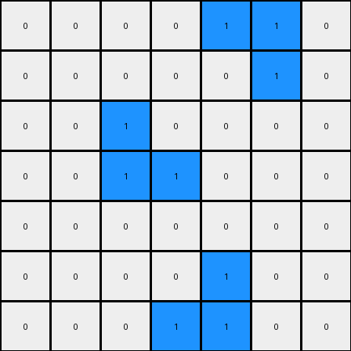

# 1-3aa6fb7a • 005 • refine_dreamer

---

Previous Code:
```python
"""
Iterate through all pixels in the input grid. If a pixel is azure (value 8),
determine if it is the top or bottom of a contiguous vertical line of azure
pixels. If it is, change its color to blue (value 1).  All other pixels remain
unchanged.
"""

import numpy as np

def transform(input_grid):
    # Initialize output grid with the same dimensions and values as the input grid
    output_grid = np.copy(input_grid)
    rows, cols = output_grid.shape

    def is_azure(grid, r, c):
        """Helper function to check if a pixel is azure."""
        return 0 <= r < rows and 0 <= c < cols and grid[r, c] == 8

    def find_top(grid, r, c):
        """Helper function to find the top of a vertical azure line."""
        while is_azure(grid, r - 1, c):
            r -= 1
        return r

    def find_bottom(grid, r, c):
        """Helper function to find the bottom of a vertical azure line."""
        while is_azure(grid, r + 1, c):
            r += 1
        return r

    # Iterate through all pixels
    for r in range(rows):
        for c in range(cols):
            # Check if the current pixel is azure
            if is_azure(output_grid, r, c):
                # Find the top and bottom of the vertical line
                top_row = find_top(output_grid, r, c)
                bottom_row = find_bottom(output_grid, r, c)

                # Apply the color change rule
                if r == top_row:
                    output_grid[r, c] = 1
                elif r == bottom_row:
                    output_grid[r,c] = 1
                # optimized to only check top or bottom - not whether to change the middle
                # elif r != top_row or r != bottom_row: # if not the top, could be any pixel below until the bottom
                #   pass # do nothing keep it azure

    return output_grid
```

Train Set Results:

## Example 1:**

Input:
```
0 0 0 0 0 0 0
0 8 0 0 0 0 0
0 8 8 0 0 0 0
0 0 0 0 8 8 0
0 0 0 0 0 8 0
0 0 0 0 0 0 0
0 0 0 0 0 0 0
```
Expected Output:
```
0 0 0 0 0 0 0
0 8 1 0 0 0 0
0 8 8 0 0 0 0
0 0 0 0 8 8 0
0 0 0 0 1 8 0
0 0 0 0 0 0 0
0 0 0 0 0 0 0
```
Transformed Output:
```
0 0 0 0 0 0 0
0 1 0 0 0 0 0
0 1 1 0 0 0 0
0 0 0 0 1 1 0
0 0 0 0 0 1 0
0 0 0 0 0 0 0
0 0 0 0 0 0 0
```

match: False
pixels_off: 8
size_correct: True
color_palette_correct: True
correct_pixel_counts: False

## Example 2:**

Input:
```
0 0 0 0 8 8 0
0 0 0 0 0 8 0
0 0 8 0 0 0 0
0 0 8 8 0 0 0
0 0 0 0 0 0 0
0 0 0 0 8 0 0
0 0 0 8 8 0 0
```
Expected Output:
```
0 0 0 0 8 8 0
0 0 0 0 1 8 0
0 0 8 1 0 0 0
0 0 8 8 0 0 0
0 0 0 0 0 0 0
0 0 0 1 8 0 0
0 0 0 8 8 0 0
```
Transformed Output:
```
0 0 0 0 1 1 0
0 0 0 0 0 1 0
0 0 1 0 0 0 0
0 0 1 1 0 0 0
0 0 0 0 0 0 0
0 0 0 0 1 0 0
0 0 0 1 1 0 0
```

match: False
pixels_off: 12
size_correct: True
color_palette_correct: True
correct_pixel_counts: False
**INSTRUCTIONS**

The code above was generated based on observations from the first training
example

we have tested the transform function on each of the task example inputs and
compared with the expected output

review each of the examples provided and the results and consider how the
natural language program should be updated to accommodate this new knowledge

respond with the following deliverables:

- general assessment of the information provided and strategy for resolving the
  errors
- gather metrics about each of the examples and results - use code_execution to
  develop accurate reports on your assumptions
- a YAML block documenting facts - Focus on identifying objects, their properties, and the actions performed on them.
- a natural language program - Be as clear and concise as possible, providing a complete description of the transformation rule.


your responses should be considered as information in a report - not a
conversation
