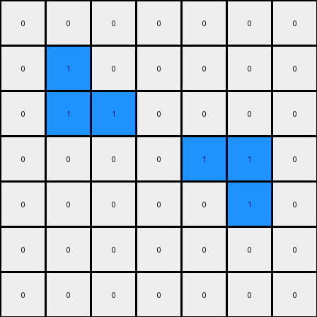

# 1-3aa6fb7a • 003 • refine_dreamer

---

Previous Code:
```python
"""
1.  **Iterate** through each pixel of the input grid.
2.  **Identify** 'azure' pixels (value 8).
3.  **Check Edge and Neighbor Condition:** For each identified 'azure' pixel, examine its neighboring to determine if it is at the "end" of the block of connected azure pixels:
    *   change an azure pixel to blue if and only if it is an azure pixel, it's on at an edge and it's neighbor on that edge is not azure
4.  **Modify:** If an 'azure' pixel is directly adjacent to any pixels that *not* connected to another azure pixel, change its value to 'blue' (1).
5.  **Maintain all other pixels**
"""

import numpy as np

def transform(input_grid):
    output_grid = np.copy(input_grid)
    rows, cols = input_grid.shape

    def is_azure(grid, r, c):
        return 0 <= r < rows and 0 <= c < cols and grid[r, c] == 8

    def has_non_azure_neighbor(grid, r, c):
      # check if the position is in the grid and if so, if it is azure, use
      # DeMorgan's Law to make the logic the inverse of "all neighbors are azure"
        return not (
          is_azure(grid, r-1,c) and
          is_azure(grid, r+1, c) and
          is_azure(grid,r,c-1) and
          is_azure(grid, r, c+1)
          )

    for r in range(rows):
        for c in range(cols):
            if input_grid[r, c] == 8:  # Identify azure pixels
                if has_non_azure_neighbor(input_grid, r, c):
                    output_grid[r, c] = 1  # Change to blue

    return output_grid
```

Train Set Results:

## Example 1:**

Input:
```
0 0 0 0 0 0 0
0 8 0 0 0 0 0
0 8 8 0 0 0 0
0 0 0 0 8 8 0
0 0 0 0 0 8 0
0 0 0 0 0 0 0
0 0 0 0 0 0 0
```
Expected Output:
```
0 0 0 0 0 0 0
0 8 1 0 0 0 0
0 8 8 0 0 0 0
0 0 0 0 8 8 0
0 0 0 0 1 8 0
0 0 0 0 0 0 0
0 0 0 0 0 0 0
```
Transformed Output:
```
0 0 0 0 0 0 0
0 1 0 0 0 0 0
0 1 1 0 0 0 0
0 0 0 0 1 1 0
0 0 0 0 0 1 0
0 0 0 0 0 0 0
0 0 0 0 0 0 0
```

match: False
pixels_off: 8
size_correct: True
color_palette_correct: True
correct_pixel_counts: False

## Example 2:**

Input:
```
0 0 0 0 8 8 0
0 0 0 0 0 8 0
0 0 8 0 0 0 0
0 0 8 8 0 0 0
0 0 0 0 0 0 0
0 0 0 0 8 0 0
0 0 0 8 8 0 0
```
Expected Output:
```
0 0 0 0 8 8 0
0 0 0 0 1 8 0
0 0 8 1 0 0 0
0 0 8 8 0 0 0
0 0 0 0 0 0 0
0 0 0 1 8 0 0
0 0 0 8 8 0 0
```
Transformed Output:
```
0 0 0 0 1 1 0
0 0 0 0 0 1 0
0 0 1 0 0 0 0
0 0 1 1 0 0 0
0 0 0 0 0 0 0
0 0 0 0 1 0 0
0 0 0 1 1 0 0
```

match: False
pixels_off: 12
size_correct: True
color_palette_correct: True
correct_pixel_counts: False
**INSTRUCTIONS**

The code above was generated based on observations from the first training
example

we have tested the transform function on each of the task example inputs and
compared with the expected output

review each of the examples provided and the results and consider how the
natural language program should be updated to accommodate this new knowledge

respond with the following deliverables:

- general assessment of the information provided and strategy for resolving the
  errors
- gather metrics about each of the examples and results - use code_execution to
  develop accurate reports on your assumptions
- a YAML block documenting facts - Focus on identifying objects, their properties, and the actions performed on them.
- a natural language program - Be as clear and concise as possible, providing a complete description of the transformation rule.


your responses should be considered as information in a report - not a
conversation
