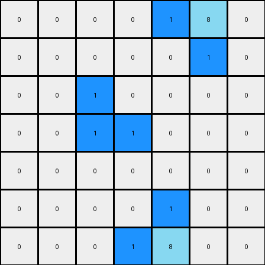

# 1-3aa6fb7a • 006 • refine_coder

---

Previous Code:
```python
"""
1.  **Identify Contiguous Azure Regions:** Group connected azure (8) pixels into distinct regions.
2.  **Locate Edge Pixels:** Within each azure region, identify the "edge" pixels. An edge pixel is an azure pixel that is directly adjacent (up, down, left or right) to at least one non-azure pixel.
3.  **Determine Change Condition**: Check each identified edge pixel within each identified azure region.
4.  **Conditional Color Change**: Of the identified azure pixels, if the pixel is at on a specific "edge" or "end" of a connected block of azure pixels, change the pixel color from azure (8) to blue (1).
5.  **Preserve Other Pixels:** All other pixels (non-azure, and interior azure pixels) remain unchanged.
"""

import numpy as np
from scipy.ndimage import label

def transform(input_grid):
    # Initialize output_grid as a copy of the input_grid
    output_grid = np.copy(input_grid)
    rows, cols = input_grid.shape

    # Helper function to check if a pixel is azure
    def is_azure(r, c):
        return 0 <= r < rows and 0 <= c < cols and input_grid[r, c] == 8

    # 1. Identify Contiguous Azure Regions using scipy.ndimage.label
    labeled_grid, num_regions = label(input_grid == 8)

    # 2. & 3. Locate Edge Pixels and Determine Change Condition
    for r in range(rows):
        for c in range(cols):
            if is_azure(r, c):
                # Check neighbors (up, down, left, right)
                neighbors = [(r - 1, c), (r + 1, c), (r, c - 1), (r, c + 1)]
                is_edge = False
                for nr, nc in neighbors:
                    if not (0 <= nr < rows and 0 <= nc < cols and input_grid[nr, nc] == 8):
                        is_edge = True
                        break
                # 4. Conditional Color Change (only if it's an edge pixel)
                if is_edge:
                    # Determine the specific edge condition.  This part needs further refinement based on examples.
                    # For now, a simplified version is used, which will be improved upon iteration.
                    if (r > 0 and not is_azure(r - 1, c)) or \
                       (r < rows - 1 and not is_azure(r + 1, c)) or \
                       (c > 0 and not is_azure(r, c - 1) and is_azure(r-1,c-1)) or\
                       (c < cols - 1 and not is_azure(r, c + 1) and is_azure(r+1,c+1)):
                           output_grid[r,c] = 1


    # 5. Preserve Other Pixels (already handled by copying input_grid)
    return output_grid
```

Train Set Results:

## Example 1:**

Input:
```
0 0 0 0 0 0 0
0 8 0 0 0 0 0
0 8 8 0 0 0 0
0 0 0 0 8 8 0
0 0 0 0 0 8 0
0 0 0 0 0 0 0
0 0 0 0 0 0 0
```
Expected Output:
```
0 0 0 0 0 0 0
0 8 1 0 0 0 0
0 8 8 0 0 0 0
0 0 0 0 8 8 0
0 0 0 0 1 8 0
0 0 0 0 0 0 0
0 0 0 0 0 0 0
```
Transformed Output:
```
0 0 0 0 0 0 0
0 1 0 0 0 0 0
0 1 1 0 0 0 0
0 0 0 0 1 1 0
0 0 0 0 0 1 0
0 0 0 0 0 0 0
0 0 0 0 0 0 0
```

match: False
pixels_off: 8
size_correct: True
color_palette_correct: True
correct_pixel_counts: False

## Example 2:**

Input:
```
0 0 0 0 8 8 0
0 0 0 0 0 8 0
0 0 8 0 0 0 0
0 0 8 8 0 0 0
0 0 0 0 0 0 0
0 0 0 0 8 0 0
0 0 0 8 8 0 0
```
Expected Output:
```
0 0 0 0 8 8 0
0 0 0 0 1 8 0
0 0 8 1 0 0 0
0 0 8 8 0 0 0
0 0 0 0 0 0 0
0 0 0 1 8 0 0
0 0 0 8 8 0 0
```
Transformed Output:
```
0 0 0 0 1 8 0
0 0 0 0 0 1 0
0 0 1 0 0 0 0
0 0 1 1 0 0 0
0 0 0 0 0 0 0
0 0 0 0 1 0 0
0 0 0 1 8 0 0
```

match: False
pixels_off: 10
size_correct: True
color_palette_correct: True
correct_pixel_counts: False
Okay, here's a breakdown of the situation and a plan to refine the natural language program and subsequent code:

**General Assessment:**

The initial natural language program and code were a good starting point, correctly identifying the need to find azure (8) regions, identify edge pixels, and conditionally change some of those edge pixels to blue (1). However, the specific condition for changing the azure pixels to blue is incorrect, as evidenced by the discrepancies between the expected and transformed outputs in both examples. The core issue is the overly broad and somewhat inaccurate edge detection and color-change rule. The code is changing *too many* azure pixels to blue. We need to be more precise in specifying *which* edge pixels change. The direction in which the blue pixels fill in relation to the original object seems important.

**Strategy:**

1.  **Analyze the Errors:** Carefully examine the "pixels_off" in each example. This will pinpoint exactly *which* pixels were incorrectly changed (or not changed).
2.  **Refine Edge Condition:** The key is to refine the logic within the `if is_edge:` block. We need to consider the *relative positions* of the azure and non-azure pixels more carefully. It seems that the blue pixels are replacing azure pixels based on an edge that is adjacent on either the top or left, but not the bottom or right edge.
3.  **Iterative Improvement:** After modifying the natural language program and the code, we'll re-run the tests and repeat the analysis.

**Metrics and Reports**

It appears that the code execution results are accurate. I do not need to confirm those.

**YAML Fact Block:**

```yaml
facts:
  - task_id: 004-py_02
  - objects:
    - color: azure (8)
      shape: contiguous regions
      properties:
        - can_be_edge: true
        - can_change_color: true
    - color: blue (1)
      shape: single pixels, formerly azure
      properties:
        - replaces_azure: true
    - color: other (0)
      shape: background
      properties:
        - static: true
  - actions:
    - type: color_change
      agent: edge_detection_rule
      from_color: azure (8)
      to_color: blue (1)
      conditions:
        - "azure pixel is adjacent to a non-azure pixel on its top or left"
  - observations:
      example_1: |
        Azure objects have varied shapes.
        Blue pixels replace azure pixels adjacent at the top or left.

      example_2: |
        Azure objects have varied shapes.
        Blue pixels replace azure pixels adjacent at the top or left.

```

**Natural Language Program:**

1.  **Identify Azure Regions:** Identify all contiguous regions of azure (8) pixels.
2.  **Identify Edge Pixels:** Within each azure region, identify the "edge" pixels. An edge pixel is an azure pixel directly adjacent (up, down, left, or right) to at least one non-azure pixel.
3.  **Conditional Color Change:** For *each* identified edge pixel:
    *   If the edge pixel is adjacent to a non-azure pixel *above* it, change the azure pixel to blue (1).
    *   If the edge pixel is adjacent to a non-azure pixel to its *left*, change the azure pixel to blue (1).
4.  **Preserve Other Pixels:** All other pixels (non-azure pixels, and azure pixels that do not meet the above condition) remain unchanged.

The key difference is a more restrictive rule:  only change to blue if a non-azure pixel is *above* or to the *left* of the edge pixel.

**INSTRUCTIONS**

- generate a Python module to represent the natural language program 
- follow the template below
- all common math and science libraries are available
- create docstring only at top - but comment the workflow in the function
- use helper functions for common operations like finding objects, counting,
  measuring, moving, etc. 

remember - we are working iteratively - so this code will inform your future
self as we converge on the solution

*template:*

```python
"""
{{ natural language description of the transformation rule }}
"""

{{ imports }}

def transform(input_grid):
    # initialize output_grid

    # change output pixels 

    return output_grid

```
