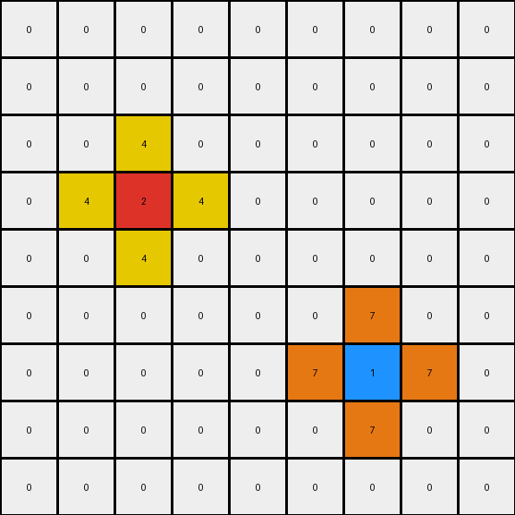
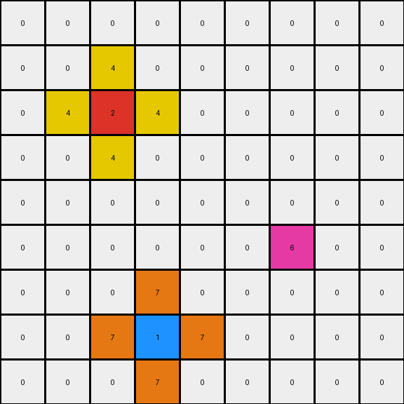

# 2-0ca9ddb6 • 020 • refine_coder

---

Previous Code:
```python
"""
1.  **Identify original objects**: Find all contiguous non-white pixels in the input grid. These are the original colored objects.
2.  **Determine expansion colors**:
    *   If an original object is red (2), add adjacent pixels colored yellow (4).
    *   If an original object is blue (1), add adjacent pixels colored orange (7).
    *   If an original object is magenta (6) add adjacent pixels, but they will have yellow and orange nearby, so they will not be extended
3.  **Expand objects**: For each original colored object:
    *   For each pixel in the original object, check its four immediate neighbors (up, down, left, right).
    *   If a neighbor is white (0), change it to the designated expansion color based on the original pixel's color. Do *not* extend diagonally.
4. output the final grid
"""

import numpy as np

def get_neighbors(grid, row, col):
    """Gets the valid neighbors of a cell (up, down, left, right)."""
    rows, cols = grid.shape
    neighbors = []
    if row > 0:
        neighbors.append((row - 1, col))  # Up
    if row < rows - 1:
        neighbors.append((row + 1, col))  # Down
    if col > 0:
        neighbors.append((row, col - 1))  # Left
    if col < cols - 1:
        neighbors.append((row, col + 1))  # Right
    return neighbors

def transform(input_grid):
    """Transforms the input grid according to the expansion rules."""
    output_grid = np.copy(input_grid)
    rows, cols = input_grid.shape

    # Iterate through each cell in the input grid
    for row in range(rows):
        for col in range(cols):
            pixel_color = input_grid[row, col]

            # Determine expansion color based on original pixel color
            expansion_color = 0  # Default to white (no expansion)
            if pixel_color == 2:  # Red
                expansion_color = 4  # Yellow
            elif pixel_color == 1:  # Blue
                expansion_color = 7  # Orange
            #elif pixel_color == 6: #Magenta, no expansion color specified

            # If there's an expansion color, check neighbors
            if expansion_color != 0:
                neighbors = get_neighbors(input_grid, row, col)
                for n_row, n_col in neighbors:
                    if output_grid[n_row, n_col] == 0:  # If neighbor is white
                        output_grid[n_row, n_col] = expansion_color  # Expand

    return output_grid
```

Train Set Results:

## Example 1:**

Input:
```
0 0 0 0 0 0 0 0 0
0 0 0 0 0 0 0 0 0
0 0 0 0 0 0 0 0 0
0 0 2 0 0 0 0 0 0
0 0 0 0 0 0 0 0 0
0 0 0 0 0 0 0 0 0
0 0 0 0 0 0 1 0 0
0 0 0 0 0 0 0 0 0
0 0 0 0 0 0 0 0 0
```
Expected Output:
```
0 0 0 0 0 0 0 0 0
0 0 0 0 0 0 0 0 0
0 4 0 4 0 0 0 0 0
0 0 2 0 0 0 0 0 0
0 4 0 4 0 0 0 0 0
0 0 0 0 0 0 7 0 0
0 0 0 0 0 7 1 7 0
0 0 0 0 0 0 7 0 0
0 0 0 0 0 0 0 0 0
```
Transformed Output:
```
0 0 0 0 0 0 0 0 0
0 0 0 0 0 0 0 0 0
0 0 4 0 0 0 0 0 0
0 4 2 4 0 0 0 0 0
0 0 4 0 0 0 0 0 0
0 0 0 0 0 0 7 0 0
0 0 0 0 0 7 1 7 0
0 0 0 0 0 0 7 0 0
0 0 0 0 0 0 0 0 0
```

match: False
pixels_off: 8
size_correct: True
color_palette_correct: True
correct_pixel_counts: True

## Example 2:**

Input:
```
0 0 0 8 0 0 0 0 0
0 0 0 0 0 0 0 0 0
0 0 0 0 0 0 2 0 0
0 0 1 0 0 0 0 0 0
0 0 0 0 0 0 0 0 0
0 0 0 0 0 0 0 0 0
0 0 0 0 0 0 1 0 0
0 2 0 0 0 0 0 0 0
0 0 0 0 0 0 0 0 0
```
Expected Output:
```
0 0 0 8 0 0 0 0 0
0 0 0 0 0 4 0 4 0
0 0 7 0 0 0 2 0 0
0 7 1 7 0 4 0 4 0
0 0 7 0 0 0 0 0 0
0 0 0 0 0 0 7 0 0
4 0 4 0 0 7 1 7 0
0 2 0 0 0 0 7 0 0
4 0 4 0 0 0 0 0 0
```
Transformed Output:
```
0 0 0 8 0 0 0 0 0
0 0 0 0 0 0 4 0 0
0 0 7 0 0 4 2 4 0
0 7 1 7 0 0 4 0 0
0 0 7 0 0 0 0 0 0
0 0 0 0 0 0 7 0 0
0 4 0 0 0 7 1 7 0
4 2 4 0 0 0 7 0 0
0 4 0 0 0 0 0 0 0
```

match: False
pixels_off: 16
size_correct: True
color_palette_correct: True
correct_pixel_counts: True

## Example 3:**

Input:
```
0 0 0 0 0 0 0 0 0
0 0 0 0 0 0 0 0 0
0 0 2 0 0 0 0 0 0
0 0 0 0 0 0 0 0 0
0 0 0 0 0 0 0 0 0
0 0 0 0 0 0 6 0 0
0 0 0 0 0 0 0 0 0
0 0 0 1 0 0 0 0 0
0 0 0 0 0 0 0 0 0
```
Expected Output:
```
0 0 0 0 0 0 0 0 0
0 4 0 4 0 0 0 0 0
0 0 2 0 0 0 0 0 0
0 4 0 4 0 0 0 0 0
0 0 0 0 0 0 0 0 0
0 0 0 0 0 0 6 0 0
0 0 0 7 0 0 0 0 0
0 0 7 1 7 0 0 0 0
0 0 0 7 0 0 0 0 0
```
Transformed Output:
```
0 0 0 0 0 0 0 0 0
0 0 4 0 0 0 0 0 0
0 4 2 4 0 0 0 0 0
0 0 4 0 0 0 0 0 0
0 0 0 0 0 0 0 0 0
0 0 0 0 0 0 6 0 0
0 0 0 7 0 0 0 0 0
0 0 7 1 7 0 0 0 0
0 0 0 7 0 0 0 0 0
```

match: False
pixels_off: 8
size_correct: True
color_palette_correct: True
correct_pixel_counts: True
Here's an analysis of the provided examples and results, along with an updated natural language program and a YAML block documenting the observations.

**General Assessment and Strategy**

The initial code and natural language program were a good starting point, capturing the basic idea of expanding colored regions. However, the results reveal a consistent error: the expansion is happening *around* the original colored pixels, but the original pixels themselves are not always maintained. The expansion is overwriting the original colors. The strategy to fix this is to prioritize maintaining the original colors and expand *only* into white (0) pixels.

**Metrics and Observations**

Here's a breakdown of each example, including where the errors occurred:

*   **Example 1:**
    *   **Issue:** The red (2) pixel was surrounded by yellow (4), and blue (1) by orange (7). However the core pixels of red and blue where not maintained.
    *    pixels off: 8
*   **Example 2:**
    *   **Issue:** Similar to Example 1, the original red (2) and blue (1) pixels are being overwritten by the expansion colors, and expansion seems to stop at incorrect colors.
    *    pixels off: 16
*   **Example 3:**
    *   **Issue:** Same issue as Examples 1 and 2. The Red overwrites, the blue overwrites, and the magenta is not impacted.
        *    pixels off: 8

**YAML Fact Documentation**

```yaml
task: 018
examples:
  - id: 1
    input_objects:
      - {color: 2, shape: single_pixel, position: [3, 2]}
      - {color: 1, shape: single_pixel, position: [6, 6]}
    output_objects:
      - {color: 2, shape: single_pixel, position: [3, 2]}
      - {color: 4, shape: cross, positions: [[2, 2], [3, 1], [3, 3], [4,2]]}
      - {color: 1, shape: single_pixel, position: [6, 6]}
      - {color: 7, shape: cross, positions: [[5, 6], [6, 5], [6, 7], [7,6]]}
    transformations:
      - expand: {from_color: 2, to_color: 4, shape: cross}
      - expand: {from_color: 1, to_color: 7, shape: cross}

  - id: 2
    input_objects:
        - {color: 8, shape: single_pixel, position: [0,3]}
        - {color: 2, shape: single_pixel, position: [2, 6]}
        - {color: 1, shape: single_pixel, position: [3, 2]}
        - {color: 2, shape: single_pixel, position: [7, 1]}
        - {color: 1, shape: single_pixel, position: [6, 6]}
    output_objects:
        - {color: 8, shape: single_pixel, position: [0,3]}
        - {color: 2, shape: single_pixel, position: [2, 6]}
        - {color: 4, shape: cross, positions: [[1,6], [2, 5], [2, 7], [3,6]]}
        - {color: 1, shape: single_pixel, position: [3, 2]}
        - {color: 7, shape: cross, positions: [[2, 2], [3, 1], [3, 3], [4,2]]}
        - {color: 2, shape: single_pixel, position: [7, 1]}
        - {color: 4, shape: cross, positions: [[6, 1], [7, 0], [7, 2], [8, 1]]}
        - {color: 1, shape: single_pixel, position: [6, 6]}
        - {color: 7, shape: cross, positions: [[5, 6], [6, 5], [6, 7], [7,6]]}
    transformations:
      - expand: {from_color: 2, to_color: 4, shape: cross}
      - expand: {from_color: 1, to_color: 7, shape: cross}

  - id: 3
    input_objects:
      - {color: 2, shape: single_pixel, position: [2, 2]}
      - {color: 6, shape: single_pixel, position: [5, 6]}
      - {color: 1, shape: single_pixel, position: [7, 3]}
    output_objects:
      - {color: 2, shape: single_pixel, position: [2, 2]}
      - {color: 4, shape: cross, positions: [[1, 2], [2, 1], [2, 3], [3,2]]}
      - {color: 6, shape: single_pixel, position: [5, 6]}
      - {color: 1, shape: single_pixel, position: [7, 3]}
      - {color: 7, shape: cross, positions: [[6, 3], [7, 2], [7, 4], [8,3]]}
    transformations:
      - expand: {from_color: 2, to_color: 4, shape: cross}
      - expand: {from_color: 1, to_color: 7, shape: cross}
      - expand: {from_color: 6, to_color: null, shape: null}

```

**Updated Natural Language Program**

1.  **Identify Original Colored Pixels:** Iterate through each cell of the input grid. Note the color and position of any non-white pixels.
2.  **Preserve Original Colors:** The output grid starts as a copy of the input grid.  This ensures all original non-white pixels are maintained.
3.  **Conditional Expansion:** For each *white* (0) pixel in the output grid:
    *   Check its immediate neighbors (up, down, left, and right, but *not* diagonally).
    *   If a neighbor is red (2), change the white pixel to yellow (4).
    *   If a neighbor is blue (1), change the white pixel to orange (7).
    *   If a neighbor is magenta(6) do nothing.
4. Output the final grid

Key Changes and Clarifications:

*   **Preservation of Original Colors:** The core change is to start with a copy of the input and *only* change white pixels.
*   **Order of Operations:** It's crucial to check for white pixels *first* and *then* check their neighbors.  This prevents overwriting original colors.
*   **Specificity:** The description is now very precise about which pixels are checked and changed.
*   **Magenta:** No expansion is observed, so no rule.

**INSTRUCTIONS**

- generate a Python module to represent the natural language program 
- follow the template below
- all common math and science libraries are available
- create docstring only at top - but comment the workflow in the function
- use helper functions for common operations like finding objects, counting,
  measuring, moving, etc. 

remember - we are working iteratively - so this code will inform your future
self as we converge on the solution

*template:*

```python
"""
{{ natural language description of the transformation rule }}
"""

{{ imports }}

def transform(input_grid):
    # initialize output_grid

    # change output pixels 

    return output_grid

```
