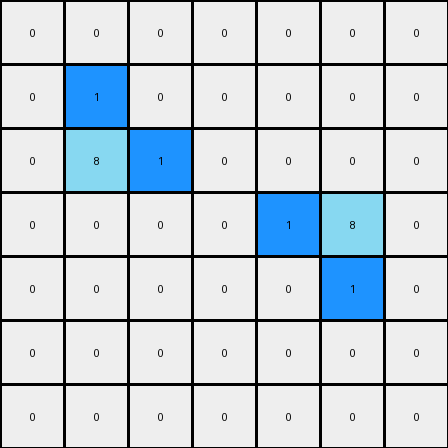
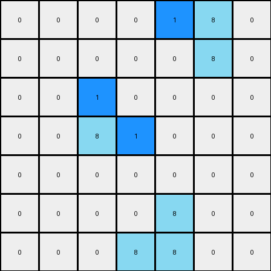

# 1-3aa6fb7a • 003 • refine_dreamer

---


Previous Code:
```python
"""
1.  **Identify:** Locate all pixels with the value '8' (azure) within the input grid.
2.  **Evaluate Adjacency:** For each azure pixel, check for diagonal adjacency:
    *   specifically, if the top left 2x2 subgrid matches either of these patterns:
        *   8s in the top-left and bottom-right, 1 is placed in top-left
        *   8s in the top-right and bottom-left, 1 is placed in bottom-right

3.  **Transform:**
    *   if an azure pixel has another azure pixel located diagonally down and to the right, change the first pixel's value to '1' (blue).
    *   if an azure pixel has another azure pixel located diagonally up and to the left, change the second pixel's value to '1' (blue)
4.  **Output:** Produce the modified grid, where the identified azure pixels have been changed to blue, and all other pixels remain unchanged.
"""

import numpy as np

def transform(input_grid):
    """Transforms the input grid according to the specified rules."""
    output_grid = np.copy(input_grid)
    rows, cols = input_grid.shape

    # Iterate through each pixel in the grid
    for i in range(rows):
        for j in range(cols):
            # Check if the current pixel is azure (8)
            if input_grid[i, j] == 8:
                # Check for diagonal adjacency (down and to the right)
                if i + 1 < rows and j + 1 < cols and input_grid[i + 1, j + 1] == 8:
                    output_grid[i, j] = 1  # Change the first pixel to blue (1)
                #check for diaganol adjaceny (up and to the left)
                elif i - 1 > 0 and j -1 > 0 and input_grid[i,j] == 8:
                    if input_grid[i-1,j-1] == 8:
                        output_grid[i,j] = 1


    return output_grid
```

Train Set Results:

## Example 1:**

Input:
```
0 0 0 0 0 0 0
0 8 0 0 0 0 0
0 8 8 0 0 0 0
0 0 0 0 8 8 0
0 0 0 0 0 8 0
0 0 0 0 0 0 0
0 0 0 0 0 0 0
```
Expected Output:
```
0 0 0 0 0 0 0
0 8 1 0 0 0 0
0 8 8 0 0 0 0
0 0 0 0 8 8 0
0 0 0 0 1 8 0
0 0 0 0 0 0 0
0 0 0 0 0 0 0
```
Transformed Output:
```
0 0 0 0 0 0 0
0 1 0 0 0 0 0
0 8 1 0 0 0 0
0 0 0 0 1 8 0
0 0 0 0 0 1 0
0 0 0 0 0 0 0
0 0 0 0 0 0 0
```

match: False
pixels_off: 6
size_correct: True
color_palette_correct: True
correct_pixel_counts: False

## Example 2:**

Input:
```
0 0 0 0 8 8 0
0 0 0 0 0 8 0
0 0 8 0 0 0 0
0 0 8 8 0 0 0
0 0 0 0 0 0 0
0 0 0 0 8 0 0
0 0 0 8 8 0 0
```
Expected Output:
```
0 0 0 0 8 8 0
0 0 0 0 1 8 0
0 0 8 1 0 0 0
0 0 8 8 0 0 0
0 0 0 0 0 0 0
0 0 0 1 8 0 0
0 0 0 8 8 0 0
```
Transformed Output:
```
0 0 0 0 1 8 0
0 0 0 0 0 8 0
0 0 1 0 0 0 0
0 0 8 1 0 0 0
0 0 0 0 0 0 0
0 0 0 0 8 0 0
0 0 0 8 8 0 0
```

match: False
pixels_off: 6
size_correct: True
color_palette_correct: True
correct_pixel_counts: False

**INSTRUCTIONS**

The code above was generated based on observations from the first training
example

we have tested the transform function on each of the task example inputs and
compared with the expected output

review each of the examples provided and the results and consider how the
natural language program should be updated to accommodate this new knowledge

respond with the following deliverables:

- general assessment of the information provided and strategy for resolving the
  errors
- gather metrics about each of the examples and results - use code_execution to
  develop accurate reports on your assumptions
- a YAML block documenting facts - Focus on identifying objects, their properties, and the actions performed on them.
- a natural language program - Be as clear and concise as possible, providing a complete description of the transformation rule.


your responses should be considered as information in a report - not a
conversation
