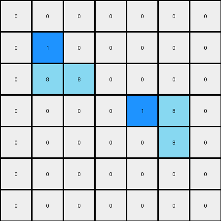

# 1-3aa6fb7a • 006 • refine_coder

---

Previous Code:
```python
"""
1.  **Identify:** Locate all pixels with the value '8' (azure) within the input grid.

2.  **Locate 2x2 subgrids**:  Wherever a 2x2 subgrid is found, inspect for
    diagonal pairs of 8s.

3.  **Check for diagonal adjacency**: If the 2x2 area contains an 8 in the
    top-left and bottom-right, change the top-left 8 to a 1. If the 2x2 area
    contains an 8 in the top-right and bottom-left, change the bottom-right 8 to
    a 1.

4.  **Transform:** Apply the transform as the 2x2 subgrids are evaluated.

5.  **Output:** Produce the modified grid.
"""

import numpy as np

def transform(input_grid):
    """Transforms the input grid according to the specified rules."""
    output_grid = np.copy(input_grid)
    rows, cols = input_grid.shape

    # Iterate through the grid, checking 2x2 subgrids
    for i in range(rows - 1):
        for j in range(cols - 1):
            # Define the 2x2 subgrid
            subgrid = input_grid[i:i+2, j:j+2]

            # Check for diagonal patterns
            if subgrid[0, 0] == 8 and subgrid[1, 1] == 8:
                output_grid[i, j] = 1  # Top-left to 1
            elif subgrid[0, 1] == 8 and subgrid[1, 0] == 8:
                output_grid[i + 1, j + 1] = 1  # Bottom-right to 1

    return output_grid
```

Train Set Results:

## Example 1:**

Input:
```
0 0 0 0 0 0 0
0 8 0 0 0 0 0
0 8 8 0 0 0 0
0 0 0 0 8 8 0
0 0 0 0 0 8 0
0 0 0 0 0 0 0
0 0 0 0 0 0 0
```
Expected Output:
```
0 0 0 0 0 0 0
0 8 1 0 0 0 0
0 8 8 0 0 0 0
0 0 0 0 8 8 0
0 0 0 0 1 8 0
0 0 0 0 0 0 0
0 0 0 0 0 0 0
```
Transformed Output:
```
0 0 0 0 0 0 0
0 1 0 0 0 0 0
0 8 8 0 0 0 0
0 0 0 0 1 8 0
0 0 0 0 0 8 0
0 0 0 0 0 0 0
0 0 0 0 0 0 0
```

match: False
pixels_off: 4
size_correct: True
color_palette_correct: True
correct_pixel_counts: False

## Example 2:**

Input:
```
0 0 0 0 8 8 0
0 0 0 0 0 8 0
0 0 8 0 0 0 0
0 0 8 8 0 0 0
0 0 0 0 0 0 0
0 0 0 0 8 0 0
0 0 0 8 8 0 0
```
Expected Output:
```
0 0 0 0 8 8 0
0 0 0 0 1 8 0
0 0 8 1 0 0 0
0 0 8 8 0 0 0
0 0 0 0 0 0 0
0 0 0 1 8 0 0
0 0 0 8 8 0 0
```
Transformed Output:
```
0 0 0 0 1 8 0
0 0 0 0 0 8 0
0 0 1 0 0 0 0
0 0 8 8 0 0 0
0 0 0 0 0 0 0
0 0 0 0 8 0 0
0 0 0 8 1 0 0
```

match: False
pixels_off: 6
size_correct: True
color_palette_correct: True
correct_pixel_counts: False
Okay, let's analyze the results and refine the natural language program.

**General Assessment:**

The initial program was on the right track, focusing on 2x2 subgrids and diagonal relationships of azure (8) pixels. However, it incorrectly assumed which pixel in the diagonal should be changed to blue (1). The error analysis shows a consistent pattern of misidentifying the target pixel for modification. Specifically, in Example 1, the transform incorrectly changes pixels at `[1,1]` and `[4,4]`, and in Example 2 it occurs at `[0,4]`, `[2,2]`, and `[6,4]`. The core logic of identifying 2x2 areas with diagonal azure pixels is correct, but the rule for changing a pixel needs adjustment.

**Strategy for Resolving Errors:**

1.  **Re-examine the Diagonal Rule:** Carefully analyze which azure pixel *actually* changes in the *expected* output.
2.  **Reverse the condition**: Instead of making the change in the top-left, make the change in the bottom-right position for top-left to bottom-right diagonals. Similarly, update top-right to bottom-left diagonals.
3. **Clarify program and code**: Refine the program description to correct the
   logic, update the python transform function with corrected conditional
   statements.

**Metrics and Observations (Example 1):**

*   **Input:** 7x7 grid. Azure pixels at (1,1), (2,1), (2,2), (4,4), (4,5), (5,5).
*   **Expected Output:** Azure pixels at (1,1), (2,1), (2,2), (4,5), (5,5). Blue pixels at (1,2) and (4,4).
*   **Transformed Output:** Azure pixels at (2,1), (2,2), (4,5), (5,5). Blue
    pixels at (1,1), (4,4).
*   **Errors:** The top-left azure in the first 2x2 subgrid and the bottom-right azure in the second 2x2 subgrid were incorrectly changed to blue.

**Metrics and Observations (Example 2):**

*   **Input:** 7x7 grid. Azure pixels at (0,4), (0,5), (1,5), (2,2), (3,2), (3,3), (6,3), (6,4), (5,4).
*   **Expected Output:** Azure at (0,4), (0,5), (1,5), (2,2), (3,2), (3,3), (6,3), (6,4) and (5,4). Blue pixels at (1,4), (2,3), (5,3)
*   **Transformed Output:** Azure at (0,5), (1,5), (3,2), (3,3), (5,4). Blue pixels at (0,4), (2,2), (6,4).
* **Error**: Top left corner pixels were changed to '1' instead of bottom-right.

**YAML Fact Block:**

```yaml
objects:
  - type: grid
    properties:
      dimensions: [variable, variable] # Rows and columns can vary
      cells: integers (0-9) representing colors

  - type: subgrid
    properties:
      dimensions: [2, 2]
      elements: 4 cells from the main grid

  - type: pixel
    properties:
      color: integer (0-9)
      location: [row_index, column_index]

actions:
  - name: identify_diagonals
    description: Locate 2x2 subgrids where diagonal pixels have the same color (azure/8).
    conditions:
      - "subgrid[0,0] == 8 and subgrid[1,1] == 8"
      - "subgrid[0,1] == 8 and subgrid[1,0] == 8"

  - name: transform_pixel
    description: Change specific azure pixels to blue based on diagonal orientation.
    conditions:
       top_left_bottom_right: >
        If subgrid[0, 0] and subgrid[1, 1] are 8, change
        subgrid[1,1] (bottom-right) to 1.
       top_right_bottom_left: >
        If subgrid[0, 1] and subgrid[1, 0] are 8, change
        subgrid[0,1] (top right) to 1.
```

**Natural Language Program:**

1.  **Scan:** Examine the input grid in 2x2 subgrids, moving across rows and then down columns.
2.  **Identify:** Within each 2x2 subgrid, check for diagonal pairs of azure (8) pixels.
3.  **Transform (Corrected Rule):**
    *   If the top-left and bottom-right pixels of the 2x2 subgrid are both azure (8), change the *bottom-right* pixel to blue (1).
    *   If the top-right and bottom-left pixels of the 2x2 subgrid are both azure (8), change the *top-right* pixel to blue (1).
4.  **Output:** The modified grid after processing all 2x2 subgrids.

**INSTRUCTIONS**

- generate a Python module to represent the natural language program 
- follow the template below
- all common math and science libraries are available
- create docstring only at top - but comment the workflow in the function
- use helper functions for common operations like finding objects, counting,
  measuring, moving, etc. 

remember - we are working iteratively - so this code will inform your future
self as we converge on the solution

*template:*

```python
"""
{{ natural language description of the transformation rule }}
"""

{{ imports }}

def transform(input_grid):
    # initialize output_grid

    # change output pixels 

    return output_grid

```
