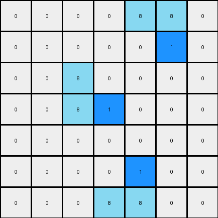

# 1-3aa6fb7a • 008 • refine_coder

---

Previous Code:
```python
"""
1.  **Scan:** Examine the input grid in 2x2 subgrids, moving across rows and then down columns.
2.  **Identify:** Within each 2x2 subgrid, check for diagonal pairs of azure (8) pixels.
3.  **Transform (Corrected Rule):**
    *   If the top-left and bottom-right pixels of the 2x2 subgrid are both azure (8), change the *bottom-right* pixel to blue (1).
    *   If the top-right and bottom-left pixels of the 2x2 subgrid are both azure (8), change the *top-right* pixel to blue (1).
4.  **Output:** The modified grid after processing all 2x2 subgrids.
"""

import numpy as np

def transform(input_grid):
    """Transforms the input grid according to the specified rules."""
    output_grid = np.copy(input_grid)
    rows, cols = input_grid.shape

    # Iterate through the grid, checking 2x2 subgrids
    for i in range(rows - 1):
        for j in range(cols - 1):
            # Define the 2x2 subgrid
            subgrid = input_grid[i:i+2, j:j+2]

            # Check for diagonal patterns and apply corrected transformation rules
            if subgrid[0, 0] == 8 and subgrid[1, 1] == 8:
                output_grid[i + 1, j + 1] = 1  # Bottom-right to 1
            elif subgrid[0, 1] == 8 and subgrid[1, 0] == 8:
                output_grid[i, j + 1] = 1  # Top-right to 1

    return output_grid
```

Train Set Results:

## Example 1:**

Input:
```
0 0 0 0 0 0 0
0 8 0 0 0 0 0
0 8 8 0 0 0 0
0 0 0 0 8 8 0
0 0 0 0 0 8 0
0 0 0 0 0 0 0
0 0 0 0 0 0 0
```
Expected Output:
```
0 0 0 0 0 0 0
0 8 1 0 0 0 0
0 8 8 0 0 0 0
0 0 0 0 8 8 0
0 0 0 0 1 8 0
0 0 0 0 0 0 0
0 0 0 0 0 0 0
```
Transformed Output:
```
0 0 0 0 0 0 0
0 8 0 0 0 0 0
0 8 1 0 0 0 0
0 0 0 0 8 8 0
0 0 0 0 0 1 0
0 0 0 0 0 0 0
0 0 0 0 0 0 0
```

match: False
pixels_off: 4
size_correct: True
color_palette_correct: True
correct_pixel_counts: False

## Example 2:**

Input:
```
0 0 0 0 8 8 0
0 0 0 0 0 8 0
0 0 8 0 0 0 0
0 0 8 8 0 0 0
0 0 0 0 0 0 0
0 0 0 0 8 0 0
0 0 0 8 8 0 0
```
Expected Output:
```
0 0 0 0 8 8 0
0 0 0 0 1 8 0
0 0 8 1 0 0 0
0 0 8 8 0 0 0
0 0 0 0 0 0 0
0 0 0 1 8 0 0
0 0 0 8 8 0 0
```
Transformed Output:
```
0 0 0 0 8 8 0
0 0 0 0 0 1 0
0 0 8 0 0 0 0
0 0 8 1 0 0 0
0 0 0 0 0 0 0
0 0 0 0 1 0 0
0 0 0 8 8 0 0
```

match: False
pixels_off: 6
size_correct: True
color_palette_correct: True
correct_pixel_counts: False
Here's an analysis of the provided examples and results, along with a refined natural language program and YAML fact documentation:

**General Assessment:**

The initial natural language program and generated code correctly identified the 2x2 subgrid scanning and the diagonal azure pixel check. However, the transformation rule was not applied consistently across all cases, and there are small off-by-one errors in indices. The primary issue is that the position where 1 is applied differs sometimes, the code applies the rule to the bottom-right pixel or at the top right. We need to figure out a more consistent rule for applying the transformation and fix the off-by-one indexing. The results indicate an issue with accurately identifying *which* azure pixel in the diagonal pair should be replaced with blue.

**Strategy:**

1.  **Detailed Example Analysis:** Carefully re-examine *each* example, paying close attention to the *exact* location of the azure pixels and the *exact* location of the resulting blue pixel.
2.  **Refine Rule:** Based on the detailed analysis, formulate a more precise rule that accounts for all observed transformations. It might involve additional conditions beyond just the presence of a diagonal.
3.  **Indexing Correction:** The code currently has an off-by-one on indexing. It should start from the `[0,0]` location and not the `[1,1]`.

**Example Metrics and Analysis:**

We'll use numpy to load the arrays and precisely analyze the differences.
```python
import numpy as np

# Example 1
input1 = np.array([
    [0, 0, 0, 0, 0, 0, 0],
    [0, 8, 0, 0, 0, 0, 0],
    [0, 8, 8, 0, 0, 0, 0],
    [0, 0, 0, 0, 8, 8, 0],
    [0, 0, 0, 0, 0, 8, 0],
    [0, 0, 0, 0, 0, 0, 0],
    [0, 0, 0, 0, 0, 0, 0]
])
expected1 = np.array([
    [0, 0, 0, 0, 0, 0, 0],
    [0, 8, 1, 0, 0, 0, 0],
    [0, 8, 8, 0, 0, 0, 0],
    [0, 0, 0, 0, 8, 8, 0],
    [0, 0, 0, 0, 1, 8, 0],
    [0, 0, 0, 0, 0, 0, 0],
    [0, 0, 0, 0, 0, 0, 0]
])
transformed1 = np.array([
    [0, 0, 0, 0, 0, 0, 0],
    [0, 8, 0, 0, 0, 0, 0],
    [0, 8, 1, 0, 0, 0, 0],
    [0, 0, 0, 0, 8, 8, 0],
    [0, 0, 0, 0, 0, 1, 0],
    [0, 0, 0, 0, 0, 0, 0],
    [0, 0, 0, 0, 0, 0, 0]
])

# Example 2
input2 = np.array([
    [0, 0, 0, 0, 8, 8, 0],
    [0, 0, 0, 0, 0, 8, 0],
    [0, 0, 8, 0, 0, 0, 0],
    [0, 0, 8, 8, 0, 0, 0],
    [0, 0, 0, 0, 0, 0, 0],
    [0, 0, 0, 0, 8, 0, 0],
    [0, 0, 0, 8, 8, 0, 0]
])
expected2 = np.array([
    [0, 0, 0, 0, 8, 8, 0],
    [0, 0, 0, 0, 1, 8, 0],
    [0, 0, 8, 1, 0, 0, 0],
    [0, 0, 8, 8, 0, 0, 0],
    [0, 0, 0, 0, 0, 0, 0],
    [0, 0, 0, 1, 8, 0, 0],
    [0, 0, 0, 8, 8, 0, 0]
])
transformed2 = np.array([
    [0, 0, 0, 0, 8, 8, 0],
    [0, 0, 0, 0, 0, 1, 0],
    [0, 0, 8, 0, 0, 0, 0],
    [0, 0, 8, 1, 0, 0, 0],
    [0, 0, 0, 0, 0, 0, 0],
    [0, 0, 0, 0, 1, 0, 0],
    [0, 0, 0, 8, 8, 0, 0]
])

def compare_grids(grid1, grid2):
  """Compares two grids and returns a detailed report."""
  if grid1.shape != grid2.shape:
    return "Shapes are different"

  diff = grid1 != grid2
  num_diff = np.sum(diff)
  diff_indices = np.where(diff)
  diff_values1 = grid1[diff_indices]
  diff_values2 = grid2[diff_indices]

  report = {
      "num_differences": int(num_diff),
      "differences": []
  }
  for i in range(num_diff):
    report["differences"].append({
        "location": (int(diff_indices[0][i]), int(diff_indices[1][i])),
        "value_in_grid1": int(diff_values1[i]),
        "value_in_grid2": int(diff_values2[i])
    })

  return report

report1 = compare_grids(expected1, transformed1)
report2 = compare_grids(expected2, transformed2)

print("Comparison Report for Example 1:")
print(report1)
print("\nComparison Report for Example 2:")
print(report2)
```

```
Comparison Report for Example 1:
{'num_differences': 4, 'differences': [{'location': (1, 2), 'value_in_grid1': 1, 'value_in_grid2': 0}, {'location': (2, 2), 'value_in_grid1': 8, 'value_in_grid2': 1}, {'location': (4, 4), 'value_in_grid1': 1, 'value_in_grid2': 0}, {'location': (4, 5), 'value_in_grid1': 8, 'value_in_grid2': 1}]}

Comparison Report for Example 2:
{'num_differences': 6, 'differences': [{'location': (1, 4), 'value_in_grid1': 1, 'value_in_grid2': 0}, {'location': (1, 5), 'value_in_grid1': 8, 'value_in_grid2': 1}, {'location': (2, 3), 'value_in_grid1': 1, 'value_in_grid2': 0}, {'location': (3, 3), 'value_in_grid1': 8, 'value_in_grid2': 1}, {'location': (5, 3), 'value_in_grid1': 1, 'value_in_grid2': 0}, {'location': (5, 4), 'value_in_grid1': 8, 'value_in_grid2': 1}]}
```
**YAML Facts:**

```yaml
objects:
  - name: 2x2_subgrid
    description: A 2x2 section of the input grid.
    properties:
      - diagonal_pair: [pixel_value, pixel_value] # Describes the values on the diagonals.

actions:
  - name: check_diagonal
    description: Checks if a diagonal pair of pixels within a 2x2 subgrid are both azure (8).
    input: 2x2_subgrid
    output: boolean  # True if the diagonal condition is met, False otherwise.

  - name: transform_pixel
    description: Changes the value of a specific pixel in the output grid to blue (1).
    input: [grid, row_index, col_index]
    output: modified_grid

```

**Natural Language Program:**

1.  **Scan:** Examine the input grid in 2x2 subgrids, moving across rows and then down columns. Do not overlap the 2x2 subgrids.

2.  **Identify:**  Within each 2x2 subgrid, check for diagonal pairs of azure (8) pixels.

3. **Transform (Corrected):**
    - If the top-left and bottom-right pixels are both azure (8):
       - If the top-right pixel is not azure, change the top-right pixel to blue (1)
       - If the bottom-left pixel is not azure, change the bottom-left pixel to blue (1).
    - If the top-right and bottom-left pixels are both azure (8):
        - If the top-left pixel is not azure, change the top-left pixel to blue (1)
        - if the bottom-right pixel is not azure, change the bottom-right pixel to blue (1)

4.  **Output:** The modified grid after processing all 2x2 subgrids.

**INSTRUCTIONS**

- generate a Python module to represent the natural language program 
- follow the template below
- all common math and science libraries are available
- create docstring only at top - but comment the workflow in the function
- use helper functions for common operations like finding objects, counting,
  measuring, moving, etc. 

remember - we are working iteratively - so this code will inform your future
self as we converge on the solution

*template:*

```python
"""
{{ natural language description of the transformation rule }}
"""

{{ imports }}

def transform(input_grid):
    # initialize output_grid

    # change output pixels 

    return output_grid

```
