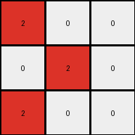
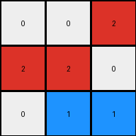

# 6-0520fde7 • 019 • refine_dreamer

---

Previous Code:
```python
"""
1. Excise Column: Remove the fourth column (all gray/5s) of the input grid.
2. Condense: Reduce to a 3x3 grid by:
   - copying the "left half" (first three numbers), skipping any complete blue (1) vertical columns.
3. Color Conversion: The blue cells (1) bordered on two sides (either vertical or horizontal, not diagonal) are changed to color red(2)
"""

import numpy as np

def get_neighbors(grid, r, c):
    neighbors = []
    if r > 0:
        neighbors.append(grid[r-1][c])  # Up
    if r < len(grid) - 1:
        neighbors.append(grid[r+1][c])  # Down
    if c > 0:
        neighbors.append(grid[r][c-1])  # Left
    if c < len(grid[0]) - 1:
        neighbors.append(grid[r][c+1])  # Right
    return neighbors

def transform(input_grid):
    # initialize output_grid
    grid = np.array(input_grid)

    # 1. Excise Column: Remove the fourth column (index 3).
    grid = np.delete(grid, 3, axis=1)

    # 2. Condense & 3. Color Conversion in one pass
    output_grid = np.zeros((3, 3), dtype=int)
    
    grid_rows, grid_cols = grid.shape
    
    
    # Create a mapping between original grid and reduced grid
    k=0
    for j in range(grid_cols):
      if len(np.where(grid[:,j] == 1)[0]) < grid_rows:
          #print(f'copying col {j} to {k}')
          for i in range(grid_rows):
            output_grid[i,k] = grid[i,j]
          k=k+1
          if k>2:
            break

    #print(output_grid)

    for r in range(3):
        for c in range(3):
            if output_grid[r, c] == 1:
                neighbors = get_neighbors(output_grid, r, c)
                if neighbors.count(0) >= 2:
                    output_grid[r, c] = 2

    return output_grid
```

Train Set Results:

## Example 1:**

Input:
```
1 0 0 5 0 1 0
0 1 0 5 1 1 1
1 0 0 5 0 0 0
```
Expected Output:
```
0 0 0
0 2 0
0 0 0
```
Transformed Output:
```
2 0 0
0 2 0
2 0 0
```

match: False
pixels_off: 2
size_correct: True
color_palette_correct: True
correct_pixel_counts: False

## Example 2:**

Input:
```
1 1 0 5 0 1 0
0 0 1 5 1 1 1
1 1 0 5 0 1 0
```
Expected Output:
```
0 2 0
0 0 2
0 2 0
```
Transformed Output:
```
1 2 0
0 0 2
1 2 0
```

match: False
pixels_off: 2
size_correct: True
color_palette_correct: False
correct_pixel_counts: False

## Example 3:**

Input:
```
0 0 1 5 0 0 0
1 1 0 5 1 0 1
0 1 1 5 1 0 1
```
Expected Output:
```
0 0 0
2 0 0
0 0 2
```
Transformed Output:
```
0 0 2
2 2 0
0 1 1
```

match: False
pixels_off: 4
size_correct: True
color_palette_correct: False
correct_pixel_counts: False
**INSTRUCTIONS**

The code above was generated based on observations from the first training
example

we have tested the transform function on each of the task example inputs and
compared with the expected output

review each of the examples provided and the results and consider how the
natural language program should be updated to accommodate this new knowledge

respond with the following deliverables:

- general assessment of the information provided and strategy for resolving the
  errors
- gather metrics about each of the examples and results - use code_execution to
  develop accurate reports on your assumptions
- a YAML block documenting facts - Focus on identifying objects, their properties, and the actions performed on them.
- a natural language program - Be as clear and concise as possible, providing a complete description of the transformation rule.


your responses should be considered as information in a report - not a
conversation
