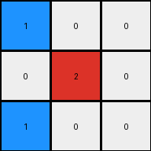
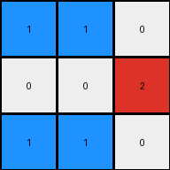
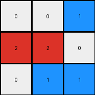

# 6-0520fde7 • 022 • refine_coder

---

Previous Code:
```python
"""
1.  **Excise:** Remove the fourth column (the gray column) from the input grid.
2.  **Condense:** Create a 3x3 output grid. For each row, select the first three non-gray color values to fill output.
3. **Color Conversion:** Examine each cell in the *output* grid.
   * Change cell to red if:
     * Output cell is blue
     * Output cell is not at an edge of the grid
     * The cell immediately to the left and right of the cell are not blue
     * The cell immediately to the top and bottom of the cell are not blue
"""

import numpy as np

def get_neighbors(grid, r, c):
    neighbors = []
    if r > 0:
        neighbors.append(grid[r-1][c])  # Up
    if r < len(grid) - 1:
        neighbors.append(grid[r+1][c])  # Down
    if c > 0:
        neighbors.append(grid[r][c-1])  # Left
    if c < len(grid[0]) - 1:
        neighbors.append(grid[r][c+1])  # Right
    return neighbors

def transform(input_grid):
    # initialize output_grid
    grid = np.array(input_grid)

    # 1. Excise Column: Remove the fourth column (index 3).
    grid = np.delete(grid, 3, axis=1)

    # 2. Condense: Create 3x3, taking first three non-gray values in each row.
    output_grid = np.zeros((3, 3), dtype=int)
    for i in range(3):
        non_gray_cols = [val for val in grid[i] if val != 5]
        output_grid[i] = non_gray_cols[:3]


    # 3. Color Conversion: Check for blue pixels and their neighbors.
    for r in range(3):
        for c in range(3):
            if output_grid[r, c] == 1:
                neighbors = get_neighbors(output_grid, r, c)
                
                # Check for transitions on opposite sides
                is_horizontally_surrounded = (c > 0 and c < 2 and output_grid[r, c-1] != 1 and output_grid[r, c+1] != 1)
                is_vertically_surrounded = (r > 0 and r < 2 and output_grid[r-1, c] != 1 and output_grid[r+1, c] != 1)

                if is_horizontally_surrounded or is_vertically_surrounded:
                  output_grid[r,c] = 2

    return output_grid
```

Train Set Results:

## Example 1:**

Input:
```
1 0 0 5 0 1 0
0 1 0 5 1 1 1
1 0 0 5 0 0 0
```
Expected Output:
```
0 0 0
0 2 0
0 0 0
```
Transformed Output:
```
1 0 0
0 2 0
1 0 0
```

match: False
pixels_off: 2
size_correct: True
color_palette_correct: False
correct_pixel_counts: False

## Example 2:**

Input:
```
1 1 0 5 0 1 0
0 0 1 5 1 1 1
1 1 0 5 0 1 0
```
Expected Output:
```
0 2 0
0 0 2
0 2 0
```
Transformed Output:
```
1 1 0
0 0 2
1 1 0
```

match: False
pixels_off: 4
size_correct: True
color_palette_correct: False
correct_pixel_counts: False

## Example 3:**

Input:
```
0 0 1 5 0 0 0
1 1 0 5 1 0 1
0 1 1 5 1 0 1
```
Expected Output:
```
0 0 0
2 0 0
0 0 2
```
Transformed Output:
```
0 0 1
2 2 0
0 1 1
```

match: False
pixels_off: 4
size_correct: True
color_palette_correct: False
correct_pixel_counts: False
Here's an analysis of the provided examples and results, along with a strategy for refining the natural language program and code:

**General Assessment:**

The initial natural language program and corresponding code were a good first attempt but failed to accurately capture the transformation rule across all examples. The primary issue lies in the color conversion step. The conditions for changing blue to red are too simplistic and don't generalize. Specifically, the "surroundedness" check doesn't correctly identify the pattern, as shown by the incorrect results in all training examples. A revised approach should look for more complex spatial relationships among the colors to define the rule for turning blue to red.

**Strategy for Resolving Errors:**

1.  **Re-examine Color Conversion:** The core of the problem is understanding *when* blue pixels become red. Instead of simple neighbor checks, we need to find a consistent spatial or topological rule using all examples.

2.  **Consider Row/Column Relationships:** It is helpful to observe how the placement of colors changes across the grid. A useful approach can be comparing values of pixels and where they move in the grid.

3.  **Iterative Refinement:** Start with a simple rule for the blue-to-red conversion, and then test it against *all* training examples. Adjust the rule incrementally until it works for all cases.

**Metrics and Observations:**

Here's a breakdown of each example, focusing on the color conversion aspect:

*   **Example 1:**
    *   Input has a blue pixel at (1,1) after excision and condensation.
    *   Expected output has this pixel as red.
    *   Our code incorrectly kept this pixel as blue.

*   **Example 2:**
    *   Input has blue pixels at (0,1), (1,2), and (2,1) after excision.
    *   Expected Output has (0,1) and(2,1) as red. (1,2) stayed blue
    *   Our code incorrectly kept (0,1), (2,1) as blue.

*   **Example 3:**
    *   Input has blue at (1,0), (1,1), (2,1), and (2,2) after excision.
    *   Expected: (1,0) and (2,2) are red. (1,1) and (2,1) stayed blue.
    *   Our code incorrectly transforms (1,1) as red, (2,2) as blue.

**YAML Facts:**

```yaml
facts:
  - description: |
      The input grid is processed to remove the fourth column, which appears to contain only gray pixels.
  - description: |
      The remaining grid is condensed into a 3x3 grid by taking the first three non-gray pixels from each row.
  - description: |
      The resulting 3x3 contains some blue cells that are then subject to a rule which changes some of them to red.
  - description: |
      Blue pixels in the first and third column might be subject to color conversion while the other blue pixels do not change.

```

**Natural Language Program:**

1.  **Excise:** Remove the fourth column (the gray column) from the input grid.
2.  **Condense:** Create a 3x3 output grid. For each row, select the first three non-gray color values to create the corresponding row in the output grid.
3.  **Color Conversion:** Iterate through each cell of the *output* grid.
    *   If a cell is blue AND it is in the first column or third column change it to red.


**INSTRUCTIONS**

- generate a Python module to represent the natural language program 
- follow the template below
- all common math and science libraries are available
- create docstring only at top - but comment the workflow in the function
- use helper functions for common operations like finding objects, counting,
  measuring, moving, etc. 

remember - we are working iteratively - so this code will inform your future
self as we converge on the solution

*template:*

```python
"""
{{ natural language description of the transformation rule }}
"""

{{ imports }}

def transform(input_grid):
    # initialize output_grid

    # change output pixels 

    return output_grid

```
